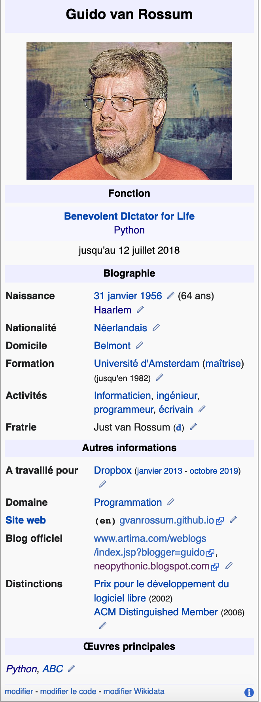
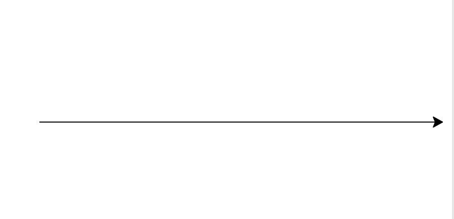
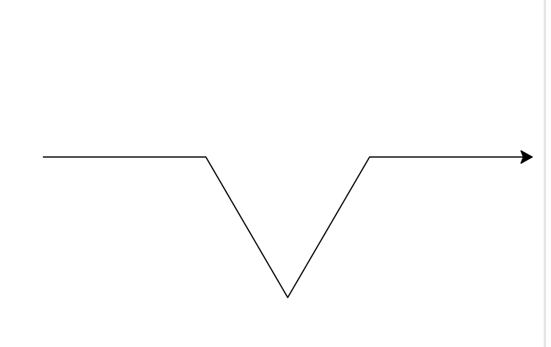
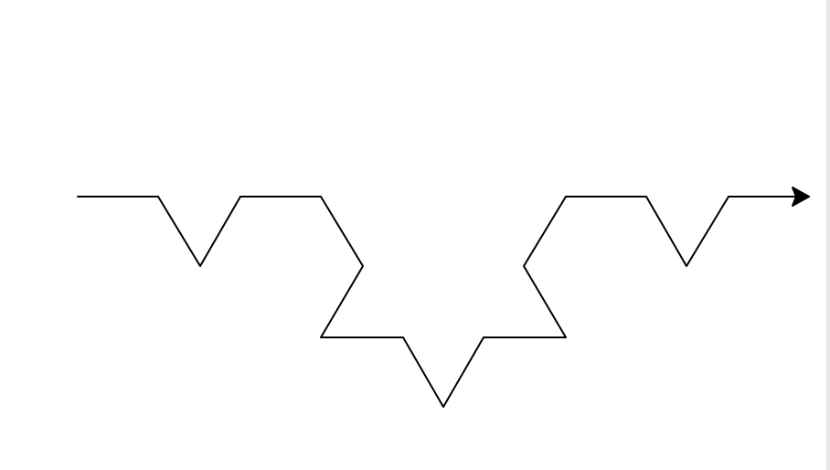
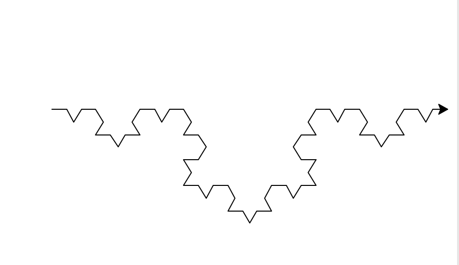
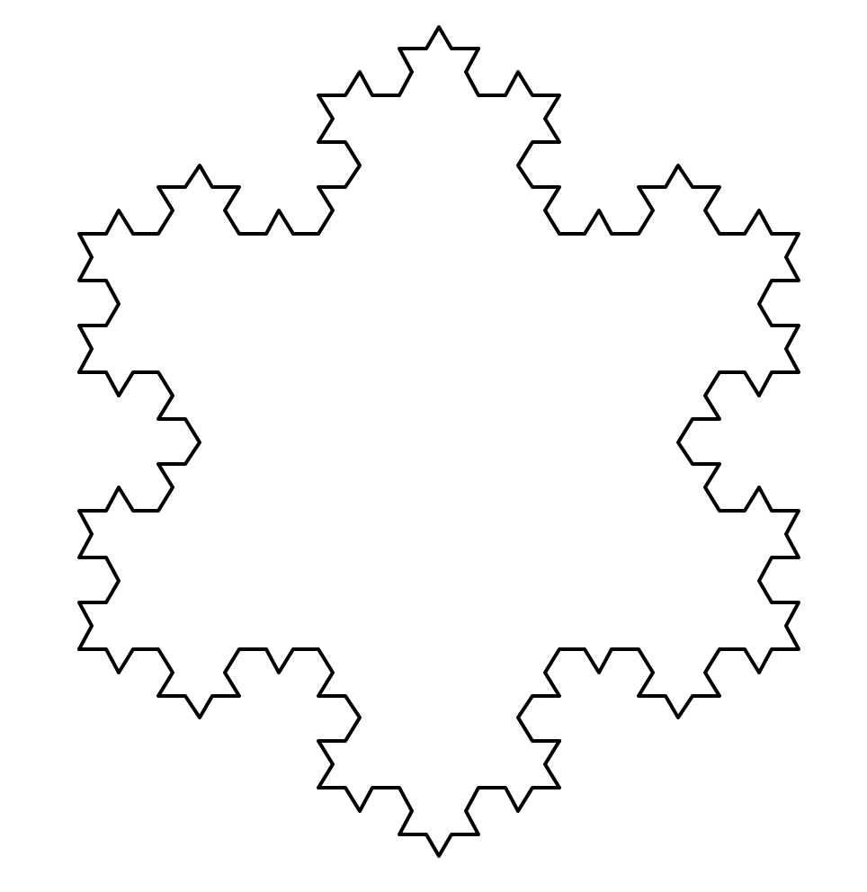

## La programmation en Python

<p align="right">
 
</p>

### Introduction au langage Python

Lors des débuts de l'informatique, dans l'immédiat après-guerre, on travaillait directement en langage machine ce qui demandait une connaissance technique très spécifique. Le besoin s'est fait sentir de faciliter la tâche du programmeur en créant un langage intermédiaire. Le Fortran créé par John Backus en 1954 fut l'un des tous premiers. De très nombreux langages suivirent ; le Python, introduit **en 1991 par Guido van Rossum** s'avère être l'un des mieux adaptés à l'enseignement.

<p align="center">
 
</p>

Guido van Rossum a créé le langage Python mais pour le faire évoluer il a eu l'excellente idée de former autour de lui une **communauté Python** dont il est dévenu le Benevolent Dictator for Life (dictateur bienveillant à vie). À ce titre-là, il validait lui-même toute proposition d'amélioration de ce langage. En juillet 2018, il décida de laisser la gouvernance tout en restant un conseiller des plus éclairés. Après un certain désarroi parmi la communauté, six propositions d'une nouvelle gouvernance furent mises au choix de ses membres. On mit en place un conseil de direction qui veille toujours à la poursuite de l'évolution du langage.

### Notions de base de programmation

#### 1) préambule 

Un **algorithme** est une suite d'instructions à exécuter. Celui-ci peut être écrit en langage naturel, c'est-à-dire en donnant des instructions en français, mais pour être exécuté, l'algorithme doit être traduit dans un langage de programmation. Un même algorithme peut ainsi être **implémenté** dans plusieurs langages de programmation différents. Par exemple, le langage utilisé par les calculatrices TI n'est pas le même que celui utilisé par les calculatrices Casion. Ainsi, si on souhaite implémentaer un algorithme sur sa calculatrice, on ne saisira pas le même **programme** selon la marque de celle-ci.

#### 2) Variables, types, affectation, comparaison

Une **variable** est désignée par un nom (une lettre, un mot, plusieurs mots séparés par le tiret bas ou underscore '_' sans espace) et contient une valeur d'un certain type.

Les **types** que nous utilisons cette année sont : 

- **int** : nombre entier relatif (positif ou négatif) ; 4 et -5 sont de type int.
- **float** : nombre flottant (à virgule) ; 2.56 et -1.627 sont de type float.
-  **str** : chaîne de caractère (string) entourée d'apostrophes ('...') ou de guillements ("....") pour la distinguer d'une variable ; une chaîne de caractères correspond souvent à du texte, chaque caractère étant un symbole (lettre, chiffre, ponctuation...)
Par exemple : "une chaîne" est de type str et contient 10 caractères (9 lettres et un espace qui compte aussi pour un caractère).
- **bool** : booléen qui peut avoir deux valeurs possibles seulement : True (vrai) et False (faux)
- **tuple** : suite d'éléments de types éventuellement différents, séparés par des virgules et entourés par des parenthèses ((...)).
Par exemple : (3,'triplet',True) est un tuple contenant trois éléments.
- **list** : liste d'éléments, souvent de même type, mais ce n'est pas obligatoire, séparés par des virgules et entourés par des crochets ([...]).
Par exemple : [0,2,4,6,8] est une liste contenant 5 éléments.
[] est une liste vide
[[3,6,9],[4,8],[5,10]] est une liste dont les éléments sont eux-mêmes des listes
[(64,'pair'),(15,'impair'),(12,'pair')] est une liste de tuple en l'occurence des couples.

Remarque : bien distinguer le symbole '.' utilisé comme virgule pour les nombres flottants du symbole ',' pour séparer les éléments d'une liste.

Dans la **console** ou **Shell** du logiciel Thonny, on peut faire quelques vérifications en utilisant la fonction interne `type()` qui permet de connaître le type d'une variable.
L'utilisation du **symbole hashtag #** indique un **commentaire** qui est ignoré par Python.

```Python
>>> type(4)#on saisit les commandes après les prompts >>> et on peut rappeler la commande précédente pour gagner du temps avec la flèche ↑ du clavier.
<class 'int'>
>>> type(-1.627)
<class 'float'>
>>> type("singe")
<class 'str'>
>>> type(True)
<class 'bool'>
>>> type((3,'triplet',True))#attention à la double parenthèse
<class 'tuple'>
>>> type( [0,2,4,6,8])
<class 'list'>
>>> type([(64,'pair'),(15,'impair'),(12,'pair')])
<class 'list'>
```

En langage Python, on utilise l'instruction `a=...` pour **affecter une valeur à une variable**.

```Python
>>> a=3
>>> b=5
>>> a+b
8
>>> a-b
-2
>>> a*b
15
>>> a/b
0.6
>>> a**2#a puissance 2
9
>>> a//5,a%5#on demande ici un tuple (les parenthèses ne sont pas obligatoires) correspondant au quotient et au reste de la division de a par 5
(0, 3)
>>> a,b,c=3,6,8#on peut affecter les valeurs de plusieurs variables en même temps
>>> a,c,b
(3, 8, 6)
```

<u>Remarque 1</u>: On peut aussi procéder de la manière suivante pour connaître le type d'une variable : on utilise un double '==' pour effectuer une **comparaison**.

```Python
>>> type("singe")==str#Attention, un simple '=' pour l'affectation, un double '==' pour une comparaison ; le résultat est un booléen
True
>>> type("singe")!=list# != signifie différent de 
True
```

<u>Remarque 2</u>: Il faut avoir en tête qu'un ordinateur utilise une représentation binaire des nombres. Ce qui donne lieu à des résultats parfois suprenants par exemple !

```Python
>>> 0.1+0.1+0.1
0.30000000000000004
```
La spécialité NSI de première vous permettra de comprendre ce qui se passe et de justifier cet affichage.

<u>Remarque 3</u> : On peut transformer une chaîne de caractère en entier avec `int()` ou en nombre flottant avec `float()`; inversement on peut tranformer un nombre en une chaîne de caractère avec `str()` ce qui peut être utile pour concaténer des chaînes de caractères. On peut aussi transformer un nombre flottant en nombre entier ; ce qui revient à en prendre la partie entière.

```Python
>>> entier="100"
>>> valeur=int(entier)
>>> valeur
100
>>> nombre_flottant="13.45"
>>> valeur_numerique=float(nombre_flottant)
>>> valeur_numerique
13.45
>>> nombre=2020
>>> nombre_texte=str(nombre)
>>> texte="Nous sommes en "+nombre_texte
>>> texte
'Nous sommes en 2020'
>>> int(5.42)
5
```

<u>Remarque 4</u> : On peut disposer d'autres outils mathématiques en **important des modules** comme par exemple le module **math** (accès aux fonctions mathématiques), le module **random** (génération de nombres aléatoires) ou le module **turtle** (module graphique). 

Pour obtenir des informations sur un module directement dans la console :

```Python
>>> a=144
>>> import math
>>> math.sqrt(a)#prend la racine carré (square root) du nombre
12.0
>>> from math import sqrt#on importe uniquement la fonction sqrt du module math
>>> sqrt(a)
12.0
```

```Python
>>> help(random)
```

```Python
>>> random.random()#donne un nombre aléatoire entre 0 et 1
0.6513551958864723
>>> random.randint(2,9)#donne un entier compris entre 2 compris et 9 compris
4
```

Pour afficher des valeurs ou du texte, on utilise la fonction `print`:
```Python
>>> b=8
>>> print("La racine carré de ",b," vaut : ",math.sqrt(b))
La racine carré de  8  vaut :  2.8284271247461903
```

#### 3) Compléments

##### a) À propos des listes

Une liste d'éléments est indexée et on accède à un élément avec son **indice** de position ; attention le premier élément est d'indice 0 et non 1 !
On peut aussi accéder au dernier élément avec un indice décroissant à partir de la valeur -1. On peut connaître la longueur d'une liste avec la fonction `len`. On ajoute des éléments à une liste avec la **méthode append()**.

```Python
>>> liste=[2,4,8,16]
>>> len(liste)
4
>>> liste[2]
8
>>> liste[-2]
8
>>> liste.append(20)
>>> liste
[2, 4, 8, 16, 20]
```
##### b) À propos des chaînes de caractères

On peut accoler deux chaînes de caractères l'une à l'autre par **concaténation** avec le simple **opérateur** +. On peut connaître la longueur de la chaîne de caractères ou accéder à un caractère de la même façon que pour les listes.

```Python
>>> salutation="Bon"+"jour"
>>> salutation
'Bonjour'
>>> salutation[3]
'j'
>>> salutation[-3]
'o'
>>> len(salutation)
7
```
##### c) À propos des tuples

On retrouve ce que l'on avait pour les listes.

```Python
>>> tuple1=(3,4,6)
>>> tuple2=(7,8,9)
>>> tuple=tuple1+tuple2
>>> tuple
(3, 4, 6, 7, 8, 9)
>>> len(tuple)
6
>>> tuple[3]
7
```
La différence entre une liste et un tuple est qu'une liste est **mutable** (on peut modifier la valeur d'un élément d'une liste) tandis qu'un tuple est **non mutable** (on ne peut pas assigner de valeur aux éléments d'un tuple).

```Python
>>> liste=[3,4,5]
>>> liste[1]=8
>>> liste
[3, 8, 5]
>>> triplet=(3,4,5)
>>> triplet[1]=8
Traceback (most recent call last):
  File "<pyshell>", line 1, in <module>
TypeError: 'tuple' object does not support item assignment
```

##### d) Les fonctions

Les fonctions en Python sont définies par le mot clef `def` : on donne un nom à la fonction et on précise ses éventuels **paramètres** ; on indique ensuite les différentes **instructions** à exécuter lors de l'appel de la fonction. Une fonction est chargée de renvoyer quelque chose : on trouvera généralement le mot `return` comme ultime instruction.

En mathématiques, on définit la fonction : f(x)=(5x-3)<sup>2</sup>.
Implémenté en Python, on écrit le programme suivant dans un fichier intitulé essais_snt.py.
Il faut veiller à bien respecter l'**indentation** qui se fait automatiquement après les ':'.

```Python
def f(x):
    return (5*x-3)**2
print(f(2))

>>> %Run essais_snt.py
49
```

##### e) Les instructions conditionnelles 

La structure conditionnelle utilise les mots : **if ; elif ; else** dans cet ordre.

<u>Exemple 1</u>: 

On se propose d'écrire un petit programme qui va répondre à l'objectif suivant que l'on traduit d'abord en langage naturel : un utilisateur entre son âge, l'ordinateur concluera que l'individu est soit un enfant (<10), soit un adolescent (≥10 ; <19), soit un adulte (≥19).

```Python
age=int(input("Entrez votre âge s.v.p : "))#le résultat d'un input est une chaîne de caractères, d'où la nécessité de la convertir en entier avec int()
if age <10:
    print("Vous êtes un enfant")
elif age>=10 and age<19:
    print("Vous êtes un adolescent")
else:
    print("Vous êtes un adulte")
```

<u>Exemple 2</u>: 

On envisage de créer une fonction `affiche_parite(n)` qui affiche le caractère pair ou impair d'un nombre n.

```Python
def affichage_pair(n):
    if n%2==0:#le double signe = pour effectuer une comparaison
        print('le nombre ',n,' est pair')
    else:
        print('le nombre ',n,' est impair')
        
>>> affichage_pair(15)
le nombre  15  est impair
>>> affichage_pair(4)
le nombre  4  est pair
```

En fait il préférable de créer une fonction `est_pair(n)` dont le rôle est de déterminer le caractère pair ou impair d'un nombre en renvoyant un booléen ; on programme ainsi ce qui va nous permettre d'évaluer une propriété d'un nombre. Puis on crée une autre fonction pour l'affichage ; l'intérêt est que la propriété pair ou impair est ainsi évaluable et pourra trouver d'autres usages dans d'autres fonctions.

```Python
def est_pair(n):
    if n%2==0:
        return True
    else:
        return False
        
def affichage(n):
    if est_pair(n):
        print('le nombre ',n,' est pair')
    else:
        print('le nombre ',n,' est impair')
        
>>> affichage(15)
le nombre  15  est impair
>>> affichage(4)
le nombre  4  est pair
```

On peut ainsi envisager d'écrire une fonction capable d'affirmer si un couple de nombres est un couple de nombres impairs.

```Python
def est_couple_impair(n,p):
    if est_pair(n) or est_pair(p):#il suffit que l'un ou l'autre soit pair pour que le couple ne soit pas un couple de nombres impairs
        return False
    else:
        return True

def affichage(n,p):
    if est_couple_impair(n,p):
        print('le couple ',n,' et ',p,'est un couple de nombres impairs')
    else:
        print('le couple ',n,' et ',p,"n'est pas un couple de nombres impairs")#noter ici la nécessité d'utiliser des guillemets      

>>> affichage(4,15)
le couple  4  et  15 n'est pas un couple de nombres impairs
>>> affichage(3,15)
le couple  3  et  15 est un couple de nombres impairs
```

<u>Exemple 3</u>: 

Définissons une fonction qui admet comme paramètres trois points A,B,C, chacun étant donné sous la forme d'un couple de coordonnées dans le repère cartésien, et qui est capable d'évaluer le caractère rectangle de ce triangle en précisant en quel point il l'est.
Au préalable on crée une fonction `norme(a,b)` qui détermine le carré de la distance entre deux points.

```Python
def norme(a,b):
    return (a[0]-b[0])**2+(a[1]-b[1])**2

def est_rectangle_en_A(a,b,c):
    if norme(a,b)+norme(a,c)==norme(b,c):
        return True
    else:
        return False
    
def est_rectangle_en_B(a,b,c):
    if norme(a,b)+norme(b,c)==norme(a,c):
        return True
    else:
        return False
    
def est_rectangle_en_C(a,b,c):
    if norme(a,c)+norme(b,c)==norme(a,b):
        return True
    else:
        return False
    
def nature_rectangle_triangle(a,b,c):
    if est_rectangle_en_A(a,b,c):
        print("Le triangle est rectangle en A")
    elif est_rectangle_en_B(a,b,c):
        print("Le triangle est rectangle en B")
    else:
        print("Le triangle est rectangle en C")

>>> nature_rectangle_triangle((-2,2),(2,4),(6,-4))
Le triangle est rectangle en B
```
##### f) Les boucles bornées

On utilise une boucle bornée `for` lorsqu'on connaît exactement le nombre de boucles ou de tâches répétitives que le programme doit exécuter.

On retiendra que `for i in range(n)` permet de faire n tours de boucles, car écrit ainsi, i commence à 0 et s'arrête à n-1.

```Python
def affiche(n):
    for i in range(n):
        print('Hello')
   
>>> affiche(3)
Hello
Hello
Hello
```

`for i in range(n,p)` fait démarrer i à n et l'arrêter à p-1.

<u>Remarque</u>:

On peut parcourir une liste ou un tuple de deux manières différentes.

```Python
>>> liste=[3,5,9]
>>> for i in range(len(liste)):
    print(liste[i])
    
3
5
9
>>> for i in liste:
    print(i)
    
3
5
9
```

<u>Exemple 1</u>: 

Programmons une fonction qui calcule pour un nombre entier n donné la somme des entiers jusqu'à ce nombre. On peut utiliser une boucle bornée parce qu'il va falloir faire n fois la même chose, à savoir ajouter à chaque tour de boucle, à une variable `somme` initialement nulle, la valeur de l'entier suivant :

```Python
def somme_entiers(n):
    somme=0
    for i in range(n+1):#i va ainsi de 0 à n
        somme+=i#ou somme=somme+i
    return somme
>>> somme_entiers(3)
6
```

<u>Exemple 2</u>: 

Programmons une fonction qui pour un entier n donné renvoie la liste des n premiers carrés (en commençant par le carré de 0). La tâche est répétitive et consiste à ajouter à la liste le carré de l'entier qui suit ; il y a n boucles à réaliser car les n premiers entiers rencontrés vont de 0 à n-1.

 ```Python
def liste_carres(n):
    liste=[]
    for i in range(n):
        liste.append(i**2)
    return liste
    
>>> liste_carres(16)
[0, 1, 4, 9, 16, 25, 36, 49, 64, 81, 100, 121, 144, 169, 196, 225]

 ```

<u>Exemple 3</u>: 

Programmons une fonction qui compte le nombre d'occurence de la lettre e dans une chaîne de caractères. Une boucle bornée est adaptée ; en effet on va parcourir chacune des lettres du mot et la comparer à la lettre e et comptabiliser les occurences : la tâche est répétitive et compte autant de comparaison qu'il y a de lettres dans le mot, ce nombre de caractères dans une chaine est donné par la fonction len().

 ```Python
def compte_occurence_lettre_e(chaine):
    compte=0
    for i in range(len(chaine)):
        if chaine[i]=="e":
            compte+=1
    return compte

>>> compte_occurence_lettre_e("premier")
2
 ```

##### g) Les boucles non bornées

On réalise une boucle non bornée lorsqu'on ne connaît pas exactement le nombre de boucle à effectuer ; toutefois on connaît la cause d'arrêt de la boucle sous une forme que l'on peut traduire de façon booléenne.

<u>Exemple</u>:

Voici un extrait de la conjecture de Syracuse donnée par Wikipédia.
> En mathématiques, on appelle suite de Syracuse une suite d'entiers naturels définie de la manière suivante : on part d'un nombre entier plus grand que zéro ; s’il est pair, on le divise par 2 ; s’il est impair, on le multiplie par 3 et on ajoute 1. En répétant l’opération, on obtient une suite d'entiers positifs dont chacun ne dépend que de son prédécesseur.	
> Par exemple, à partir de 14, on construit la suite des nombres : 14, 7, 22, 11, 34, 17, 52, 26, 13, 40, 20, 10, 5, 16, 8, 4, 2, 1, 4, 2… C'est ce qu'on appelle la suite de Syracuse du nombre 14.	
> Après que le nombre 1 a été atteint, la suite des valeurs (1,4,2,1,4,2…) se répète indéfiniment en un cycle de longueur 3, appelé cycle trivial.
> Si l'on était parti d'un autre entier, en lui appliquant les mêmes règles, on aurait obtenu une suite de nombres différente. A priori, il serait possible que la suite de Syracuse de certaines valeurs de départ n'atteigne jamais la valeur 1, soit qu'elle aboutisse à un cycle différent du cycle trivial, soit qu'elle diverge vers l'infini. Or, on n'a jamais trouvé d'exemple de suite obtenue suivant les règles données qui n'aboutisse pas à 1, puis au cycle trivial.
> La conjecture de Syracuse, encore appelée conjecture de Collatz, conjecture d'Ulam, conjecture tchèque ou problème 3x + 1, est l'hypothèse mathématique selon laquelle la suite de Syracuse de n'importe quel entier strictement positif atteint 1.
> En dépit de la simplicité de son énoncé, cette conjecture défie depuis de nombreuses années les mathématiciens. Paul Erdős a dit à propos de la conjecture de Syracuse : « les mathématiques ne sont pas encore prêtes pour de tels problèmes ». 

Une boucle non bornée est adaptée ici car on n'a pas idée du nombre d'éléments que l'on va obtenir dans la suite avant d'aboutir à 1, par contre on pourra s'arrêter à cette valeur puisqu'on apprend que la suite va se répéter au-delà selon un cycle trivial.
On se propose de programmer une fonction qui pour un entier n donne les éléments de la suite de Syracuse et qui compte le nombre d'éléments rencontrés avant d'aboutir à 1.

 ```Python
def syracuse(n):
    liste=[n]
    i=n
    while i!=1:
        if i%2==0:
            i=i//2
        else:
            i=3*i+1
        liste.append(i)
    return liste,len(liste)-1
    
>>> syracuse(14)
([14, 7, 22, 11, 34, 17, 52, 26, 13, 40, 20, 10, 5, 16, 8, 4, 2, 1], 17)
 ```

##### h) Le module turtle

Le module **turtle** permet de tracer des figures comme on le ferait avec un stylo, la pointe du stylo étant la tortue. La tortue est initialement placée au centre du repère et se déplace sur le graphique en fonction des instructions qu'on lui donne.

Les principales fonctions mises à votre disposition dans le module turtle sont les suivantes :

**reset()** : efface l’écran, recentre la tortue et remet les variables à zéro
		
**forward(distance)** : avance d’une distance donnée en pixel
	
**backward(distance)** : recule d’une distance donnée en pixel
	
**left(angle)** : pivote vers la gauche d'un angle en degrés
	
**right(angle)** : pivote vers la droite d'un angle en degrés
	
**up()**: relève le crayon (pour pouvoir avancer sans dessiner)

**down()** : abaisse le crayon (pour recommencer à dessiner)

**goto(x, y)** : va à l’endroit de coordonnées (x, y) en pixel

/!\ Ne pas oublier d'utiliser la fonction up() avant d'utiliser goto() car sinon il tracera le parcours effectué.

**hideturtle()** : masque la tortue.

**showturtle()** : afficher la tortue. 

Le **flocon de Von Koch** s'obtient en partant d'un triangle équilatéral, puis en modifiant successivement chacune des arêtes de la façon suivante : 
- On divise l'arête en 3
- On construit un triangle équilatéral ayant pour base le segment du milieu
- On ôte le segment du milieu
- On effectue de nouveau ces étapes sur chacune des arêtes obtenues

 ```Python
from turtle import *

def branche(largeur,n):
    if n==0:
        forward(largeur)
    else:
        branche(largeur/3,n-1)
        right(60)
        branche(largeur/3,n-1)
        left(120)
        branche(largeur/3,n-1)
        right(60)
        branche(largeur/3,n-1)
        
def flocon(largeur,n):
    reset()
    pensize(2)#fixe l'épaisseur du trait
    speed(0)
    branche(largeur,n)#côté 1
    left(120)
    branche(largeur,n)#côté 2
    left(120)
    branche(largeur,n)#côté 3
    hideturtle() 
 ```

La fonction `branche` permet de construire l'un des trois côtés du flocon. Cette fonction est récursive car elle s'appelle elle-même en faisant décroître n d'une unité.

branche(400,0)

branche(400,1) 


branche(400,2) 


branche(400,3) 


La fonction  `flocon` permet de construire chacun des trois côtés du flocon, en effectuant une rotation de 120° entre chaque construction.

flocon(400,3) 


