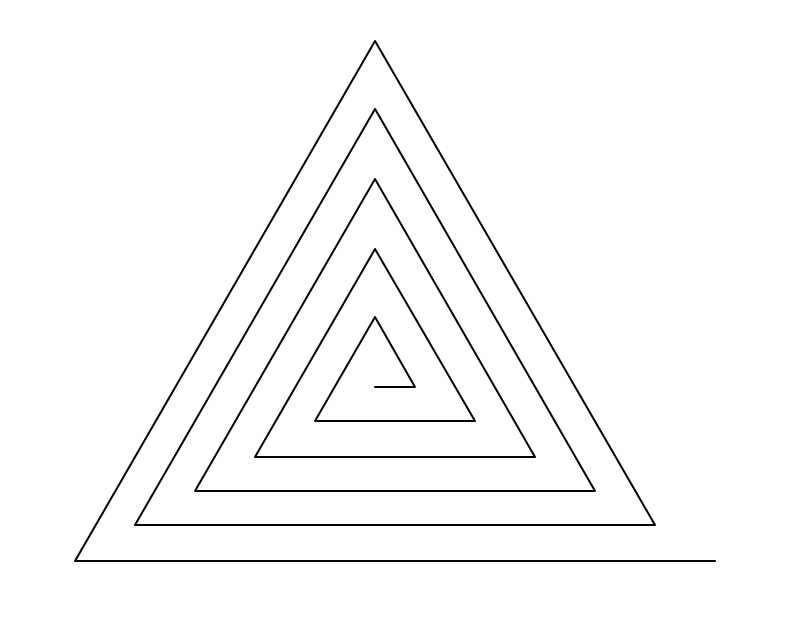

### Devoir Maison n°2

Code pour vérifier les tests des docstring à placer à la fin du fichier python.

```Python
if __name__ == '__main__':
  import doctest
  doctest.testmod(verbose=True)
```
### Exercice 1 : à la recherche du nombre d'or

La suite de Fibonacci se construit comme ceci : les deux premiers termes valent 1, puis chaque terme est la somme des deux précédents.   
F(1)=1 ; F(2)=1 ; F(3)=2 ; F(4)=3 ; F(5)=5 ; F(6)=8....

Compléter la fonction `Fibo(n)` ci-dessous permettant de déterminer le n-ième terme de la suite de Fibonacci.

```Python
def Fibo(n):
    """
    Renvoie le nième terme de la suite de Fibonaccci
    param : n : int
    return : int
    >>> Fibo(6)
    8
    """
    if n==1 or n==2:
        return 1
    else:
        return "à compléter"
```
 

 

Comme l'affirme cet extrait de wikipédia à propos du nombre d'or, il existe une relation entre le nombre d'or et la suite de Fibonacci étudiée précédemment. Ce nombre est en effet la valeur du rapport F(n+1)/F(n) quand n est très grand (ou encore la limite qu'atteint le quotient de deux termes consécutifs de la suite de Fibonacci plus on avance dans les termes de la suite).   

Compléter la fonction `nombre_or(p)` ci-dessous qui permet d'approcher la valeur du nombre d'or donnée dans le document à 10<sup>-`p`</sup> près ou en d'autres termes au `p`ième chiffre près après la virgule.

```Python
def nombre_or(p):
    """
    Renvoie un tuple constitué d'une part de la valeur de n telle que le rapport Fibo(n+1)/Fibo(n) approche le nombre d'or 
    à 10^(-p) près et d'autre part de la valeur approchée ainsi obtenue
    param : p : int
    return : tuple 
    >>> nombre_or(10)
    (25, 1.6180339886704431)
    """
    valeur_exacte=(1+5**0.5)/2
    n=1
    while # la suite à compléter
```

On sera amené à utiliser la fonction `abs()` qui donne la valeur absolue d'un nombre pour obtenir une différence toujours positive.
```Python
>>> abs(-10)
10
>>> abs(10)
10
```

Applications du nombre d'or dans des domaines variés :


 

 

 


### Exercice 2 : faire de l'aléatoire avec le module random

1) Écrire une fonction  `lancers` telle que `lancers(n)` simule n lancers d'un dé équilibré à 6 faces et renvoie le résultat sous forme de liste.
On importera la bibliothèque `random` pour pouvoir appeler la fonction `randint` de cette bibliothèque, telle que random.randint(n,p) renvoie un entier aléatoire entre n et p, n et p étant compris.

```Python
>>> import random
>>> random.randint(2,8)
5 
```

```Python
>>> lancers(4)
[2, 1, 4, 5]
>>> lancers(4)
[6, 1, 1, 1]
>>> lancers(4)
[4, 4, 6, 2]
>>> lancers(4)
[2, 5, 6, 1]
```

Indications : dans la fonction `lancers(n)`, créer d'abord une liste vide à laquelle on ajoute autant de fois qu'il y a de lancers réalisés, c'est-à-dire n fois, au moyen de la méthode `append`,  les résultats des tirages au sort en utilisant `random.randint` ; comme l'action est répétitive puisqu'il y a n lancers, on utilise une boucle `for..in range..`. La liste ainsi complétée est renvoyée à l'issue de la boucle par la fonction au moyen de `return`.

2) Écrire une fonction `piece` telle que `piece(n)` simule n lancers d'une pièce équilibrée et renvoie la fréquence des "piles" observés.

```Python
>>> pieces(400)
0.47
>>> pieces(4000)
0.49975
```
Indications : dans le même esprit que l'exercice précédent, mais cette fois-ci avec une pièce et non un dé, on place dans la fonction une variable qui sert de compteur initialement à 0 qui se charge de compter les piles (on peut décider que pile c'est la sortie de 1 et que face c'est la sortie de 0); à la fin des n lancers on renvoie la proportion de "piles" parmi les n lancers.

3) Écrire une fonction `truquee` telle que `truquee(n,p)` simule n lancers d'une pièce truquée, dont la probabilité de faire "piles" vaut p, et renvoie la fréquence des "piles" observées.

Indications : la fonction random() de la librairie random génère un nombre compris entre [0,1[ ; random.random()+0.6 génère un nombre compris entre [0.6,1.6[ ; int(random.random()+0.6) génère un nombre qui vaut 0 pour tous les nombres compris dans l'intervalle [0.6,1[ d'étendue 0.4 et 1 pour tous les nombres compris entre [1,1.6[ d'étendue 0.6 ; on a donc 60% de chance d'avoir 1 et 40% de chance d'avoir 0.
La fonction int() donne en effet la partie entière du nombre.

```Python
>>> random.random()
0.6271423151497822
>>> int(0.8)
0
>>> int(1.5)
1
>>> truquee(100,0.6)
0.65
>>> truquee(1000,0.6)
0.587
>>> truquee(10000,0.6)
0.6067
>>> truquee(100000,0.6)
0.60069
```

### Exercice 3 : dessiner avec le module `turtle`

1) Que fait la fonction `trace` définie ci-dessous ?

```Python
from turtle import *
def trace(n,larg):
    reset()#efface l'écran
    for i in range(1,n+1):
        left(90)#tourne de 90° vers la gauche
        forward(larg*i)#avance tout droit de la distance (larg*i)
```

2) Écrire un programme qui permet de tracer des triangles en spirales.

 


