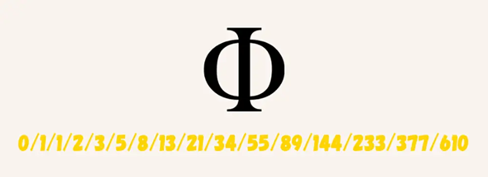
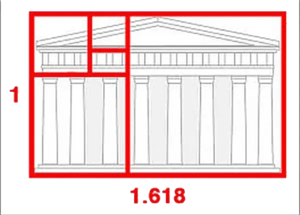

## Exercices de programmation

Il est demandé d'écrire les `docstrings` pour toutes les fonctions réalisées en écrivant quelques résultats escomptés en sortie et de les vérifier en important le module `doctest` avec le code ci-dessous.

```Python
if __name__ == '__main__':
  import doctest
  doctest.testmod(verbose=True)
```

On donne la présentation usuelle pour la `docstring` d'une fonction à travers un exemple :

```Python
def eleve_au_carre(n):
    """
    renvoie le carré du nombre entier n
    param : n : int
    return : int
    >>> eleve_au_carre(4)
    16
    """
    return n**2
```

On n'hésitera pas également à ajouter des commentaires en les précédant du caractère # ; l'interpréteur Python ignore tout ce qui suit jusqu'à la fin de la ligne courante.
On réalisera un fichier avec l'extension .py par exercice et on les rangera tous dans le même dossier.

### Exercice 1 : de l'utilisation des boucles en programmation

<u>Ce qu'il faut savoir :</u> 

Une <b>bloucle non conditionnelle et bornée</b> se fait avec **`for i in range(n)`** qui produit n tours de boucle, i est une variable qui prend les valeurs de 0 à n-1 ; on peut également décider d'une autre valeur initiale pour la variable, en écrivant par exemple `for i in range(2, n)` qui fait varier la variable i de 2 compris à n-1.

Par exemple : on affiche 5 fois le mot "salut" ainsi que l'état de la variable

```Python
>>> for tour in range(5):
    print(tour,"salut")   
0 salut
1 salut
2 salut
3 salut
4 salut
```

Une <b>bloucle conditionnelle et non bornée</b> se fait avec l'instruction **`while`**.

Par exemple : on fait la même chose que précédemment mais d'une autre manière en imposant une condition qui limite l'évolution de la variable : 

```Python
>>> tour=0
>>> while tour<5:
    print(tour,"salut")
    tour +=1    
0 salut
1 salut
2 salut
3 salut
4 salut
```

Problème : Une légende de l'Inde ancienne raconte que le jeu d'échecs a été inventé par un vieux sage que son roi voulut remercier en lui affirmant qu'il lui accorderait n'importe quel cadeau en récompense. Le vieux sage demanda qu'on lui fournisse simplement un peu de riz pour ses vieux jours, et plus précisément un nombre de grains de riz suffisant pour qu'on puisse en déposer 1 sur la première case du jeu qu'il venait d'inventer, deux sur la suivante, quatre sur la troisième, en doublant ainsi chaque fois le nombre de grains déposés, et ainsi de suite jusqu'à la 64e case. 

Écrire un script qui permet d'afficher le résultat suivant :

numero de case :  1  ; nombre de grains déposés sur cette case :  1.0  ; nombre total de grains déposés sur l'échiquier:  1.0    

numero de case :  2  ; nombre de grains déposés sur cette case :  2.0  ; nombre total de grains déposés sur l'échiquier:  3.0   

numero de case :  3  ; nombre de grains déposés sur cette case :  4.0  ; nombre total de grains déposés sur l'échiquier:  7.0

etc...    

numero de case :  64  ; nombre de grains déposés sur cette case :  ?  ; nombre total de grains déposés sur l'échiquier:  ?

N.B : pour otenir le résultat en notation scientifique, on écrira non pas 1 qui est du type int mais 1.0 qui est du type float.

### Exercice 2 : de l'utilisation de l'instruction conditionnelle if

La structure conditionnelle utilise les mots : **`if ; elif ; else`** dans cet ordre.
`elif` est utilisé dans le cas où se présentent plusieurs alternatives.

<u>Exemple</u>: 

On se propose d'écrire un petit programme qui va répondre à l'objectif suivant que l'on traduit d'abord en langage naturel : un utilisateur entre son âge, le programme concluera que l'individu est soit un enfant (<10), soit un adolescent (≥10 ; <19), soit un adulte (≥19).

```Python
age=int(input("Entrez votre âge s.v.p : "))#le résultat d'un input est une chaîne de caractères, d'où la nécessité de la convertir en entier avec int()
if age <10:
    print("Vous êtes un enfant")
elif age>=10 and age<19:
    print("Vous êtes un adolescent")
else:
    print("Vous êtes un adulte")
```

Connaissance : le symbole % est appelé <b>modulo</b>, il donne le reste de la division de deux nombres : 

```Python
>>> 9/2
4.5
#le résultat de la division
>>> 9%2
1
#le reste de la division
>>> 9//2
4
#le quotient de la division
```

1) Dans un premier temps, écrire un script qui permet d'afficher sur une seule ligne, séparés par le caractère " ; ", les 20 premiers multiples de 7 en utilisant l'instruction while. Pour afficher une variable sans changer de ligne et en insérant le caractère " ; ", on utilise l'instruction print(variable, end=" ; " ).   

Vous devez obtenir :
0;7;14;21;28;35;42;49;56;63;70;77;84;91;98;105;112;119;126;133;

2) Réaliser ensuite la fonction affichage(m,n) dont la docstring vous est donnée.

```Python
def affichage(m,n):
    """
    affiche les n premiers multiples de m séparés par ;
    param : m : int
    param : n : int
    return : None 
    # la fonction ne renvoie effectivement rien mais affiche quelque chose
    >>> affichage(7,20)
    0;7;14;21;28;35;42;49;56;63;70;77;84;91;98;105;112;119;126;133;
```

3) Amélioration : faire en sorte d'indiquer à l'aide d'une * les multiples de m qui sont aussi des multiples de 3. On utilisera l'instruction conditionnelle `if`, l'opérateur modulo `%` qui donne le reste de la division entière de 2 nombres, et l'opérateur de comparaison `==` .

```Python
def affichage_ameliore1(m,n):
    """
    affiche les n premiers multiples de m séparés par ; et ajoute * pour un multiple de 3
    param : m : int
    param : n : int
    return : None
    >>> affichage_ameliore1(7,20)
    0*;7;14;21*;28;35;42*;49;56;63*;70;77;84*;91;98;105*;112;119;126*;133;
```

4) De la même façon indiquer également à l'aide d'un ! les multiples de m qui sont aussi des multiples de 2.

```Python
def affichage_ameliore2(m,n):
    """
    affiche les n premiers multiples de m séparés par ; et ajoute * pour un multiple de 3 et ou ! pour un multiple de 2
    param : m : int
    param : n : int
    return : None
    >>> affichage_ameliore2(7,20)
    0*!;7;14!;21*;28!;35;42*!;49;56!;63*;70!;77;84*!;91;98!;105*;112!;119;126*!;133;
    """
```


### Exercice 3 : interagir avec l'utilisateur avec input

Une entreprise fournit des ramettes de papier à prix dégressif en fonction du nombre de lots achetés : les 50 premiers lots sont vendus 3,68€, au-delà chaque lot est vendu 3,22€. Écrire une fonction `prix(n)` qui lorsqu'on saisit le nombre `n` de lots achetés retourne (avec un return) le prix à payer puis procéder à l'affichage (avec un print) du résultat.

```Python
>>> %Run exercices_programmation_snt.py
nombre de lots de ramettes de papier achetés ? 100
Il vous en reviendra 345.0€
```

Utiliser :

1) `input` pour interroger l'utilisateur ; le résultat est une chaîne de caractères à convertir en nombre entier à l'aide de `int()`.

exemple :
```Python
nombre=int(input("nombre de lots de ramettes de papier achetés ? "))
```
2) la concaténation (addition) de chaînes de caractères ; transformer un nombre en chaîne de caractères se fait avec `str()`.

exemple :

```Python
>>> variable=4
>>> "vous avez acheté "+str(variable)+ " livres"
'vous avez acheté 4 livres'
```

### Exercice 4 : manipuler les élements d'un tuple

Un cinéma propose un pass mensuel à 15€ permettant d'obtenir une réduction sur le prix des séances : sans réduction la séance est à 8,70€, alors qu'avec le pass la séance est à 5,50€. 
Sans résoudre mathématiquement le problème, écrire une première fonction `abo1(n)` qui renvoie (avec un return) une chaîne de caractères et qui permet d'afficher (en utilisant dans un deuxième temps l'instruction `print()`) s'il est avantageux de prendre le pass ou non en fonction du nombre ` n` de séances dans le mois ; la fonction affiche également sur la même ligne le prix total à payer et l'avantage que représente ce choix.

```Python
>>> %Run exercices_programmation_snt.py
combien de séances de cinéma allez-vous prendre ? 2
Ne prenez pas le pass, il est désavantageux ; vous payez 17.4€ sans le pass au lieu de 26.0€ avec le pass
>>> %Run exercices_programmation_snt.py
combien de séances de cinéma allez-vous prendre ? 8
Prenez le pass, il est avantageux ; vous payez 59.0€ avec le pass au lieu de 69.6€ sans le pass
```
Écrire maintenant une deuxième fonction `abo2(n)` qui renvoie cette fois deux informations numériques sous la forme d'un tuple, la première information étant le prix sans abonnement, la seconde le prix avec abonnement. Pour renvoyer deux valeurs a et b sous forme de tuple, écrire `return (a,b)`.

```Python
>>> abo2(2)
(17.4, 26.0)
>>> abo2(8)
(69.6, 59.0)
```

Une fois que l'on dispose de la fonction `abo2(n)` précédente, écrire une fonction `avantage()` qui utilise cette fonction et qui renvoie le nombre de séances à partir duquel le pass devient avantageux. 

Pour récuperer la première et la deuxième valeur d'un tuple, procéder ainsi : 

```Python
>>> doublet=(10,17)
>>> doublet[0]
10
>>> doublet[1]
17
```

```Python
>>> %Run correction_exercices_programmation_snt.py
Prendre le pass devient avantageux à partir de 5 séances.
```

Indication : on augmente le nombre n de séances et on compare les prix avec et sans abonnement.

### Exercice 5 : parcourir les éléments d'une liste

1) Écrire un programme qui analyse un par un tous les éléments d'une liste de mots par exemple liste_complete=['Jean','Maximilien','Brigitte','Sonia','Jean-Pierre'] pour générer deux nouvelles listes : l'une contiendra les mots comportant moins de 6 caractères, l'autre comportant les mots de plus de 6 caractères.

**Indications** : 

a) On utilise la fonction intégrée `len()` qui renvoie la longueur d'une chaîne de caractères et la méthode `append` associée à une occurence d'objet de type liste qui permet d'ajouter un élément à cette liste. 

Exemple : 

```Python
>>> liste=[3,"chien"]
>>> len(liste)
2
>>> liste.append(2.0)
>>> liste
[3, 'chien', 2.0]
```

b) On peut parcourir les éléments d'une liste de deux manières, soit élément après élément, soit index d'élément après index d'élément.

```Python
for element in liste:
    print(element)
    
for i in range(len(liste)):
    print(liste[i])
```

2) Amélioriation : l'utilisateur est invité à entrer sans cesse de nouveaux noms, jusqu'à ce qu'il décide de terminer en frappant `<Enter>` en guise d'entrée. Le programme se termine avec l'affichage des deux listes. Créer une fonction `traitement` qui admettra en argument la liste ainsi constituée et qui en sortie affichera les deux listes comme précédemment.


### Exercice 6 : à la recherche du nombre d'or

La suite de Fibonacci se construit comme ceci : les deux premiers termes valent 1, puis chaque terme est la somme des deux précédents.
F(1)=1
F(2)=1
F(3)=2
F(4)=3
F(5)=5
F(6)=8....

Proposer un fonction `Fibo(n)` permettant de déterminer le n-ième terme de la suite de Fibonacci.

```Python
>>> Fibo(38)
39088169
```
 

 

Comme l'affirme cet extrait de wikipédia à propos du nombre d'or, il existe une relation entre le nombre d'or et la suite de Fibonacci étudiée précédemment. Ce nombre est en effet la valeur du rapport F(n+1)/F(n) quand n est très grand (ou encore la limite qu'atteint le quotient des termes consécutifs de la suite de Fibonacci quand ceux-ci sont très grands). Proposer une fonction qui permet d'approcher la valeur du nombre d'or donnée dans le document à 10<sup>-10</sup> près.

```Python
>>> nombre_or()
(25, 1.6180339886704431)
```

On sera amené à utiliser la fonction `abs()` qui donne la valeur absolue d'un nombre.
```Python
>>> abs(-10)
10
>>> abs(10)
10
```

Applications du nombre d'or dans des domaines variés :


 

 

 



### Exercice 7 : faire de l'aléatoire avec le module random

1) Écrire une fonction  `lancers` telle que `lancers(n)` simule n lancers d'un dé équilibré à 6 faces et renvoie le résultat sous forme de liste.
On importera la bibliothèque `random` pour pouvoir appeler la fonction `randint` de cette bibliothèque, telle que random.randint(n,p) renvoie un entier aléatoire entre n et p, n et p étant compris.

```Python
>>> import random
>>> random.randint(2,8)
5 
```

```Python
>>> lancers(4)
[2, 1, 4, 5]
>>> lancers(4)
[6, 1, 1, 1]
>>> lancers(4)
[4, 4, 6, 2]
>>> lancers(4)
[2, 5, 6, 1]
```

Indications : dans la fonction `lancers(n)`, créer d'abord une liste vide à laquelle on ajoute autant de fois qu'il y a de lancers réalisés, c'est-à-dire n fois, au moyen de la méthode `append`,  les résultats des tirages au sort en utilisant `random.randint` ; comme l'action est répétitive puisqu'il y a n lancers, on utilise une boucle `for..in range..`. La liste ainsi complétée est renvoyée à l'issue de la boucle par la fonction au moyen de `return`.

2) Écrire une fonction `piece` telle que `piece(n)` simule n lancers d'une pièce équilibrée et renvoie la fréquence des "piles" observés.

```Python
>>> pieces(400)
0.47
>>> pieces(4000)
0.49975
```
Indications : dans le même esprit que l'exercice précédent, mais cette fois-ci avec une pièce et non un dé, on place dans la fonction une variable qui sert de compteur initialement à 0 qui se charge de compter les piles (on peut décider que pile c'est la sortie de 1 et que face c'est la sortie de 0); à la fin des n lancers on renvoie la proportion de "piles" parmi les n lancers.

3) Écrire une fonction `truquee` telle que `truquee(n,p)` simule n lancers d'une pièce truquée, dont la probabilité de faire "piles" vaut p, et renvoie la fréquence des "piles" observées.

Indications : la fonction random() de la librairie random génère un nombre compris entre [0,1[ ; random.random()+0.6 génère un nombre compris entre [0.6,1.6[ ; int(random.random()+0.6) génère un nombre qui vaut 0 pour tous les nombres compris dans l'intervalle [0.6,1[ d'étendue 0.4 et 1 pour tous les nombres compris entre [1,1.6[ d'étendue 0.6 ; on a donc 60% de chance d'avoir 1 et 40% de chance d'avoir 0.
La fonction int() donne en effet la partie entière du nombre.

```Python
>>> random.random()
0.6271423151497822
>>> int(0.8)
0
>>> int(1.5)
1
>>> truquee(100,0.6)
0.65
>>> truquee(1000,0.6)
0.587
>>> truquee(10000,0.6)
0.6067
>>> truquee(100000,0.6)
0.60069
```

### Exercice 8 : dessiner avec le module random

1) Que fait la fonction `trace` définie ci-dessous ?
Dans un premier temps, répondre sans exécuter le programme.

```Python
from turtle import *
def trace(n,larg):
    reset()
    for i in range(1,n+1):
        left(90)
        forward(larg*i)
```

2) Écrire un programme qui permet de tracer des triangles en spirales.


 

Indications : s'inspirer du code de l'exercice 15.


Aller plus loin...

### Exercice 9 

Traiter l'[exercice1 du sujet n°3](https://github.com/VLesieux/NSI-Terminale/blob/master/Banque_Sujets_2021/21_NSI_03/21_NSI_03.pdf) de la banque des sujets de Terminale NSI ; il s'agit de programmer la fonction multiplication en utilisant uniquement les opérations addition et soustraction.

### Exercice 10 

Traiter l'[exercice1 du sujet n°5](https://github.com/VLesieux/NSI-Terminale/blob/master/Banque_Sujets_2021/21_NSI_05/21_NSI_05.pdf) de la banque des sujets de Terminale NSI ; il s'agit d'écrire une fonction permettant de passer de l'écriture binaire d'un entier à sa valeur décimale.

### Exercice 11 

Traiter l'[exercice1 du sujet n°9](https://github.com/VLesieux/NSI-Terminale/blob/master/Banque_Sujets_2021/21_NSI_09/21_NSI_09.pdf) de la banque des sujets de Terminale NSI ; il s'agit d'écrire une fonction permettant de calculer la moyenne d'une série de notes coefficientées.


### Exercice 12

Traiter l'[exercice2 du sujet n°19](https://github.com/VLesieux/NSI-Terminale/blob/master/Banque_Sujets_2021/21_NSI_19/21_NSI_19.pdf) de la banque des sujets de Terminale NSI ; il s'agit d'écrire une fonction permettant de coder un message selon le code de César.


### Exercice 13

Traiter l'[exercice2 du sujet n°20](https://github.com/VLesieux/NSI-Terminale/blob/master/Banque_Sujets_2021/21_NSI_20/21_NSI_20.pdf) de la banque des sujets de Terminale NSI ; il s'agit d'écrire une fonction qui retourne si oui ou non une chaîne de caractères ou un nombre est un palindrome.