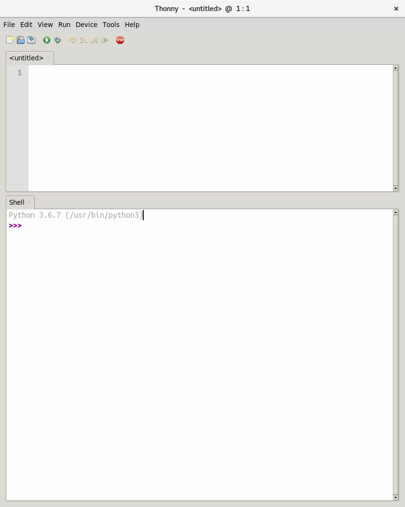
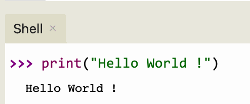
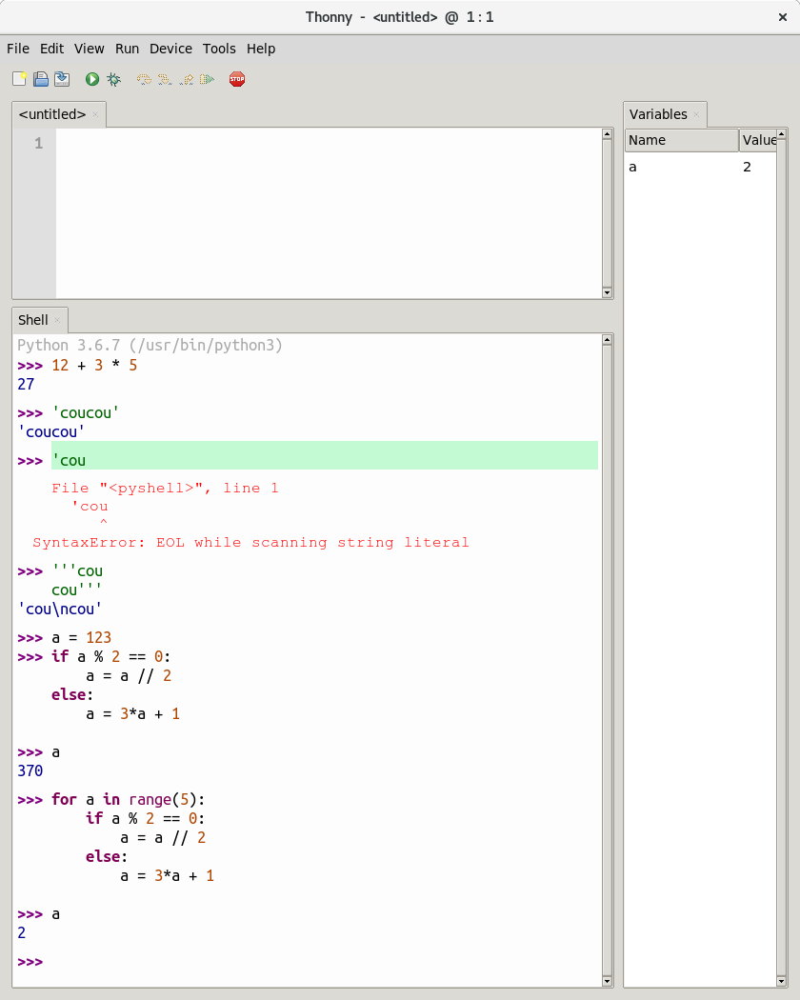
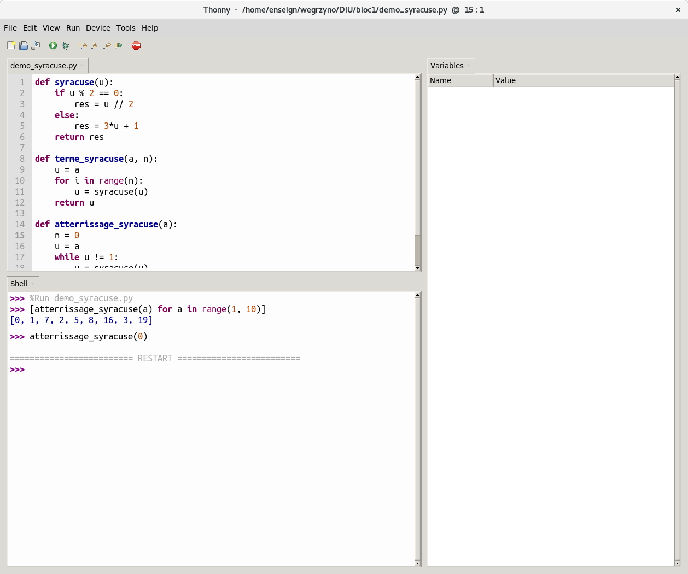
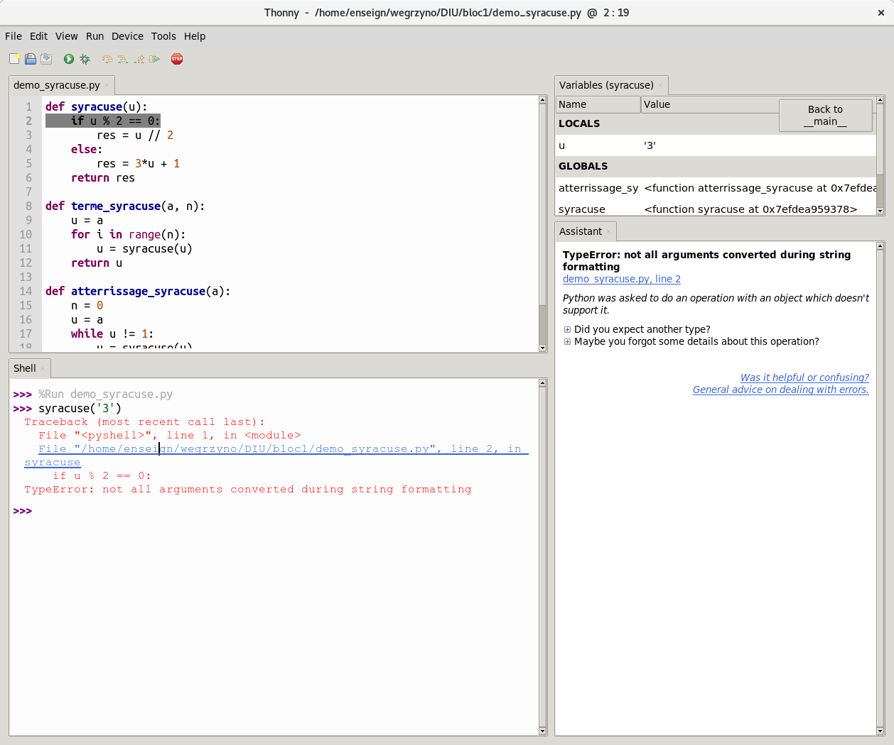
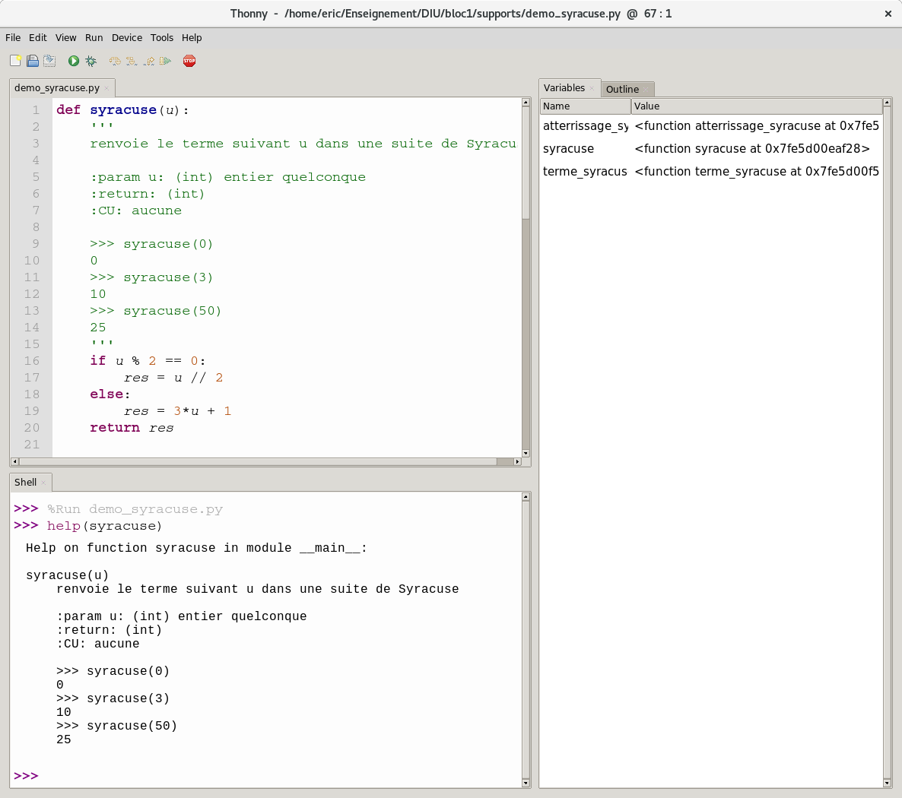

# Thonny


Thonny est un *environnement de développement intégré* (EDI ou IDE en anglais pour 
*Integrated Development Environment*) qui a été particulièrement bien conçu pour les programmeurs débutant en Python ; c'est un outil puissant qui facilite le processus de développement en Python en fournissant une gamme de fonctionnalités et d'outils essentiels pour écrire, déboguer et gérer efficacement des projets Python.


La dernière version disponible à ce jour (septembre 2023) est la 3.10.

Site officiel pour télécharger l'application : [Thonny](https://thonny.org)

**Remarque** : distinguer Python qui est un langage et Thonny qui est un environnement intégré de programmation en Python.


## Utilisation de base
Lorsqu'on lance Thonny la première fois, on découvre une fenêtre avec sa barre de menus usuels, une rangée de boutons, et deux panneaux correspondant à
* l'éditeur (l'onglet correspondant est nommé initialement `<untitled>`)
* l'interpréteur (l'onglet correspondant est nommé `Shell`)



## Le shell
Le *shell* est la zone dans laquelle l'utilisateur intéragit/dialogue avec l'interpréteur Python.

### Dialogue avec l'interpréteur

L'*invite de commande* (ou prompt) `>>>` attend une instruction.    Une instuction doit être écrite sur une seule ligne sauf si:

* elle est parenthésée (liste : [], tuples : (), dictionnaires : {}, chaînes de caractères avec triple délimiteur : ''' ''')     
* elle est composée : instructions conditionnelles (if ...) , itérations (for ...)

Mon premier dialogue avec l'interpréteur :



### L'explorateur de variables

* faire apparaître une vue sur les variables définies par le programmeur dans la session courante : menu View/Variables
* un nouveau panneau (onglet `Variables`) apparaît sur la droite qui présente les variables en donnant leur nom et leur valeur
* dans le shell ajouter une définition d'une nouvelle variable, puis modifier sa valeur. observer dans la vue sur les variables



### Facilités de dialogue 

* utilisation historique via la flèche haut du clavier
* complétion automatique via la touche TAB du clavier (sera revue avec l'éditeur)
* possibilité de «nettoyer» le shell via clik droit option `clear`

## L'éditeur
L'éditeur permet la rédaction de *scripts* (fichiers contenant du code Python). Ces scripts peuvent être exécutés et utilisés dans le shell

### Avantages de l'éditeur

* effectue une sauvegarde à chaque exécution (demande un nom de fichier si 1ère exécution) => toute modification est sauvegardée
* coloration syntaxique permettant de visualiser des erreurs :
  * des mots clés du langage (`def`, `if`, `for`, `while`, `True`, `False` ...)
  * des constantes littérales (couleurs distinctes pour nombres et chaînes de caractères)
  * coloration des régions marquées par un délimiteur ouvert mais non fermé (chaines de caractères, listes, tuples, dictionnaires, ...)
* **indentation automatique** lorsque nécessaire :  l'indentation est un moyen de structurer visuellement votre code en utilisant des espaces ou des tabulations pour montrer les blocs de code imbriqués. C'est une caractéristique importante de la syntaxe Python, car elle indique comment le code est organisé et quelles parties du code sont liées les unes aux autres.
* complétion automatique avec la touche TAB => favorise l'utilisation de noms longs pour les paresseux
* visualisation de la portée des variables

### Exécution d'un script, plusieurs possibilités

* via le menu `Run/Run current script`
* via le bouton flèche verte
* via la touche F5

Si le script vient d'être créé (onglet nommé `<untitled>`), boîte de dialogue pour demander un nom de script. Si le nom donné ne contient pas l'extension `.py` Thonny la rajoute.

**NB** : lors de l'éxécution d'un script, le répertoire de travail est celui dans lequel est sauvegardé le script. (Important si besoin d'accéder à des fichiers)

**Remarque :** si un script ne contient aucune instruction d'affichage (`print`), alors son exécution ne se traduit que par la mention `%Run nom_script.py` dans le shell et rien d'autre.

=> un script peut 

* ne contenir que des définitions de variables, fonctions, ... et on utilise ces définitions dans le shell
* contenir des instructions d'affichage (ou d'`input`) qui seront immédiatement exécutées et laisseront des traces dans le shell (éviter leur abus en phase de développement de fonctions).

### Illustration de ces points avec un exemple simple: la suite Syracuse
cf fichier [demo_syracuse.py](assets/demo_syracuse.py)

Cet exemple sera étudié dans le détail ; pour le moment il faut juste savoir qu'il s'agit d'une suite de valeurs construite à partir d'une valeur initiale ; pour obtenir la valeur suivante :

* on divise la valeur initiale par 2 si celle-ci est paire,
* on la multiplie par 3 en lui ajoutant 1 si la valeur initiale est impaire ; 

il s'avère qu'au bout d'un certain temps la suite atteint toujours la valeur 1 puis finit par se répèter indéfiniment (1,4,2,1,4,2…).

* commencer par écrire la première fonction `syracuse` sans docstring. Profiter de 
  l'ouverture de la parenthèse des paramètres pour souligner la coloration syntaxique (en gris).
  
* exécuter => il faut donner un nom au script (qui change l'intitulé de l'onglet) => il ne se passe rien dans le shell. 
  
  ATTENTION pour la suite (docstring) il ne faut jamais nommer le script du même nom qu'une des fonctions.
  
  Noter que dans la vue sur les variables, les variables précédemment définies ont disparues, et un seul  nom est défini : `syracuse` de valeur `<function syracuse at ...>`
  
  => on travaille toujours dans un environnement de variables «propre» : celui des définitions du script plus éventuellement quelques variables définies dans la session en cours  
  
* dans le Shell utiliser la fonction `syracuse`  en faisant par exemple syracuse(3) 

* dans le Shell utiliser la complétion automatique pour appeler la fonction `terme_syracuse` ; contruire la liste des valeurs partant de 9 en écrivant dans le Shell :

  `[terme_syracuse(9,i) for i in range(1,30)]`

* écrire la troisième fonction `atterrissage_syracuse` sans docstring.

* exécuter dans le Shell `atterrissage_syracuse(9)` 

* exécuter dans le Shell  :

  `[atterrissage_syracuse(a) for a in range(1,10)]`

   À quoi cela correspond ?

* essayer avec 0 => calcul infini : pourquoi ? => nécessité d'interrompre le calcul => deux solutions 
  - usage du bouton panneau  stop (en haut en rouge)
  - usage de la combinaison Ctrl+C au clavier
  les issues ne sont pas identiques : 
  - le premier redémarre un nouvel interpréteur (et donc les variables sont perdues)
  - le second interrompt l'exécution de la commande en cours, et laisse intact l'environnement tel qu'il était au moment de l'interruption.



## Naviguer d'une fonction à l'autre

* aller dans le menu View/Outline : un nouvel onglet `Outline` apparait dans le panneau à côté des variables
* cliquer sur l'un ou l'autre des items qui y figurent permet de naviguer dans l'éditeur


## Localiser une erreur 

* dans le shell taper la commande `syracuse('3')` => cela se passe mal, pourquoi ? : plusieurs lignes rouges sont écrites ! Elles se lisent de bas en haut.
* dernière ligne : une exception est déclenchée portant le nom de `TypeError`
* ligne du dessus la ligne de code ayant déclenché l'exception
* ligne du dessus lien vers le fichier et la ligne de ce fichier contenant ce code
* cliquer sur le lien amène à la ligne de code responsable surlignée 
* et dans la vue sur les variables, on visualise les variables locales et globales au moment du déclenchement de l'exception.



## Docstring

* partir de la fonction `help` dans le shell sur quelques fcts prédéfinies (`abs`, `len`, `print`)
* essayer `help` avec les fcts du script `syracuse` => pas grand chose
* on ajoute une docstring dans `syracuse`
  ```python
  def syracuse(u):
      '''
      renvoie le terme suivant u d'une suite de Syracuse
	  '''
  ```
  une *docstring* de fonction est une chaîne de caractères placée immédiatement après l'en-tête, qui s'étend généralement sur plusieurs lignes et donc qui est délimité par un triple `'` ou un triple `"`.
* exécuter et utiliser la fonction `help` sur `syracuse`
* on complète la doctring avec des informations de type des paramètres et de valeur renvoyée, en mentionnant les contraintes (ou conditions) d'utilisation (ici aucune) et en donnant quelques exemples (préparation aux doctests vus à la session prochaine)
  ```python
  def syracuse(u):
      '''
      renvoie le terme suivant u d'une suite de Syracuse
    
      :param u: (int) entier quelconque
	    :return: (int)
	    :CU: aucune
    
      >>> syracuse(0)
      0
      >>> syracuse(3)
      10
      >>> syracuse(50)
      25
    '''
  ```
* faire de même pour les deux autres fonctions



Le module  `doctest  ` ci-dessous à placer en fin de fichier permet de valider des test placés dans la docstring :

  ```python
  if __name__ == '__main__':
    import doctest
    doctest.testmod(verbose=True)
  ```
On obtient après exécution :

  ```python
>>> %Run exemple_syracuse.py
Trying:
    syracuse(0)
Expecting:
    0
ok
Trying:
    syracuse(3)
Expecting:
    10
ok
Trying:
    syracuse(10)
Expecting:
    5
ok
3 items had no tests:
    __main__
    __main__.atterrissage_syracuse
    __main__.terme_syracuse
1 items passed all tests:
   3 tests in __main__.syracuse
3 tests in 4 items.
3 passed and 0 failed.
Test passed.
  ```
Si maintenant on place dans la docstring de la fonction syracuse    

  ```python
 >>> syracuse(3)
    13
  ```
On obtient :

  ```python
>>> %Run exemple_syracuse.py
Trying:
    syracuse(0)
Expecting:
    0
ok
Trying:
    syracuse(3)
Expecting:
    13
**********************************************************************
File "__main__", line 8, in __main__.syracuse
Failed example:
    syracuse(3)
Expected:
    13
Got:
    10
Trying:
    syracuse(10)
Expecting:
    5
ok
3 items had no tests:
    __main__
    __main__.atterrissage_syracuse
    __main__.terme_syracuse
**********************************************************************
1 items had failures:
   1 of   3 in __main__.syracuse
3 tests in 4 items.
2 passed and 1 failed.
***Test Failed*** 1 failures.
  ```

Le module  `doctest  ` permet donc de révéler des erreurs dans notre code par rapport à nos attentes et s'avère un outil indispensable pour le programmeur.