## Exercices Thème 6 : La photographie numérique

### Exercice 1 : notions de définition et de résolution d'une image

On dispose d'une image carrée dont la définition est de 4 Mpx.   
On rappelle que la **définition** d'une image est le nombre total de pixels sur l'écran, c'est donc le produit du nombre de pixels sur la hauteur par le nombre de pixels sur la largeur de l'image.   
On rappelle que la **résolution** d'un écran est la densité de pixels ; elle s'exprime en ppi (pixels per inch).

1 inch = 1 pouce = 2.54 cm

1. Déterminer les dimensions en cm de cette image :  

- si elle est affichée sur un écran d'iphone de résolution 460 ppi (pixels per inch).  
- si elle est imprimée par une imprimante de résolution 300 dpi (dots per inch).  

2. Compléter le programme suivant ; utiliser `round( ,1)` pour arrondir le résultat avec un seul chiffre après la virgule.

```python
def dimension(definition,resolution):
    """
    Renvoie les dimensions en cm de cette image supposée carrée
    à partir des données definition et resolution
    param : definition : int
    param : resolution : int
    return : float
    >>> dimension(4*10**6,460)
    11.0
    >>> dimension(4*10**6,300)
    16.9
    """
	pass

if __name__ == '__main__':
  import doctest
  doctest.testmod(verbose=True)   
```

3. Application pratique: 
Un magasin propose deux ordinateurs à des prix intéressants.   
Le premier possède un écran de définition 1233 × 925 px et de dimensions 345,44 × 259,08 mm (écran 17").   
Le second a un écran de définition 1219 × 914 px et de dimensions 304,80 × 228,60 mm (écran 15").  
Lequel a la meilleure résolution ?  Considérer une dimension.

### Exercice 2: notion de luminance

La **luminance** relative est une grandeur correspondant à la sensation visuelle de luminosité ; elle varie entre 0 pour le noir et 1 pour le blanc pris comme référence, la pondération est basée sur la sensibilité de l'oeil humain  ; le vert contribue le plus à l'intensité perçue par l'œil humain et le bleu le moins.   
Lorsque l'on dispose du code RVB d'une couleur, que l'on note (R,V,B), le calcul de la luminance se calcule à l'aide de la formule : 

`L = (0.2126 * R + 0.7152 * V + 0.0722 * B)/255`

Le résultat sera arrondi à 2 chiffres après la virgule en utilisant la fonction `round( ,2)` de la manière suivante :

```python
>>> round(1.555,2)
1.55
>>> round(1.556,2)
1.56
```

Compléter la fonction `lum(couleur)` qui renvoie la valeur de la luminance, lorsque la couleur est donnée sous forme d'un triplet (R,V,B).  

```python
def lum(couleur):
    """
    renvoie la luminance (sensation visuelle) associée à couleur définie par le triplet (R,V,B)
    param : tuple
    return : float avec deux chiffres après la virgule
    >>> lum((255,255,255))
    1.0
    >>> lum((0,0,0))
    0.0
    """
    
    
if __name__ == '__main__':
    import doctest
    doctest.testmod(optionflags=doctest.NORMALIZE_WHITESPACE | doctest.ELLIPSIS, verbose=True)
```

Applications : 

1) Demander la luminance de la couleur jaune et la luminance de la couleur cyan ; conclure.

2) " Pour être perçue avec la même intensité, une source de lumière rouge orangée doit être près de 10 fois plus puissante qu’une source de lumière jaune-vert. C’est d’ailleurs de cette couleur que vont être repeintes les ambulances du Samu de l’Essonne, comme le sont souvent les camions de pompiers américains. " [cf. article. ça m'interesse](https://www.caminteresse.fr/societe/quelle-est-la-couleur-la-mieux-percue-par-loeil-humain-1163473/).

Vérifier cette affirmation.

### Exercice 3 : traitements d'une image numérique avec Python

Dans cet exercice nous allons utiliser le module Image de la librairie **PIL** ou **pillow** de Python (à télécharger dans le menu outils du logiciel Thonny).

On suivra [sur ce document pdf](http://vfsilesieux.free.fr/traitements_d_une_me%CC%82me_image.pdf) les différents traitements possibles d'une image avec Python : 

1) transformation noir et blanc
2) transformation filtre rouge
3) transformation filtre vert
4) transformation filtre bleu
5) transformation nuance de gris
6) symétrie verticale
7) symétrie horizontale

Tous ces traitements peuvent être réunis dans une [application en Python](Assets/Transformations_images.py).

On peut réaliser la même chose avec le langage JavaScript : [voir l'application web](http://isnangellier.alwaysdata.net/php/traitement.html)

### Exercice 4 : créer des images numériques de drapeaux

Il s'agit de réaliser, pour chaque drapeau, un programme permettant d'obtenir les drapeaux suivants (200×200) portant chacun un fin liseré noir. 

→ On trouvera ici une application web permettant [le codage des couleurs](http://isnangellier.alwaysdata.net/php/colours.html) .

1) France : 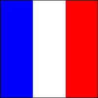

Donnée : code pour la réalisation du drapeau français ; l'image au format jpg, par exemple `drapeau_france.jpg`, se formera **dans le même le dossier** que le programme à l'extension python, `drapeau_france.py` :

```python

from PIL import Image# importe le module Image de la bibliothèque PIL nécessaire à la création des images

def drapeau_france():
    (colonne,ligne)=(200,200)
    imagearrivee=Image.new('RGB',(colonne,ligne))
    
# le parcours de toutes les lignes y et colonnes x de l'image pour implanter en (x,y) le pixel de la couleur (r,v,b) de notre choix
    
    for x in range(colonne):
        for y in range(ligne):
            if x<200/3:
                imagearrivee.putpixel((x,y),(0,0,255)) # le bleu
            elif x>200/3 and x<400/3:
                imagearrivee.putpixel((x,y),(255,255,255)) # le blanc
            else:
                imagearrivee.putpixel((x,y),(255,0,0)) # le rouge
                                
# le liseré noir commun à tous les drapeaux

    for x in range(colonne):
        imagearrivee.putpixel((x,0),(0,0,0))
        imagearrivee.putpixel((x,199),(0,0,0))
    for y in range(ligne):
        imagearrivee.putpixel((0,y),(0,0,0))
        imagearrivee.putpixel((199,y),(0,0,0)) 
        
    imagearrivee.save("drapeau_france.jpg")#enregistre l'image

drapeau_france()# appelle la fonction définie précédemment qui n'admet pas de paramètre.
```

2) Belgique : 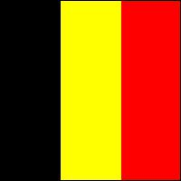

**Indication** : modifier les couleurs du drapeau précédent.

3) Hollande : 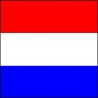

**Indication** : modifier les conditions qui portent maintenant sur les lignes y et non plus sur les colonnes x.

4) Suisse : 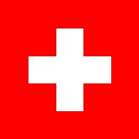

**Indication** : créer le fond rouge, puis une bande blanche horizontale, puis une bande blanche verticale.

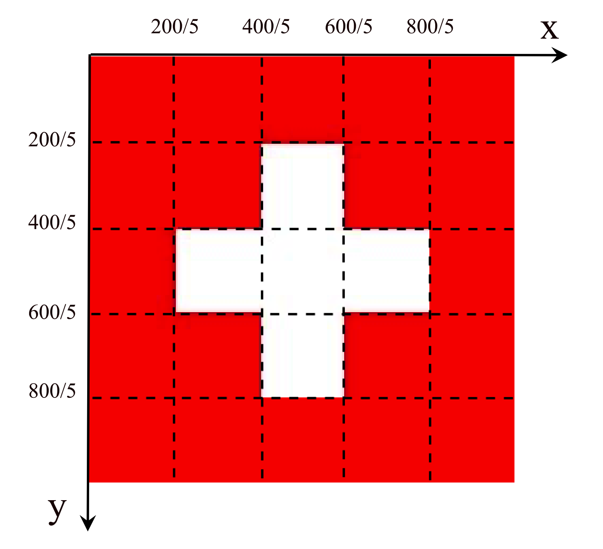

Quand plusieurs conditions doivent être remplies en même temps, utiliser l'opérateur logique `and`.

5) Japon :  

**Indication** : Le disque rouge, qui représente le soleil levant, se situe exactement au centre du drapeau et son diamètre est fixé au 3/5ième de la hauteur du drapeau ; les points à l'intérieur du disque ont la propriété d'être à une distance du centre inférieure au rayon du cercle qui le délimite ; on utilisera pour cela une fonction intermédaire `distance(A,B)`, qui calcule, grâce au théorème de Pythagore, la distance entre deux points A et B dont on connaît les coordonnées cartésiennes. 
Cette fonction devra être introduite **avant** la fonction `drapeau_japon()` car elle doit être  définie au préalable.

```python
def distance(A,B):
    """
    renvoie la distance entre le point A(xA,yA) et le point B(xB,yB)
    param : A : tuple
    param : B : tuple
    return : float
    Exemple
    >>> distance((4,0),(0,3))
    5.0
    """
    return ((A[0]-B[0])**2+(A[1]-B[1])**2)**0.5
```

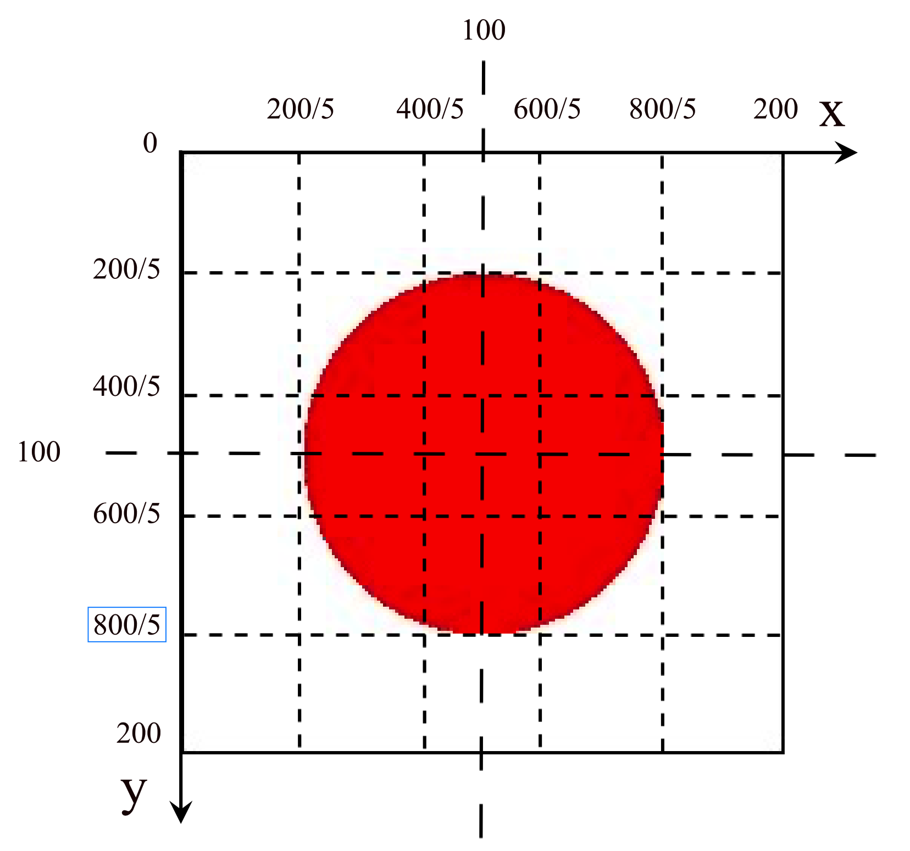


Complément: Niger : (Le diamètre du disque orange est égal aux trois quarts de la hauteur de la bande blanche) 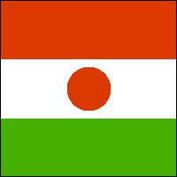

Pour aller plus loin : autres drapeaux : 

- **le drapeau des Seychelles** (situé dans l'ouest de l'océan Indien et rattaché au continent africain) peut être réalisé approximativement ainsi :   

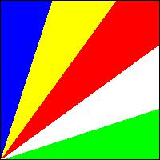

On peut proposer le programme suivant à compléter.
En travaillant avec la liste `couleurs` et l'indice `i` qui permet de parcourir les différents secteurs angulaires, on fait l'économie d'écrire toutes les conditions et on synthètise en une seule ligne l'ensemble des conditions à remplir.

```python

from PIL import Image

import math # on importe le module math pour utiliser math.pi et la fonction math.tan

couleurs=[(0,255,0),.......### à compléter (1) ##########................]

alpha=####### à compléter (2) (l'angle exprimé en radian en fonction de math.pi qui représente 180°)
# on suppose l'angle alpha commun à tous les secteurs angulaires

def drapeau_seychelles():
    (colonne,ligne)=(200,200)
    imagearrivee=Image.new('RGB',(colonne,ligne))
    for x in range(colonne):
        for y in range(ligne):
            X,Y=x,200-y #changement de repère pour avoir l'origine en bas à gauche
            for i in range(5):
                if Y>math.tan(alpha*i)*X and ############# à compléter (3) ##########:
                    imagearrivee.putpixel((x,y),######## à compléter (4) ############)
    
# le liseré noir

    for x in range(colonne):
        imagearrivee.putpixel((x,0),(0,0,0))
        imagearrivee.putpixel((x,199),(0,0,0))
    for y in range(ligne):
        imagearrivee.putpixel((0,y),(0,0,0))
        imagearrivee.putpixel((199,y),(0,0,0)) 
    imagearrivee.save("drapeau_seychelles.jpg")
    
drapeau_seychelles()

```

Explications : une droite passant par l'origine d'équation `y=a*x` partage l'espace en deux demi-plans ; les points du demi-plan inférieur vérifient `y<a*x` tandis que les points du demi-plan supérieur vérifient `y>a*x`.


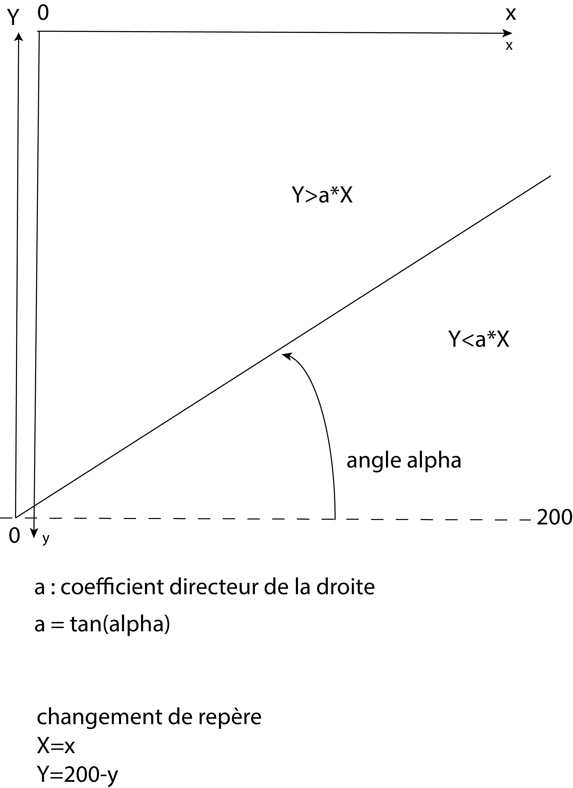

- **le drapeau du Vietnam** : [voir ici les explications ](http://isnangellier.alwaysdata.net/php/Algorithme_localisation_quelconque.html)

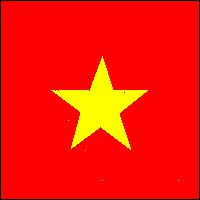

```python

from PIL import Image

etoile=[[51.0,90.0],[89.0,90.0],[102.0,55.0],[113.0,90.0],[149.0,89.0],[119.0,113.0],[131.0,150.0],[100.0,127.0],[70.0,149.0],[80.0,112.0]]

def verifie(X,Y,contour):
    calcul=0
    try:
        for i in range(len(contour)):            
            m,t=10,10            
            if (i==len(contour)-1):
                yA=contour[i][1]
                yB=contour[0][1]
                xA=contour[i][0]
                xB=contour[0][0]
            else:            
                yA=contour[i][1]
                yB=contour[i+1][1]
                xA=contour[i][0]
                xB=contour[i+1][0]            
            if xB!=xA:
                a=(yB-yA)/(xB-xA)
                yK=(yA-a*xA)/(1-a*(X/Y))
                xK=(X/Y)*yK
                m=xK/X
            else:
                xK=xA
                yK=(Y/X)*xK
                m=yK/Y            
            if m>=0 and m<=1:
                if xB!=xA:
                    t=(xK-xA)/(xB-xA)
                else:
                    t=(yK-yA)/(yB-yA)
            if t>=0 and t<=1:
                    calcul+=1 
        if calcul%2==0:
            return False
        if calcul%2==1:
            return True
    except ZeroDivisionError:
        return None

def drapeau_vietnam():
    (colonne,ligne)=(200,200)
    imagearrivee=Image.new('RGB',(colonne,ligne))

    for x in range(colonne):
        for y in range(ligne):
            if verifie(x,y,etoile):
                imagearrivee.putpixel((x,y),(255,255,0))
            else:
                imagearrivee.putpixel((x,y),(255,0,0))
                
# le liseré noir
               
    for x in range(colonne):
        imagearrivee.putpixel((x,0),(0,0,0))
        imagearrivee.putpixel((x,199),(0,0,0))
    for y in range(ligne):
        imagearrivee.putpixel((0,y),(0,0,0))
        imagearrivee.putpixel((199,y),(0,0,0)) 
    imagearrivee.save("Drapeau_vietnam.jpg")
    
drapeau_vietnam()

##### pour trouver les coordonnées des points du contour de l'étoile à 5 branches   

#from turtle import *
#
#def get_mouse_click_coor(x, y):
#    print(x-50, 200-(y+10))
#
#onscreenclick(get_mouse_click_coor)
#
#goto(100,100)
#speed(1)
#right(36)
#for k in range(5):
#    forward(100)
#    left(144)
#    print(position())
#    
#mainloop()
```

### Exercice 5 : interactions avec une image numérique

**Application I** : Comparer la longueur réelle d'un fleuve et la distance à vol d'oiseau entre sa source et son embouchure. [Programme en Python](Assets/longueur_fleuve.py). Idée inspirée par ce [documentaire](https://youtu.be/YIeuCCQoUWc).


**Application II** : Apprendre une mappemonde avec une [application web](http://isnangellier.alwaysdata.net/php/Projet_carte.html) ou une [application écrite en Python](Assets/Mappemonde.py).

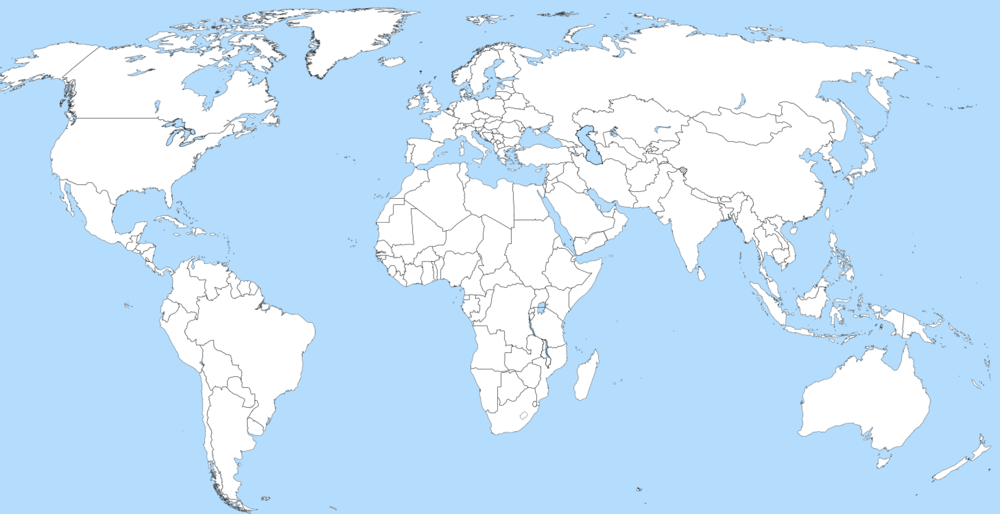

