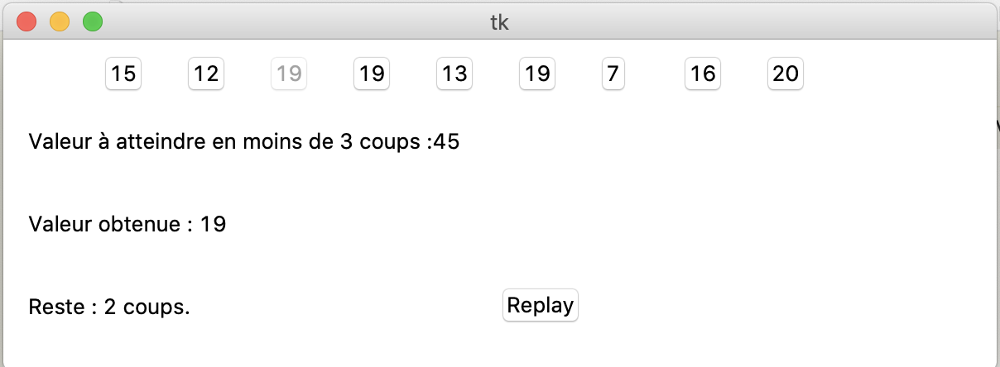
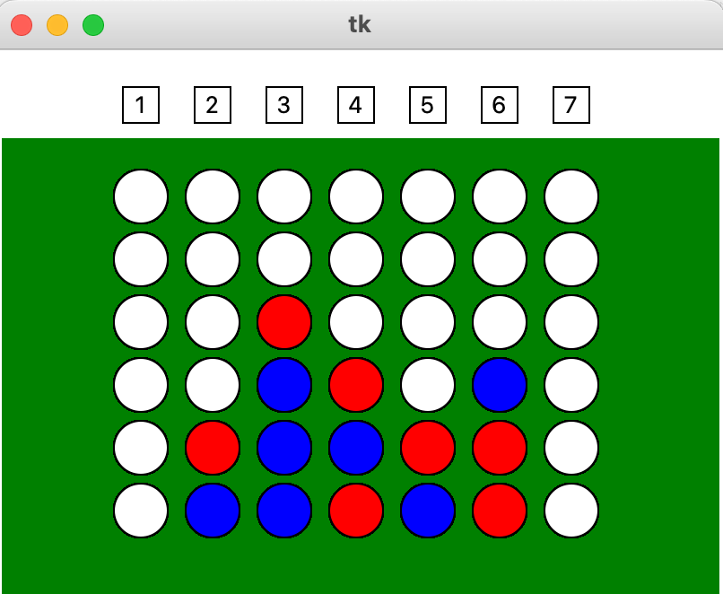

## Exercices Thème 5 : Informatique embarquée et objets connectés

### Exercice 1 : rechercher ses objets connectés

Cet exercice doit être fait chez vous et suppose que vous ayez une box internet chez vous.
Accédez à la page de configuration de votre box (renseignez-vous à l'aide d'un moteur de recherche). Par exemple Freebox est accessible à l'adresse IP locale  192.168.0.254 qu'il suffit de rentrer dans le navigateur pour y accéder.

Recherchez combien d'objets sont connectés via votre box.

### Exercice 2 : réaliser une interface graphique avec Python

On donne ici le code d'un jeu écrit en Python qui utilise la bibliothèque graphique tkinter.
Expliquer comment l'interface du jeu a été créée et interpréter le fonctionnement du programme.



```Python
valeur_a_atteindre=0
Solution=[]    
Suite=[]    
nombre_essais=0    
valeur_obtenue=0    
solution_affiche=""         
from random import randint         
def initialise():    
    global Solution    
    Solution=[]    
    global Suite    
    Suite=[]    
    global nombre_essais    
    nombre_essais=0    
    global valeur_obtenue    
    valeur_obtenue=0   
    global valeur_a_atteindre    
    valeur_a_atteindre=0    
    for i in range(1,10):#on construit une suite de 9 valeurs tirées au hasard entre 0 et 20     
        Suite.append(str(randint(0,21)))   
    print ("Suite de valeurs choisies : ",Suite)    
    CopieSuite=tuple(Suite)#on réalise une copie-témoin de la suite qui va subir des modifications (suppression de valeurs)      
    for i in range(1,4):    
        n=len(Suite)#mesurer la taille de la liste    
        x=randint(0,n-1)#choisit une valeur d'index au hasard sur une liste de plus en plus courte    
        Solution.append(Suite[x])#on ajoute cette valeur à liste Solution    
        valeur_a_atteindre += int(Suite[x])#on calcule au fur et à mesure la valeur à atteindre    
        Suite.remove(Suite[x])#on supprime la valeur de Suite pour qu'elle ne soit pas à nouveau choisie    
    global solution_affiche    
    solution_affiche=';'.join(Solution)    
    print ("Combinaison à réaliser : ", Solution)    
    print (valeur_a_atteindre)  
    L3.config(text="")             
    for i in range(1, 10):    
        B = eval("B" + str(i))    
        B.config(text=str(CopieSuite[i-1]))    
        B.config(command=lambda x=i, y=CopieSuite[i-1]: ajoute(x, y))    
        B.config(state=NORMAL)              
    L1.config(text="Valeur à atteindre en moins de 3 coups : "+str(valeur_a_atteindre))   
    L2.config(text="Valeur obtenue : "+str(valeur_obtenue))         
def ajoute(n,valeur):#le premier paramètre est le numéro du bouton, le second est la valeur à ajouter    
    global valeur_obtenue    
    global nombre_essais    
    nombre_essais+=1    
    valeur_obtenue+=int(valeur)    
    print (valeur_obtenue)    
    L2.config(text="Valeur obtenue : "+str(valeur_obtenue))    
    B=eval("B"+str(n))    
    B.config(state=DISABLED)    
    if valeur_obtenue==valeur_a_atteindre:    
        L3.config(text="Vous avez gagné !")    
        nombre_essais=-1    
    if nombre_essais<3 and nombre_essais>0:    
        L3.config(text="Reste : "+str(3-nombre_essais)+" coups.")    
    if nombre_essais>=3:    
        L3.config(text="Perdu. Une solution était : "+' + '.join(Solution))#affiche les éléments de la liste solution avec le séparateur +     
    
from tkinter import *    
fenetre = Tk()#on crée l'objet fenêtre    
fenetre.geometry('600x200')#la méthode geometry() permet de la redimensionner    
B1=Button(fenetre)    
B2=Button(fenetre)    
B3=Button(fenetre)    
B4=Button(fenetre)    
B5=Button(fenetre)    
B6=Button(fenetre)    
B7=Button(fenetre)    
B8=Button(fenetre)    
B9=Button(fenetre)     
    
Replay=Button(fenetre,text="Replay",command=initialise)    
Replay.place(x=300,y=150)
    
for i in range(1,10):    
    B=eval("B"+str(i))    
    B.place(x=10+50*i,y=10)    
L1=Label(fenetre,text="Valeur à atteindre en moins de 3 coups :"+str(valeur_a_atteindre))    
L1.place(x=10,y=50)    
L2=Label(fenetre,text="Valeur obtenue : "+str(valeur_obtenue))    
L2.place(x=10,y=100)    
L3=Label(fenetre)    
L3.place(x=10,y=150)    
initialise()    
fenetre.mainloop()#la méthode mainloop() permet de lancer un gestionnaire d’événements sur cette fenêtre
```

Pour aller plus loin, on donne ici le code d'un jeu de puissance 4 avec la bibliothèque tkinter.



```Python
from tkinter import*
fenetre=Tk()
canvas1=Canvas(fenetre,width=400,height=40)
canvas1.grid(row=1, column=0)

choix_colonne=None

fini=False

class Bouton(object):
    def __init__(self,canvas,x,y,number):
        self.x=x
        self.y=y
        self.number=number
        self.canvas1=canvas1    
    def represente(self):
        self.canvas1.create_rectangle(self.x-20, self.y-20,self.x,self.y)
        self.canvas1.create_text(self.x-10, self.y-10,text=self.number)

boutons=[(i,(40*i+50,40)) for i in range(1,8)]

Boutons=[]

for i in range(len(boutons)):
    Boutons.append(Bouton(canvas1,boutons[i][1][0],boutons[i][1][1],i+1))
    Boutons[i].represente()
    
limites=[(i,(40*i+30,40*i+50)) for i in range(1,8)]

def aff_mess_vainqueur(plateau):
    """
    : affichage du gagnant
    : param : bool(valeur_joueur)  identification du joueur (True:I;False:II)
    : param : bool(per_gag)  identification gagné ou égalité (True:gagné;False:égalité)
    : return : None
    """
    if etat_final(plateau):
        if test_ligne(plateau,True) or test_colonne(plateau,True) or test_diagonale_up(plateau,True) or test_diagonale_down(plateau,True):
            print('Le joueur I a gagné')
        elif test_ligne(plateau,False) or test_colonne(plateau,False) or test_diagonale_up(plateau,False) or test_diagonale_down(plateau,False):
            print('Le joueur II a gagné')
        else:
            print('Egalité')

def detec_clic(event):
    global valeur_joueur
    valeur_joueur=not(valeur_joueur)
    global choix_colonne
    global config
    global fini
    x , y = event.x, event.y
    if y>=20 and y<=40 and not fini:
        for valeurs in range(len(limites)):
            if x>=limites[valeurs][1][0] and x<=limites[valeurs][1][1]:                
                choix_colonne=limites[valeurs][0]
                evolution_jeu(valeur_joueur,config,choix_colonne)
                afficher_config(config)
                aff_evolution_jeu(config)
    fini=etat_final(config)
    if fini:
        aff_mess_vainqueur(config)
   
canvas1.bind("<Button-1>", detec_clic)

canvas2=Canvas(fenetre,width=400,height=500,bg="green")
canvas2.grid(row=2, column=0)

class Jeton(object):
    def __init__(self,canvas,x,y,couleur):
        self.x=x
        self.y=y
        self.couleur=couleur
        self.canvas2=canvas2
    def represente(self):
        self.canvas2.create_oval(self.x-15,self.y-15,self.x+15,self.y+15,width=1,fill=self.couleur)


Jetons=[]

def afficher_config(config):
    for ligne in range(6):
        for colonne in range(7):
            if config[ligne][colonne]==0:
                Jetons.append(Jeton(canvas2,40*colonne+80,35*ligne+35,"white"))
            elif config[ligne][colonne]==1:
                Jetons.append(Jeton(canvas2,40*colonne+80,35*ligne+35,"red"))
            else:
                Jetons.append(Jeton(canvas2,40*colonne+80,35*ligne+35,"blue"))                
    for i in range(len(Jetons)):
        Jetons[i].represente() 

##############################################################################################
valeur_joueur=False

def situation_init():
    """
    : création de la situation initiale du jeu
    : renvoie le plateau initiale
    : param : Rien
    Exemple:
    """
    plateau=[
    [0, 0, 0, 0, 0, 0, 0],
    [0, 0, 0, 0, 0, 0, 0],
    [0, 0, 0, 0, 0, 0, 0],
    [0, 0, 0, 0, 0, 0, 0],
    [0, 0, 0, 0, 0, 0, 0],
    [0, 0, 0, 0, 0, 0, 0],
    ]
    return plateau


def aff_evolution_jeu(plateau):
    """
    : permet d'afficher le plateau dans la console
    : param : plateau : list
    : return : None
    Exemple:
    >>> config = [[0, 0, 0, 0, 0, 0, 0], [0, 0, 0, 0, 0, 0, 0], [0, 0, 0, 0, 0, 0, 0], [0, 0, 0, 0, 0, 0, 0], [0, 1, 0, 0, 1, 0, 0], [0, 1, 2, 2, 2, 2, 0]]
    >>> aff_evolution_jeu(config)
    1 2 3 4 5 6 7
    · · · · · · · 
    · · · · · · · 
    · · · · · · · 
    · · · · · · · 
    · ■ · · ■ · · 
    · ■ □ □ □ □ · 
    """
    print("1 2 3 4 5 6 7")
    numero=1
    for ligne in plateau:
        for element in ligne:
            if element==0:
                print('\u00B7',end=' ')
            if element==1:
                print( '■',end=' ')
            if element==2:
                print( '□',end=' ')
        print()

def test_jeu_rempli(plateau):
    """
    >>> test_jeu_rempli(situation_init())
    False
    """
    for i in range(8):
        for j in range(8):
            if plateau[i][j]==0:
                return False
    return True

def choix_joueur(valeur_joueur,plateau):
    """
    : Demande au joueur d'effectuer un choix d'allumettes à enlever (2 ou 3)
    : param : bool(valeur_joueur) identification du joueur (True:I;False:II)
    : param : int(param_jeu) nombres d'allumettes
    : return : int(choix) choix du joueur
    Remarque: Ne pas faire de doctest sur des fonctions d'entrées /sorties
    """
    if valeur_joueur:
        joueur='I blanc'
    else:
        joueur='II noir'
    #init choix jeu
    choix=False
    #Les joueurs doivent ramasser tour à tour 2 ou 3 allumettes
    while choix !=True:
        question= input('JOUEUR {} : Choisir la position de votre pion : '.format(joueur))
        position= int(question[0])
        choix=test_validite_choix(valeur_joueur,position,plateau)
    return position

def evolution_jeu(valeur_joueur,plateau,choix_joueur):
    """
    : permet de faire évoluer le jeu
    : param : int(param_jeu) nombres d'allumettes
    : param : bool(valeur_joueur) identification du joueur (True:I;False:II)
    : return : int(param_jeux) le nombres d'allumettes restantes
    >>> jeu=situation_init()
    >>> aff_evolution_jeu(evolution_jeu(True,jeu,7))
    1 2 3 4 5 6 7
    · · · · · · · 
    · · · · · · · 
    · · · · · · · 
    · · · · · · · 
    · · · · · · · 
    · · · · · · □ 
    >>> config = [[0, 0, 0, 0, 0, 0, 0], [0, 0, 0, 0, 0, 0, 0], [0, 0, 0, 0, 0, 0, 0], [0, 0, 0, 0, 0, 0, 0], [0, 1, 0, 0, 1, 0, 0], [0, 1, 2, 2, 2, 2, 0]]
    >>> aff_evolution_jeu(config)
    1 2 3 4 5 6 7
    · · · · · · · 
    · · · · · · · 
    · · · · · · · 
    · · · · · · · 
    · ■ · · ■ · · 
    · ■ □ □ □ □ · 
    >>> aff_evolution_jeu(evolution_jeu(False,config,2))
    1 2 3 4 5 6 7
    · · · · · · · 
    · · · · · · · 
    · · · · · · · 
    · ■ · · · · · 
    · ■ · · ■ · · 
    · ■ □ □ □ □ · 
    >>> aff_evolution_jeu(evolution_jeu(True,config,1))
    1 2 3 4 5 6 7
    · · · · · · · 
    · · · · · · · 
    · · · · · · · 
    · ■ · · · · · 
    · ■ · · ■ · · 
    □ ■ □ □ □ □ · 
        
    """
    dernier=0
    for i in range(5,-1,-1):
        if plateau[i][choix_joueur-1]==0:
            dernier=i
            break
    if valeur_joueur==True:
        pion=2
        plateau[dernier][choix_joueur-1]=2
    else:
        pion=1
        plateau[dernier][choix_joueur-1]=1  
    return plateau

def test_validite_choix(valeur_joueur,le_choix,plateau):
    """
    : test de la validité de la position
    : param : bool(valeur_joueur) identification du joueur (True:I;False:II)
    : param le_choix: tuple
    : param plateau : la grille de jeu
    : return : le choix validé ou non du joueur
    """
    if not (le_choix in [1,2,3,4,5,6,7]):
        return False
    else:
        return True
           
def action_joueur(valeur_joueur,param_jeu):
    """
    : permet de connaitre le nombre d'allumettes à enlever
    : param : bool(valeur_joueur) identification du joueur (True:I;False:II)
    : return : int(choix) choix du joueur
    """
    lechoix=choix_joueur(valeur_joueur,param_jeu)
    return lechoix

def test_ligne(plateau,joueur):
    """
    Renvoie True si alignement selon colonne des jetons de joueur sinon False
    >>> config = [[0, 0, 0, 0, 0, 0, 0], [0, 0, 0, 0, 0, 0, 0], [0, 0, 0, 0, 0, 0, 0], [0, 0, 0, 0, 0, 0, 0], [0, 1, 0, 0, 1, 0, 0], [0, 1, 2, 2, 2, 2, 0]]
    >>> aff_evolution_jeu(config)
    1 2 3 4 5 6 7
    · · · · · · · 
    · · · · · · · 
    · · · · · · · 
    · · · · · · · 
    · ■ · · ■ · · 
    · ■ □ □ □ □ · 
    >>> test_ligne(config,True)
    True
    >>> test_ligne(config,False)
    False
    """
    if joueur:
        pion=2
    else:
        pion=1   
    for i in range(6):
        for j in range(4):
            if plateau[i][j]==pion and plateau[i][j]==plateau[i][j+1] and plateau[i][j+1]==plateau[i][j+2] and plateau[i][j+2]==plateau[i][j+3]:
                return True
    return False
    
def test_colonne(plateau,joueur):
    """
    Renvoie True si alignement selon colonne des jetons de joueur sinon False
    >>> config = [[0, 1, 0, 0, 0, 0, 0], [0, 1, 0, 0, 0, 0, 0], [0, 1, 0, 0, 0, 0, 0], [0, 1, 0, 0, 0, 0, 0], [0, 2, 0, 0, 2, 0, 0], [0, 2, 0, 0, 2, 0, 0]]
    >>> aff_evolution_jeu(config)
    1 2 3 4 5 6 7
    · ■ · · · · · 
    · ■ · · · · · 
    · ■ · · · · · 
    · ■ · · · · · 
    · □ · · □ · · 
    · □ · · □ · · 
    >>> test_colonne(config,False)
    True
    >>> test_colonne(config,True)
    False
    """
    if joueur:
        pion=2
    else:
        pion=1   
    for i in range(3):
        for j in range(7):
            if plateau[i][j]==pion and plateau[i][j]==plateau[i+1][j] and plateau[i+1][j]==plateau[i+2][j] and plateau[i+2][j]==plateau[i+3][j]:
                return True
    return False

def test_diagonale_up(plateau,joueur):
    """
    Renvoie True si alignement selon diagonale montante des jetons de joueur sinon False
    >>> config = [[0, 0, 0, 0, 0, 0, 0], [0, 0, 0, 0, 0, 0, 0], [0, 0, 0, 0, 1, 1, 0], [0, 0, 0, 1, 1, 2, 0], [0, 1, 1, 2, 1, 1, 0], [0, 1, 2, 2, 2, 1, 0]]
    >>> aff_evolution_jeu(config)
    1 2 3 4 5 6 7
    · · · · · · · 
    · · · · · · · 
    · · · · ■ ■ · 
    · · · ■ ■ □ · 
    · ■ ■ □ ■ ■ · 
    · ■ □ □ □ ■ · 
    >>> test_diagonale_up(config,False)
    True
    >>> test_diagonale_up(config,True)
    False
    """
    if joueur:
        pion=2
    else:
        pion=1   
    for i in range(6):
        for j in range(7):
            try:
                if plateau[i][j]==pion and plateau[i][j]==plateau[i-1][j+1] and plateau[i-1][j+1]==plateau[i-2][j+2] and plateau[i-2][j+2]==plateau[i-3][j+3]:
                    return True
            except IndexError:
                pass
    return False

def test_diagonale_down(plateau,joueur):
    """
    Renvoie True si alignement selon diagonale descendante des jetons de joueur sinon False
    >>> config = [[0, 0, 0, 0, 0, 0, 0], [0, 0, 0, 0, 0, 0, 0], [0, 0, 1, 0, 1, 1, 0], [0, 0, 2, 1, 1, 2, 0], [0, 1, 1, 2, 1, 1, 0], [0, 1, 2, 2, 2, 1, 0]]
    >>> aff_evolution_jeu(config)
    1 2 3 4 5 6 7
    · · · · · · · 
    · · · · · · · 
    · · ■ · ■ ■ · 
    · · □ ■ ■ □ · 
    · ■ ■ □ ■ ■ · 
    · ■ □ □ □ ■ · 
    >>> test_diagonale_down(config,False)
    True
    >>> test_diagonale_down(config,True)
    False
    """
    if joueur:
        pion=2
    else:
        pion=1   
    for i in range(6):
        for j in range(7):
            try:
                if plateau[i][j]==pion and plateau[i][j]==plateau[i+1][j+1] and plateau[i+1][j+1]==plateau[i+2][j+2] and plateau[i+2][j+2]==plateau[i+3][j+3]:
                    return True
            except IndexError:
                pass
    return False    

def etat_final(plateau):
    """
    """
    if test_jeu_rempli(plateau):
        fini=True
    else:
        fini=False
    if test_ligne(plateau,True) or test_ligne(plateau,False) or test_colonne(plateau,True) or test_colonne(plateau,False) or test_diagonale_up(plateau,True) or test_diagonale_up(plateau,False) or test_diagonale_down(plateau,True) or test_diagonale_down(plateau,False):
        fini=True
    return fini

##############################################################################################

config = situation_init()
afficher_config(config)

fenetre.mainloop()

if __name__ == '__main__':
    import doctest
    doctest.testmod(verbose=True)

```

### Exercice 3 : sécurité des mots de passe

1) Une méthode courante d'attaque informatique consiste à trouver un mot de passe par force rute, c'est-à-dire tester toutes les possibilités.

Testez la sûreté de vos mots de passes potentiels sur https://password.kaspersky.com/

2) Écrire une fonction `connexion` telle que `connexion(password)` permet de se connecter à un système et renvoie un booléen déterminant si le mot de passe entré est correct. Pour simplifier, on suppose que le mot de passe que vous avez choisi est un entier.

3) Écrire une fonction `force_brute(n)` cherchant le mot de passe par force brute entre 0 et n. Cette fonction doit renvoyer le mot de passe s'il a été trouvé sinon afficher un message négatif.

Remarque : cet exercice est l'occasion de différencier **variable locale** connue d'une fonction et **variable globale** connue par l'ensemble des fonctions du code.

### Exercice 4 : les voitures autonomes de demain ?

Sur le site http://www.cea.fr, on peut lire le texte suivant :

Une voiture autonome désigne une voiture dont la conduite est en partie ou entièrement automatisée.

Il existe différents niveaux d’autonomie, dont certains sont déjà très courants et utilisés. Par exemple, les systèmes d’antiblocage des roues (ABS) constituent le premier niveau d’autonomie d’un véhicule. Au total, la classification établie par la SAE international* compte 5 niveaux.

Niveau 0 : Conduite manuelle. Toutes les tâches sont réalisées par l’Homme.

Niveau 1 : Conduite assistée : cogestion du contrôle de la voiture par l’usager et la machine. Le système d’antiblocage des roues (ABS) ou le régulateur de vitesse qui dispense le conducteur d’actionner les pédales d’accélérateur et de freinage pendant qu’il est activé sont des exemples de dispositif d’autonomie de niveau 1. On parle aussi de système « foot off ».

Niveau 2 : Conduite partiellement automatisée : la trajectoire de la voiture (mouvements longitudinaux et latéraux) est assurée par la machine. Avec une voiture de niveau 2, le conducteur peut lâcher temporairement le volant tant qu’il reste vigilant à son environnement de conduite. Exemple : le centrage automatique dans la voie. Ces systèmes sont aussi appelés « hands off ». Ils sont devenus fréquents dans les voitures actuelles.

Niveau 3 : Conduite conditionnellement automatisée : la trajectoire est gérée automatiquement et la voiture est capable de surveiller son environnement de conduite et possède la capacité d’alerter le conducteur si une situation nécessitant sa reprise en main impérative et immédiate survient. Dans certaines conditions, ce niveau d’autonomie permet au conducteur de détourner temporairement et brièvement les yeux de la route. Par exemple, lors d’embouteillages, certaines voitures permettent de confier la surveillance de la route à un logiciel informatique. La voiture avance toute seule, conserve les distances de sécurité et reste dans sa voie. Une fois sortie des bouchons, la voiture prévient le conducteur qui doit reprendre le volant. Ce genre de systèmes est aussi appelé « eyes off ».

Niveau 4 : Conduite hautement automatisée : la trajectoire est gérée automatiquement et la voiture surveille son environnement pour garantir la sécurité même en cas de défaillance ou d’événement imprévu. L’automatisation de la conduite reste cependant limitée à certaines routes telles que les autoroutes et à des conditions météorologiques classiques. Les voitures de niveau 4 dispensent totalement le conducteur de tout devoir de vigilance et lui permettent de s’engager dans d’autres tâches que la conduite telles que regarder un film ou travailler sur un écran. Ces systèmes sont aussi appelés « mind off ». Les voitures de niveau 4 ne circulent pas encore sur les routes et sont encore à l’état de prototype.

Niveau 5 : Conduite totalement automatisée : la voiture est totalement automatisée sur tout type de routes. 

Une voiture totalement autonome est équipée de plusieurs éléments matériels (capteurs) et logiciels qui coopèrent automatiquement grâce à une intelligence artificielle. La première étape pour qu’une voiture autonome conduise à la place du conducteur est de l’équiper d’une multitude de capteurs : caméras, radars, lasers tels que des lidars, capteurs ultrasons. Tous ces capteurs constituent en quelque sorte les « yeux » de la voiture et collectent en permanence toutes les informations extérieures utiles à la conduite comme le trafic routier ou encore les panneaux de signalisation. Afin d’assurer une autonomie sans faille, tous les capteurs sont redondants et les informations données par des capteurs de nature physique différente se complètent. 

Les informations brutes collectées par tous les capteurs sont acheminées vers le cerveau de la voiture, le logiciel informatique. C'est lui le pilote. Il analyse, recoupe et donne un sens aux données en temps réel. Il repose sur une intelligence artificielle. Ce logiciel informatique a reçu au préalable une phase d’apprentissage pour pouvoir analyser correctement l’environnement extérieur et reconnaître par exemple un visage ou comprendre un panneau de signalisation. Il a appris à mémoriser de nombreux scénarios, comme l'arrêt brutal d'une voiture, pour être capable d'adapter la réponse dans toutes les circonstances. Le cerveau de la voiture est également redondé.

En fonction du résultat de l’analyse des données par l’intelligence artificielle, la voiture totalement autonome peut prendre une décision de conduite. Par exemple, les caméras et les lidars d’une voiture autonome détectent une forme. Les données recueillies sont envoyées au logiciel informatique qui, après analyse et fusion des données, reconnaît une apparence humaine et l'interprète donc comme étant un piéton. C'est à partir de cette interprétation que le logiciel comprend que le piéton s'engage sur le passage piéton. Il anticipe et prend donc la décision d'activer les freins pour stopper la voiture.

La prise de décision aboutit ensuite à une action qui active ou désactive certaines commandes comme tourner à droite, freiner, accélérer, etc.

1. À quels niveaux d'autonomie se situent les voitures actuelles ?
2. Quels sont les capteurs mentionnés ? À quoi servent-ils ?
3. Quels sont les actionneurs mentionnées ?
4. À votre avis, quels intérêts apportent les voitures autonomes ?
5. À votre avis, à quelles difficultés se heurtent l'introduction des voitures autonomes ?

### Exercice 5 : un exemple de microcontrôleur

[Prise en main d’un microcontrôleur](https://phychim.ac-versailles.fr/spip.php?article1076) : la carte ARDUINO.  

Applications : 

- [réalisation d'un capacimètre](Assets/Capacimetre_Arduino.pdf)
- [système de detection de passager](Assets/systeme_de_detection_de_passager.pdf) 
