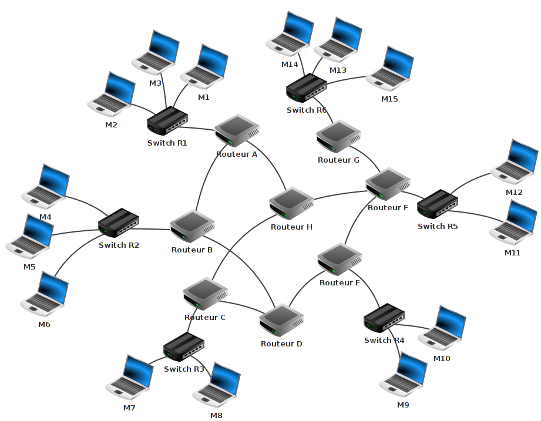

## Internet 

### Le réseau des réseaux

Pour que deux ordinateurs communiquent entre eux il faut les mettre en **réseau**.

Dans un lycée par exemple, les ordinateurs sont reliés au **réseau local** de l'établissement à l'aide de câbles.  

Des **serveurs** dédiés permettent de faire fonctionner le réseau, de stocker et de rendre accessibles des données depuis n'importe quel ordinateur de l'établissement : c'est le serveur Kwartz dont le cloud est aussi accessible de l'extérieur.

Chez soi, si l'on a plusieurs ordinateurs qui se connectent à la même box (en filaire ou en Wifi), cela constitue également un réseau dit **local**, auquel peuvent aussi être reliés un ou plusieurs téléphones, une imprimante ou un décodeur TV...

Il existe énormément de réseaux à travers le monde. Tous ces réseaux peuvent également être reliés entre eux pour former **le réseau des réseaux** : Internet qui signifie Inter-networks.

Tous les objets connectés à Internet (ordinateurs, téléphones, montres connectées, etc..) peuvent communiquer entre eux et échanger des informations : textes, images, sons, vidéos, etc..   

Pour cela, plusieurs **supports physiques de communication** peuvent être utilisés : 
- **câbles électriques** : transport de l'électricité
- **fibre optique** : transport de la lumière utilisant la réflexion totale de celle-ci dans le cœur de la fibre sans perte d'énergie

- **air libre** : wifi, 4G : transport d'ondes électromagnétiques. En France, selon les **opérateurs** (Bouygues Telecom, Free, Orange, SFR...), les fréquences utilisées pour la 4G sont dans les bandes 700, 800 et 900 MHz, 1800, 2100 et 2600 MHz ; il est à noter qu'il s'agit toujours du même type d'onde électromagnétique que ce que l'on trouve dans les fours à micro-ondes, mais avec toutefois une différence de puissance, de l'ordre de 0,1 W pour le Wi-Fi, mais de l'ordre de 1000 W pour le four à micro-ondes.

### Historique

- 1969 (l'année du premier pas de l'homme sur la Lune) : L'Arpanet voit le jour, il s'agit du premier réseau de commutation de paquets reliant 4 machines de centres universitaires américains. Le protocole NCP sera utilisé.
- 1971 : Envoi du premier courrier électronique.
- 1971 : Parallèlement en France, Louis Pouzin crée le réseau Cyclades. Le projet est abandonné en 1978 mais ses travaux ont influencé la mise au point d'Internet et du protocole TCP/IP.
- 1974 : Définition de la suite des protocoles TCP/IP, il sera adopté par l'Arpanet en 1983 en remplacement du protocole NCP.
- 1983 : Création du DNS, base de données permettant la gestion des noms de domaines.
- 1989 : Naissance du World Wide Web. Le Web, qui s'appuie sur Internet, est un ensemble de documents reliés entre eux par un système hypertexte et consultables à l'aide d'un navigateur.
- 1993 : Popularisation du Web avec l'arrivée du navigateur NCSA Mosaic, doté d'une interface graphique. C'est le premier navigateur permettant l'utilisation d'images sur des pages Web.

### Transmission d'informations

Les données transmises entre deux ordinateurs sont codées en binaire (en base 2) sous la forme d'une suite de 0 et de 1 : on parle de **bits**. 

L'intérêt de cette représentation est de pouvoir transférer les données par des signaux électriques (1: signal, 0: rien) ou optiques (1 : allumé, 0: éteint).

Remarque : 

En informatique, on compte l'information en **octet** : 1 octet est formé de 8 bits ; il y a donc 28=256 octets possibles de (0,0,0,0,0,0,0,0) à (1,1,1,1,1,1,1,1) qui codent les niveaux de 0 à 255. 

L'information numérique se mesure en octet et ses multiples ; kilooctet : 1 ko=10^3 o, megaoctet : 1 Mo=10^6 o, gigaoctet : 1 Go=10^9 o ; teraoctet : 1 To=10^12 o.

Le trafic de données mobiles peut atteindre 6 Go par utilisateur et par mois en moyenne, avec une croissance moyenne de plus de 40% par an !

Pour que les données (des milliards de 0 et de 1 envoyés les uns après les autres) soient correctement transmises, puis exploitées, des **protocoles** ont été mis en place.

Les données sont **encapsulées** par différents protocoles, c'est-à-dire qu'on va y accoler un certain nombre d'informations, notamment : où est situé l'ordinateur destinataire ? quel sera le logiciel destinataire ?...

Cet ensemble d'informations constitue la **trame** et c'est ce qui est transmis via le réseau Internet.

### Le protocole TCP/IP

Parmi les différents protocoles utilisés, on retrouve très fréquemment TCP/IP. Il s'agit en réalité de deux protocoles distincts mais utilisés conjointement. 

#### Le protocole TCP (Transmission Control Protocol)

Imaginons que l'on souhaite envoyer une photo numérique. Il s'agit d'un fichier volumineux qui ne pourra pas être envoyé en une seule fois mais devra être découpé en morceaux. Le protocole TCP se charge de découper les données sous forme de **paquets numérotés** et d'indiquer à quel logiciel ces paquets sont destinés. TCP s'assure ensuite que tous ces paquets sont bien transmis grâce à des **accusés de réception** et les rassemble. Si des paquets ont été perdus lors de la transmission, TCP se charge de demander leur nouvel envoi.
Le protocole TCP assure ainsi une transmission fiable, mais pour autant sans garantie dans le temps.

Cependant il nous manque encore une information essentielle à la transmission des données : où est situé l'ordinateur B sur le réseau Internet ?

#### Le protocole IP (Internet Protocol)

Pour comprendre le fonctionnement du protocole IP on peut faire assez naturellement l'analogie avec l'envoi du courrier par la Poste.

Lorsqu'on envoie une lettre par la Poste on l'insère dans une enveloppe sur laquelle sont inscrites l'adresse du **destinataire** et celle de l'**expéditeur**. Ici la lettre à envoyer correspond aux données encapsulées par TCP. Le protocole IP les encapsule en ajoutant entre autres les adresses du destinataire et de l'expéditeur.

À quoi ressemble l'adresse d'un ordinateur ?   

L'**adresse IP**, à distinguer de l'adresse **MAC** qui est l'adresse de la machine donnée par le constructeur, est constituée de **4 nombres compris entre 0 et 255 séparés par un point**. 

Par exemple, supposons que l'adresse IP de l'expéditeur soit 192.168.0.1 et que celle du destinataire soit 172.152.23.108, on obtient le **datagramme** suivant :

Dans la trame envoyée, l'adresse IP est codée sur **4 octets**, c'est-à-dire sur 32 bits (4*8). Pour cela on utilise la représentation binaire des nombres compris entre 0 et 255 (correspondant aux 256 possibilités pour chaque octet).

Exemple : considérons l'adresse : 172.152.23.108.

Pour coder 172 en binaire, il s'agit de décomposer 172 en puissances de 2 (en base 2).
Les puissances de 2 sont : (20=1;21=2;22=4;23=8;24=16;25=32;26=64;27=128;28=256..)
172=1×128+0×64+1×32+0×16+1×8+1×4+0×2+0×1
172=1×27+0×26+1×25+0×24+1×23+1×22+0×21+0×20

D'où le **code binaire** de 172 : (10101100).   
On procède de même pour 152 : (10011000).  
Puis pour 23 : (00010111).  
Enfin pour 108 : (1101100).    
D'où les 32 bits (4×8) du code binaire de l'adresse : 1010110010011000000101111101100

Remarque : étant donné le nombre grandissant d'objets connectés ce format d'adresse IP, appelé adresse IPv4 formé de 4 octets, soit 32 bits, devient insuffisant ; il est en effet limité pour coder 232=4×109 adresses. 

On utilise donc de plus en plus le protocole IPv6 qui utilise des adresses codées sur 128 bits ce qui donne 2128=3×1038 adresses possibles. 
Les adresses IPv6 sont représentées par 8 groupes de 2 octets codés sous forme hexadécimale (10 chiffres de 0 à 9 puis 6 lettres de A à F) séparés par ":".

Exemple d'adresse IPv6 : 2019:0ca8:0000:86b2:0000:0000:db16:8004

Remarque : Chaque adresse IP est unique dans un réseau privé, ce n'est en revanche pas le cas sur l'ensemble du réseau Internet. Par exemple l'adresse IP de son ordinateur personnel commence souvent par 192.168.0., il s'agit en fait d'une adresse IP privée qui n'est pas directement accessible depuis Internet contrairement aux adresses IP publiques. Certaines plages d'adresses sont réservées aux adresses privées permettant l'utilisation de la même adresse IP sur des réseaux privés différents.

#### Autres protocoles

TCP/IP n'est pas la seule suite de protocoles utilisée, il s'agit seulement de la plus répandue. Il en existe de nombreux autres, citons par exemple UDP/IP. Le **protocole UDP**, tout comme TCP, encapsule les données de sorte qu'elles soient transmises au bon logiciel. En revanche UDP ne gère pas les accusés de réception. L'avantage est que la transmission est plus rapide, l'inconvénient est qu'il n'y a aucune fiabilité sur la transmission (les paquets vont-ils tous arriver ? dans l'ordre ?). Ce n'est pas forcément un problème, par exemple quand il s'agit de visionner une vidéo en streaming.

### Routage

Maintenant que l'on sait de quoi est constituée une trame transmise entre deux objets connectés, il reste à savoir comment celle-ci circule entre ces deux objets. Une fois encore on peut faire l'analogie avec l'acheminement du courrier par La Poste : quand on expédie une lettre, on la dépose au bureau de poste, elle sera ensuite envoyée dans différents centres de tri avant d'être distribuée au destinataire. 

Le schéma ci-dessus montre que les ordinateurs sont reliés entre eux par des **switchs**, chaque switch correspondant à un réseau local, eux-mêmes reliés à des **routeurs**.

Le rôle d'un routeur est analogue au centre de tri ; son rôle est de faire communiquer entre eux les réseaux qu'il relie et d'aiguiller correctement chaque trame reçue. Pour cela le routeur utilise sa **table de routage** : en fonction de l'adresse IP de destination il choisira à qui il doit renvoyer la trame.
Sur le réseau représenté sur le schéma ci-dessus, lorsqu'une trame est envoyée par l'ordinateur M2 à destination de l'ordinateur M10, elle peut être relayée par les routeurs A, B, D, E mais ce n'est pas le seul chemin possible, la trame peut aussi passer par le routeur H et suivre le chemin H, F, E ; le cheminement effectivement suivi dépend des tables de routage des routeurs rencontrés.

Remarques :
- Une box internet joue en fait à la fois le rôle de routeur et de switch
- Qu'est-ce que la **neutralité du net** ? Il s'agit du principe selon lequel les données circulent sans distinction ni sur les expéditeurs/destinataires ni sur le contenu (texte, vidéo, etc..). Il n'y a ainsi aucune priorité accordée sur les trames qui transitent sur le réseau.
- On entend parfois parler du fait de "débrancher Internet" ; c'est impossible ! On peut éventuellement déconnecter un ensemble de machines d'Internet mais l'interconnexion des réseaux est telle que deux machines pourront toujours communiquer entre elles en empruntant éventuellement un autre chemin ou une déviation.
- On a vu qu'il existe des milliers de réseaux d'Internet, la table de routage ne les recense pas tous ! Si jamais le routeur reçoit une trame dont l'adresse de destination n'est pas dans la table, elle devra suivre la "route par défaut" indiquée par la table de routage. Par ailleurs la table n'est pas fixe et elle est régulièrement actualisée.
- Que se passe-t-il lors d'une panne réseau ? Si un paquet ne parvient pas à trouver sa destination, va-t-il transiter indéfiniment sur le résau ? Dans l'adresse IP figure toujours une donnée appelée **TTL** (Time To Live) qui indique le nombre maximal de routeurs par lequel peut transiter le paquet. À chaque fois que le paquet traverse un routeur, la TTL diminue, une fois arrivée à 0 le paquet est détruit. Cela permet de ne pas encombrer le réseau. Si un paquet a été détruit et ne parvient donc pas à destination, il sera de toute façon redemandé par le protocole TCP.

### Serveurs DNS (Domain Name System)

Lorsque nous utilisons Internet, que se passe-t-il ?
Imaginons que l'on souhaite s'informer pour son orientation grâce au site de l'Onisep.

On commence par ouvrir le **navigateur** de son choix et dans la barre d'adresse on tape l'adresse web du site de l'Onisep : www.onisep.fr
Le navigateur va alors chercher à se connecter au **serveur web** correspondant pour télécharger les ressources nécessaires et afficher la page web demandée.
L'adresse symbolique www.onisep.fr est une adresse simple à mémoriser, mais on a vu que pour faire communiquer deux machines entre elles selon le protocole TCP/IP il fallait connaître leurs adresses IP. Un mécanisme a donc été mis en place pour faire correspondre le **nom de domaine** onisep.fr à l'adresse IP du serveur web sur lequel est stocké le contenu de la page web : le **DNS**. Il s'agit d'une sorte d'annuaire permettant d'associer une adresse IP à chaque nom de domaine. On interroge les serveurs DNS (ordinateurs sur lesquels est implémenté le protocole DNS) pour connaître l'adresse IP d'un serveur web.

Remarques : 
- Un serveur web héberge des ressources web (pages web, images, vidéos, etc..), il est connecté au réseau Internet et échange des informations avec les utilisateurs. On parle d'interaction client/serveur.
- Un navigateur est un logiciel permettant d'afficher du contenu Web. Les navigateurs les plus utilisés dans le monde sont : Google Chrome, Firefox, Safari, Internet Explorer et Opera..

### Serveurs pair-à-pair (Peer to peer, p2p)

#### Intérêt

Comme on l'a vu, la plupart des interactions sur Internet sont des interactions client-serveur. Cependant le modèle n'est pas toujours le plus adapté : si beaucoup d'utilisateurs (clients) cherchent à accéder en même temps à une ressource lourde (une vidéo par exemple) sur un même serveur, celui-ci va vite se retrouver saturé par toutes les requêtes qui lui parviennent. Dans ce cas l'utilisation d'un réseau pair-à-pair est plus pertinente.

Un réseau **pair-à-pair** s'appuie sur Internet et met en relation des ordinateurs qui peuvent partager du contenu. Selon ce modèle chaque utilisateur joue à la fois le rôle de client et de serveur : lorsqu'on télécharge une vidéo sur un réseau p2p (découpée en paquets), dès que l'on a téléchargé une partie des paquets on peut à son tour les envoyer à d'autres utilisateurs du réseau. Cela permet de répartir les tâches sur l'ensemble des utilisateurs du réseau plutôt que de tout concentrer sur un unique serveur.

#### Risques

Il faut rester vigilant lorsqu'on utilise ce type de réseau : il n'y a aucune garantie sur le contenu réel, on peut donc se retrouver à télécharger des logiciels malveillants (vers, virus, chevaux de Troie, etc..) à son insu, puis les diffuser à son tour.

#### Légalité

Bien que l'utilisation des réseaux pair-à-pair soit tout à fait légale, on ne peut pas partager n'importe quel contenu. En effet, la plupart des oeuvres (musiques, films) diffusées sur ce type de réseaux sont protégés par des droits d'auteur. Avant de télécharger/diffuser quoi que ce soit, il faut vérifier quels sont les droits et devoirs associés à la **licence** sous laquelle a été publiée le contenu.

### Pour aller plus loin : le modèle OSI

Comme on l'a vu, pour que des objets connectés à Internet puissent communiquer entre eux, ils doivent être en mesure de "se comprendre", c'est pour cela qu'ont été définis des **protocoles** afin que les informations puissent être traitées. Nous nous sommes intéressés aux protocoles TCP et IP mais d'autres protocoles entrent également en jeu lors de la transmission d'informations.
Le **modèle OSI** est né en 1984, il s'agit d'un modèle en 7 couches indiquant comment doivent communiquer les objets connectés à Internet. Les données à transmettre sont encapsulées selon différents protocoles en parcourant les couches du modèle OSI depuis la couche 7 (applicative). La trame va ensuite parcourir le réseau à travers différents équipements (switchs, routeurs). Une fois la trame transmise, le récepteur devra remonter toutes les couches du modèle OSI pour que le bon logiciel puisse accéder aux données.

Le protocole IP est un protocole de couche 3, TCP est un protocole de couche 4 (UDP également). Un routeur est un matériel de couche 3 (il implémente le protocole IP), un switch un matériel de couche 2. Dans les protocoles de couche 7 (la couche applicative) on retrouve par exemple les protocoles DNS, HTTP et HTTPS.
Le modèle OSI est un modèle théorique et peut être simplifié dans le cadre TCP/IP :

