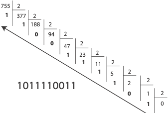
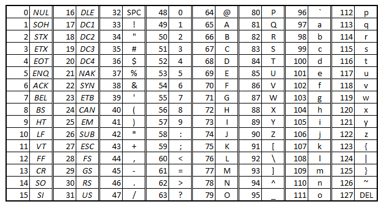

## Exercices Thème 1 : Internet

### Exercice 1 : Simuler un réseau avec le logiciel Filius

[La transmission des données dans un réseau](Assets/Transmission_donnees.md)

### Exercice 2 : à faire chez soi

a. Déterminer sa propre adresse IP.  

Sous Windows, aller dans `Système Windows`
- ouvrir un terminal en cliquant sur `Démarrer`, `exécuter` et en tapant `cmd`
- saisir la commande `ipconfig`

b. Accéder à sa propre table de routage.
Sous Windows, dans un terminal saisir la commande `route print`.


c. Identifier la route empruntée pour accéder au site web www.facebook.com

Sous Windows, dans un terminal saisir la commande :  `tracert www.facebook.com`.

d. Vérifier que le site www.wikipedia.org vous est accessible en saisissant dans un terminal la commande `ping www.wikipedia.org` puis accéder directement au site en utilisant l'adresse IP.
 
Rappeler le nom que l'on donne sur Internet aux serveurs qui disposent d’une application logicielle (sorte d’annuaire) permettant de faire la correspondance entre le nom de domaine demandé et l’IP publique associée au serveur. 

### Exercice 3 : la notion de TTL (Time to live ou durée de vie)

Sur le réseau simplifié décrit ci-dessous, citer au moins trois chemins permettant de relier la machine M8 à la machine M4.


1) Quelle est la valeur minimale du TTL d'un paquet émis par M8 pour qu'il parvienne à M4 ?
On rappelle que le TTL est une donnée placée au niveau de l'en-tête du paquet IP qui indique le nombre maximal de routeurs de transit pour éviter qu'un paquet ne boucle à l'infini s'il existe un problème de boucle de routage.

2) Que se passe-t-il si le routeur B tombe en panne ? si le routeur D tombe en panne ?

### Exercice 4 : le codage binaire de l'information transmise dans le réseau

Toute l'information (textes, images, sons) qui transite sur le réseau internet est numérisée en binaire pour être interprétée par nos logiciels aussi est-il intéressant de comprendre la numérisation en binaire.

Un exemple de codage binaire 'à la main' de l'entier 755 : 



Comme le montre cet exemple, la méthode utilisée pour obtenir le code binaire d'un nombre décimal consiste à réaliser une succession de divisions euclidiennes par 2 où chaque fois le quotient devient le nouveau dividende, et cela aussi longtemps que le quotient est strictement plus grand que 0. Les restes sont lus de bas en haut pour composer le code.

1) Coder 'à la main' en binaire la valeur décimale 51. Vérifier dans la console de Thonny avec `bin(51)`.

2) Inversement, calculer 'à la main' la valeur décimale de l'octet `10110001`. Vérifier dans la console de Thonny avec `0b10110001`.

Cette fois les différents bits du code binaire représentent les différentes puissances de 2 (de droite à gauche en commençant par 0) correspondant à la décomposition en base 2 du nombre.
En effet, de même que l'écriture 1|2|8 est la représentation décimale d'une quantité égale à 128  correspondant à la décomposition en base 10 : 8×10^0+2×10^1+1×10^2, de même le code binaire 1|0|1|1 est la représentation binaire de la quantité égale à 11 correspondant à la décomposition en base 2 : 1×2^0+1×2^1+0×2^2+1×2^3=1+2+8.

3) Après avoir observé dans l'algorithme utilisé le rôle que prend, à chaque tour de boucle, le nouveau dividende par rapport au quotient précédent, compléter le programme suivant de conversion décimal-binaire en python dont une seule ligne est manquante.

```python

def conversion_decimal_binaire(n):
    """
    Donne la représentation binaire sur un octet du nombre entier décimal n
    param : n : int
    return : str
    >>> conversion_decimal_binaire(18)
    '00010010'
    >>> conversion_decimal_binaire(141)
    '10001101'
    """
    resultat=""
    
    while n>0:
        resultat=str(n%2)+resultat
        #!!!!ligne manquante!!!!
                    
    #il faut maintenant rajouter des 0 autant que nécessaire pour obtenir un octet
    
    resultat='0'*(8-len(resultat))+resultat
    
    return resultat
```

Code à ajouter pour importer le module doctest et vérifier les tests de la docstring :

```Python
if __name__ == '__main__':
  import doctest
  doctest.testmod(verbose=True)
```

On peut maintenant utiliser cette fonction en demandant à l'utilisateur de rentrer un nombre décimal pour le convertir en binaire


```python
nombre=input("Quel est le nombre dont vous voulez connaître la représentation binaire ? ")

print("La représentation binaire de",nombre,"est : ",conversion_decimal_binaire(int(nombre)))
```

4) En utilisant le programme précédent, on cherche à coder en écriture binaire l'adresse IP 192.168.1.13

Peut-on concevoir un programme qui donnerait directement le code binaire d'une adresse IP ?

Pour cela, on peut transformer une chaîne de caractères en liste en utilisant un séparateur avec la méthode `split` puis parcourir cette liste avec `for element in `.

```python
>>> "192.168.1.13".split(".")
['192', '168', '1', '13']
>>> for element in ['192', '168', '1', '13']:
    	print(element)    
192
168
1
13
```

Compléter la fonction ci-dessous : 

```Python
def encodage_adresse_IP_binaire(adresseIP):
    """
    Encode une adresse IP en binaire
    param : adresse IP : str
    return : str
    >>> encodage_adresse_IP_binaire("192.168.1.13")
    '11000000101010000000000100001101'
    """
```

5) Une autre application est l'encodage en binaire d'un texte utilisant le codage ASCII  (American Standard Code for Information Interchange) des caractères. L'ASCII définit 128 caractères numérotés de 0 à 127 et codés en binaire de 0000000 à 1111111. Sept bits suffisent donc. Toutefois, les ordinateurs travaillant presque tous sur un multiple de huit bits (un octet) depuis les années 1970, chaque caractère d'un texte en ASCII est souvent stocké dans un octet dont le 8e bit est 0.

 

Pour obtenir le code ASCII d'un caractère :

```Python
>>> ord("k")
107
```

Compléter la fonction ci-dessous : 

```Python
def encodage_texte_ascII_binaire(texte):
    """
    Code un texte ascII en binaire
    param : texte : str
    return : str
    >>> encodage_texte_ascII_binaire("vive la snt")
    '0111011001101001011101100110010100100000011011000110000100100000011100110110111001110100'
    """
```

Faire un programme qui demande à l'utilisateur le texte qu'il veut encoder.

6)  Compléter maintenant le programme suivant de conversion binaire-décimal en python dont une ligne est incomplète.

```python
def conversion_binaire_decimal(code_binaire):
    """
    Renvoie la valeur décimal de code_binaire
    param : code_binaire : str
    return : int
    >>> conversion_binaire_decimal('00110011')
    51
    """
    resultat=0
    for i in range(len(code_binaire)):
        nombre=int(code_binaire[i])
        resultat+=nombre*(2**(# à compléter #))
    return resultat
```

Faire un programme qui demande à l'utilisateur le code binaire qu'il veut convertir en décimal.

Donner par exemple l'adresse IP en notation décimale codée par 10011000110000110110110001100010

7) Peut-on concevoir un programme qui donnerait directement l'adresse IP sous forme décimale à partir de son expression sous forme binaire ?

Pour cela, il faut prélever des parties de la chaîne de caractères en réalisant un `slice` :

```python
>>> "10011000110000110110110001100010"[0:8]
'10011000'
```
```python
def conversion_adresseIP_binaire_decimal(code_binaire):
    """
    Renvoie le code décimal d'une adresse IP sous la forme de 4 octets
    param : code_binaire : str
    return : str
    >>> conversion_adresseIP_binaire_decimal('11000000101010000000000100001101')
    '192.168.1.13'
    """
```

8) Compléter la fonction ci-dessous qui permet de décoder le code binaire correspondant à un texte.

Pour obtenir le caractère correspondant à un code décimal, utiliser 

```Python
>>> chr(52)
'4'
```

```Python
def decodage_binaire_texte_ascII(code_binaire):
    """
    Décode Code un texte ascII en binaire
    param : texte : str
    return : str
    >>> decodage_binaire_texte_ascII('0111011001101001011101100110010100100000011011000110000100100000011100110110111001110100')
    'vive la snt'
    """
```


