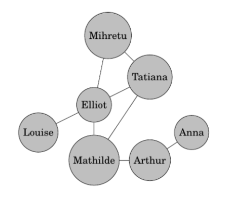

## Exercices Thème 3 : Réseaux sociaux


### Exercice 1 : manipulation d'un graphe

On placera à la fin du fichier le code pour valider les tests des docstrings.

```Python
if __name__ == '__main__':
  import doctest
  doctest.testmod(verbose=True)
```

Tous les tests présents dans les documentations des fonctions seront validés avec notre exemple appelé Graphe, étudié en cours, pour rappel : 


```Python
Graphe=[[1,3,4],[0,4],[3],[0,2],[0,1]]
```

On admet le code ci-dessous qui permet de trouver l'**excentricité** d'un sommet ; on rappelle qu'il s'agit de la plus grande distance de ce sommet aux autres sommets du graphe ; la **distance** d'un sommet à un autre étant le nombre d'arêtes correspondant au chemin le plus court qui sépare ces sommets.

```Python
from collections import deque

def excentricite(graphe, sommet):
    """
    Renvoie la plus grande distance du sommet passé en paramètre aux autres sommets de graphe
    param : graphe : list
    param : sommet : int
    >>> excentricite(Graphe, 0)
    2
    >>> excentricite(Graphe, 1)
    3
    """
    # Initialiser la distance de chaque sommet à l'infini
    distances = {s: float('inf') for s in range(len(graphe))}
    # Initialiser la distance du sommet de départ à 0
    distances[sommet] = 0

    # Initialiser la file d'attente avec le sommet de départ
    queue = deque([sommet])

    # Itérer jusqu'à ce que la file d'attente soit vide
    while queue:
    # Prendre le premier sommet de la file d'attente
        sommet = queue.popleft()
    # Parcourir tous les sommets adjacents au sommet actuel
        for voisin in graphe[sommet]:
      # Si la distance du voisin est infinie, cela signifie qu'il n'a pas encore été visité
            if distances[voisin] == float('inf'):
        # Mettre à jour la distance du voisin en lui attribuant la distance du sommet actuel + 1
                distances[voisin] = distances[sommet] + 1
        # Ajouter le voisin à la file d'attente pour être traité ultérieurement
                queue.append(voisin)

    # Retourner la distance maximale des sommets par rapport au sommet de départ
    return max(distances.values())
```

#### Première partie : en utilisant cette fonction et les indications fournies, compléter les codes des trois fonctions suivantes `diametre(graphe)`, `rayon(graphe)`, `centre(graphe)`:

1. Fonction `diametre(graphe)`

```Python
def diametre(graphe):
    """
    Renvoie la plus grande valeur de l'excentricité
    param : graphe : list
    >>> diametre(Graphe)
    3
    """
```
 
**Indication1:** on rappelle que le diamètre d'un graphe est la plus grande valeur des excentricités des sommets de ce graphe ; elle est égale à 3 pour notre exemple Graphe car pour les différents sommets A, B, C, D, E on a respectivement les excentricités : e(0)=2 ; e(1)=3 ; e(2)=3 ; e(3)=2 ; e(4)=3.

**Indication2** : Pour prendre le maximum d'une liste de valeurs.

```Python
>>> liste=[2,8,5]
>>> max(liste)
8
```      

**Indication3** : Il faut donc réaliser une liste initialement vide que l'on peut appeler `valeurs` et la peupler avec les valeurs des excentricités des sommets, puis renvoyer le maximum de cette liste. On pourra s'inspirer du code de la fonction `liste_des_amis_commun(i,j,graphe)` vue en cours.

 ------------
2. Fonction `rayon(graphe)`

    
```Python
def rayon(graphe):
    """
    Renvoie la plus petite valeur de l'excentricité
    param : graphe : list
    >>> rayon(Graphe)
    2
    """
```

**Indication1:** on rappelle que le rayon d'un graphe est la plus petite valeur des excentricités des sommets de ce graphe ; elle est égale à 2 pour notre exemple Graphe car pour les différents sommets A, B, C, D, E on a respectivement les excentricités : e(0)=2 ; e(1)=3 ; e(2)=3 ; e(3)=2 ; e(4)=3.   

**Indication2** : Pour prendre le minimum d'une liste de valeurs.

```Python
>>> liste=[2,8,5]
>>> min(liste)
2
```
**Indication3** : Il faut donc réaliser une liste initialement vide que l'on peut appeler `valeurs` et la peupler avec les valeurs des excentricités des sommets, puis renvoyer le minimum de cette liste. On pourra s'inspirer du code de la fonction `liste_des_amis_commun(i,j,graphe)` vue en cours.

------------

3. Fonction `centre(graphe)`

```Python
def centre(graphe):
    """
    Renvoie le ou les sommets de plus petite excentricité
    param : graphe : list
    >>> centre(Graphe)
    [0, 3]
    """
```

**Indication1** : Le ou les centres d'un graphe sont le ou les sommets du graphe où l'excentricité est minimale et correspond au rayon du graphe.

**Indication2** : Réaliser une liste initialement vide appelée par exemple `centres` et la peupler lorsque l'excentricité du sommet est égale au rayon du graphe puis renvoyer cette liste. 

------------

#### Deuxième partie : application à un autre graphe :



1. Donner une représentation par liste d'adjacence, similaire à Graphe, appelée `Graphe_exercice`, pour ce graphe.  
On numérotera les sommets (à partir de 0) dans l'ordre alphabétique des noms et on utilisera la liste de noms suivante :

`noms_exercice=["Anna","Arthur","Elliot","Louise","Mathilde","Mihretu","Tatiana"]`

2. Déterminer sur le papier, en expliquant, le diamètre et le rayon de ce graphe. Indiquer également le ou les centres de ce graphe.
3. Retrouver, dans la console de Thonny, le le diamètre, le rayon, le ou les centres de ce graphe en faisant agir sur votre graphe les fonctions précédentes. Notez vos résultats.
5. Les individus Elliot, Tatiana, Mihretu, Mathilde forment-ils une clique ? Justifier. Comment le vérifier dans la console en utilisant la fonction `est_clique` du cours.


### Exercice 2 : attention aux Fake News

Une personne malveillante décide d'envoyer une `Fake News` à 3 personnes. Le jour suivant, chacune de ces 3 personnes envoie à nouveau cette nouvelle à 3 nouvelles personnes, et ainsi de suite. Au bout de combien de jours le monde entier est-il au courant de cette fake news ?
Population mondiale : 7,8 milliards.

Compléter le code ci-dessous.

```Python
S=3
n=1
while S<7.8*10**9:
    ......
    ......
print(n)
```
### Exercice 3 : à lire pour être sensibilisé aux risques numériques

Consulter le [kit complet](Assets/kit_complet_de_sensibilisation.pdf) et effectuer le test de connaissances.
