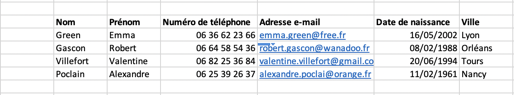

## Thème 4 : Les données structurées et leurs traitements

### Introduction

L'informatique s'est révélée d'une très grande efficacité pour manipuler des fichiers immenses ce qui a permis aux entreprises comme à l'administration une gestion rapide et efficace des données. Pour y parvenir, les informaticiens ont conçu des algorithmes très astucieux et d'une très grande fiabilité.

### Histoire

- 1725 : Basile Bouchon invente un système de programmation utilisant un ruban perforé qui permet d'automatiser un métier à tisser.


- 1928 : IBM fait breveter ses cartes perforées à 80 colonnes qui sont les premiers supports de stockage des données.


- 1956 : Invention du premier disque dur, l'IBM 305, constitué de 50 disques de 24 pouces (61 cm) de diamètre et permettant de stocker environ 5Mo de données. Actuellement on peut obtenir une capacité de stockage de 16 To (3 millions de fois plus, à vérifier) sans dépasser les 3,5 pouces (9 cm).


- 1970 : Invention du modèle relationnel, grâce à E.F.Codd, permettant de structurer et d'indexer des bases de données
- 1979 : Création du premier tableur : VisiCalc.


- 1997 : Apparition du terme Big Data, faisant référence à des ensembles massifs de données générés par l'utilisation des outils numériques
- 2000 : Utilisation de la clé USB et la carte SD comme supports de stockage
- 2009 : Le président Obama lance l'<i>Open Government Initiative</i> afin d'instaurer davantage de transparence dans la gouvernance. Cette « initiative » vise à créer un niveau sans précédent de transparence et d'ouverture du gouvernement. Elle se situe dans une tendance émergente qui est celle de l' <i>Open source governance</i>, qui prône l'application en politique et dans la gouvernance des démocraties de philosophies telles que l'open source et les « contenus ouverts » (**Open data**), pour permettre à tout citoyen intéressé de contribuer à créer les contenus de la Politique, et pour permettre aux gouvernements de mieux bénéficier des savoirs et savoir-faire locaux. Les agences gouvernementales ont en 2010 commencé, autour du gouvernement fédéral, à produire des pages Web de gouvernance élargie, proposant des informations autrefois inaccessibles au public, et invitant les citoyens américains à produire des idées et suggestions.


### Les données structurées

Lorsqu'on parle de **données structurées**, une **donnée** est une valeur (nombre ou chaîne de caractères) décrivant une entité (une personne, un objet, un événement).
Une même entité peut être décrite par plusieurs **descripteurs**.
Dans le cas de données portant sur un individu identifiable, on parle de **données personnelles**.

Exemple : Un contact dans son téléphone portable peut être décrit par les descripteurs : "Nom", "Prénom", "Numéro de téléphone", "Adresse e-mail", "Date de naissance". Il s'agit évidemment de données personnelles.

Une **collection de données**, c'est-à-dire un ensemble de données décrivant plusieurs entités avec les mêmes descripteurs, peut être représentée à l'aide d'un tableur : les objets en ligne, les descripteurs en colonne. On parle aussi de **table de données**.

Une **base de données** est une ensemble de tables de données pouvant être reliées entre elles.

Différents formats peuvent être utilisés pour représenter des données structurées, notamment les formats CSV (Comma Separated Values), XML (eXtensible Markup Language), JSON (JavaScript Object Notation) et VCF (Virtual Contact File).

Exemple : le format utilisé pour pour les contats dans un smartphone est le format qui porte l'extension VCF (fichier vCard).

vCard 4.0 :
```vCard
BEGIN:VCARD
VERSION:4.0
N:Gump;Forrest;;Mr.;
FN:Forrest Gump
ORG:Bubba Gump Shrimp Co.
TITLE:Shrimp Man
PHOTO;MEDIATYPE=image/gif:http://www.example.com/dir_photos/my_photo.gif
TEL;TYPE=work,voice;VALUE=uri:tel:+1-111-555-1212
TEL;TYPE=home,voice;VALUE=uri:tel:+1-404-555-1212
ADR;TYPE=WORK;PREF=1;LABEL="100 Waters Edge\nBaytown\n, LA 30314\nUnited States of America":;;100 Waters Edge;Baytown;LA;30314;United States of America
ADR;TYPE=HOME;LABEL="42 Plantation St.\nBaytown\, LA 30314\nUnited States of America":;;42 Plantation St.;Baytown;LA;30314;United States of America
EMAIL:forrestgump@example.com
REV:20080424T195243Z
x-qq:21588891
END:VCARD
```

Exemple de données :

| Nom        | Prénom      | Numéro de téléphone | Adresse e-mail                    | Date de naissance | Ville    |
|------------|-------------|--------------------|-----------------------------------|-------------------|----------|
| Green      | Emma        | 06 36 62 23 66     | emma.green@free.fr                | 2002-05-16        | Lyon     |
| Gascon     | Robert      | 06 64 58 54 36     | robert.gascon@wanadoo.fr          | 1988-02-08        | Orléans  |
| Villefort  | Valentine   | 06 82 25 36 84     | valentine.villefort@gmail.com     | 1994-06-20        | Tours    |
| Poclain    | Alexandre   | 06 25 39 26 37     | alexandre.poclai@orange.fr        | 1961-02-11        | Nancy    |

Vue des [données](Assets/contacts.xls) mises en tableau réalisé dans un tableur tel que Excel ou LibreofficeCalc : 

Le même [fichier](Assets/contacts.csv) au format **csv** lu dans un éditeur de texte :


Le même fichier au format **xml** lu dans un éditeur de texte :


Le même fichier au format **json** lu dans un éditeur de texte :


Les fichiers au format PDF, JPG, MP3...constituent également des fichiers de données mais ceux-ci sont **non structurées**.

Une partie de fichier au format mp3 lue dans un éditeur de texte :


Cependant, à chacun de ces fichiers sont toujours associées des **métadonnées** indiquant selon le type de fichier une date, un auteur, une donnée de géolocalisation, un matériel utilisé... 

Exemple de métadonnées d'un fichier audio :


### Collecte des données

L'utilisation actuelle des outils numériques fait qu'une quantité incroyable de données sont stockées et exploitées, ce que l'on appelle le **Big Data**.

Parmi ces données, on retrouve celles renseignées par les utilisateurs de sites internet, par exemple lorsque l'on crée un compte sur un site de vente en ligne ou lorsque l'on s'inscrit sur un réseau social : on renseigne les champs 'Nom', 'Prénom', 'Date de naissance'.. d'un **formulaire**. Ces données sont souvent transmises à des partenaires commerciaux ou des organismes qui pourront les exploiter. On trouve généralement une case à cocher à la fin des formulaires donnant notre accord pour la transmission de nos données à ces partenaires, qu'il suffit donc de ne pas cocher.

D'autres données proviennent, comme on l'a vu dans le thème "web", des **cookies** créés lors de nos navigations sur internet, ou encore des autorisations données lors du téléchargement d'applications sur smartphone ou tablette. On peut donc ainsi transmettre, sans même le savoir, des données de géolocalisation relatives à notre activité sur Internet, voire issues de notre carnet d'adresse. Il est donc important de bien lire les conditions relatives à l'utilisation des données avant de télécharger une application.

Enfin, certaines données dites ouvertes  : **Open data** sont publiques et libres de droits. On trouve par exemple un grand nombre de données de toutes sortes sur le site [https://www.data.gouv.fr](https://www.data.gouv.fr) qui est la plateforme ouverte des données publiques françaises.

Le **RGPD**, Règlement Général sur la Protection des Données, entré en vigueur le 25 mai 2018, vise à renforcer la protection des données personnelles dans l'Union Européenne en établissant des règles sur la collecte et la gestion des données récoltées par les entreprises et organismes. On trouve par exemple dans les dispositions un **droit à l'effacement des données personnelles** (c'est-à-dire le droit pour chacun de demander l'effacement de ses données pour certains motifs), un **droit à la portabilité des données personnelles** (on peut ainsi demander à un organisme de nous fournir les données personnelles nous concernant en vue par exemple de les transmettre à un autre organisme), ainsi que des principes de **protection des données** (nécessité de garantir au mieux la sécurité des données).


# Traitement des données structurées : travail à réaliser

Lorsqu'on dispose d'une table de données, il peut être intéressant d'effectuer des opérations de **recherche**, de **tri**, de **filtre** ou bien des **calculs** sur les valeurs des descripteurs.

Exemple : dans un fichier client, on peut effectuer les opérations suivantes:

- rechercher le numéro de téléphone d'un client pour le contacter  

- trier les données dans l'ordre alphabétique des noms de familles, puis des prénoms

- filtrer les clients dans une catégorie ; par exemple dans la catégorie 18-25 ans pour une publicité ciblée

- déterminer la répartion homme/femme des clients

On peut également **croiser** les informations de plusieurs tables issues d'une même base de données.

Exemple : Dans le but de distribuer des bons d'achat aux clients les plus fidèles d'un magasin, on peut commencer par filtrer dans le fichier des ventes les clients ayant effectué le plus d'achats, puis chercher dans un deuxième leurs adresses postales dans le fichier client.

Lorsque les données sont représentées sur un tableur, on peut aisément effectuer ce genre d'opérations qui consistent à **filtrer**,  **trier** ou **faire une recherche**.


**Exemple à réaliser** : On réalise le fichier `contacts.py` avec Thonny en le plaçant dans le même dossier que le fichier `contacts.csv` obtenu à partir du fichier `contacts.xlsx` placé dans le dossier Assets.

```Python
import csv
fichier=open("contacts.csv","r")
table=[]
for ligne in fichier:
    table.append(ligne.rstrip().split(';'))
fichier.close
del table[0]#suppression de la ligne des descripteurs
print(table)
```

Voir l'effet ci-dessous de `rstrip()` et de `split(';')` pour comprendre le code.

```Python
>>> phrase="Ceci est une phrase avec changement de ligne\n"
>>> phrase.rstrip()
'Ceci est une phrase avec changement de ligne'
```

```Python
>>> animaux="Chien; chat; oiseau; moustique"
>>> animaux.split(";")
['Chien', ' chat', ' oiseau', ' moustique']
```

On observe que table est ainsi une liste formée de sous-listes ou tableau à deux dimensions.

Commençons par trier les contacts dans l'ordre alphabétique des noms de famille à l'aide de la fonction `sorted`.

```Python
table=sorted(table)
```

La fonction `sorted`, appelée par défaut sans paramètre, trie la table par ordre alphabétique sur le premier champ,c'est-à-dire selon l'élément d'indice 0 des sous-listes, qui est le Nom .

Pour **trier** sur un autre champ, par exemple Ville, qui constitue pour les sous-listes, notées ici `element`, la valeur d'indice 5, voici la procédure à suivre :

```Python
def tri_selon_ville(element):
    return element[5]

table1=sorted(table,key=tri_selon_ville)
```

Remarque1 : pour trier dans l'ordre décroissant, écrire : `table1=sorted(table,key=tri_selon_ville,reverse=True)`

Remarque 2: on peut aussi écrire 
`table.sort(key=tri_selon_ville)`, mais dans ce cas on modifie la table de départ `table` alors que la méthode précédente permet de créer une nouveau tableau `table1` en gardant intact le tableau de départ.

Trions maintenant le tableau des contacts par âge, pour cela on utilise :

```Python

>>> '11/02/1961'[-4::]#on extraie les quatre derniers caractères
'1961'

>>> int('11/02/1961'[-4::])#on transforme la chaîne de caractères en entier
1961

```
```Python
def tri_selon_age(element):
    return int(element[4][-4::])

table2=sorted(table,key=tri_selon_age)
```

Effectuons maintenant la **recherche** du contact dont le numéro de téléphone est '06 64 58 54 36'. Proposons pour cela une fonction `recherche` qui admet deux paramètres `telephone` et `tableau`, et qui parcourt l'ensemble des contacts de notre tableau à la recherche du contact qui possède ce numéro de téléphone : 

```Python
def recherche(telephone,tableau):
    for element in tableau:
        if element[2]==telephone:
            return element
>>> recherche('06 64 58 54 36',table)
['Gascon', 'Robert', '06 64 58 54 36', 'robert.gascon@wanadoo.fr', '08/02/1988', 'Orléans']
```

Code pour vérifier les docstrings :

```Python
if __name__ == '__main__':
    import doctest
    doctest.testmod(optionflags=doctest.NORMALIZE_WHITESPACE | doctest.ELLIPSIS, verbose=True)
```

Effectuons maintenant un **filtrage** selon un ou plusieurs critères donnés (en ajoutant autant de conditions), pour ne garder que quelques valeurs, ici par exemple la première lettre du nom :

```Python
def filtrer(tableau,premiere_lettre_du_nom):
    """
    Renvoie les noms du tableau de contacts qui commencent par premiere_lettre_du_nom
    param : tableau : list
    param : premiere_lettre_du_nom : str
    return : list
    >>> filtrer(table,'G')
    ['Green', 'Gascon']
    """
    resultat=[]
    for element in tableau:
        if element[0][0]==premiere_lettre_du_nom:
            resultat.append(element[0])
    return resultat
```

On peut également **dénombrer** les éléments correspondant à ce filtrage en déterminant la longueur de la liste :

```Python
def denombre(tableau,premiere_lettre_du_nom):
    """
    Renvoie le nombre de noms du tableau de contacts qui commencent par premiere_lettre_du_nom
    param : tableau : list
    param : premiere_lettre_du_nom : str
    return : int
    >>> denombre(table,'G')
    2
    """
    resultat=[]
    for element in tableau:
        if element[0][0]==premiere_lettre_du_nom:
            resultat.append(element[0])
    return len(resultat)
```

Une autre formulation est la création d'un compteur.

```Python
def denombre_version2(tableau,premiere_lettre_du_nom):
    """
    Renvoie le nombre de noms du tableau de contacts qui commencent par premiere_lettre_du_nom
    param : tableau : list
    param : premiere_lettre_du_nom : str
    return : int
    >>> denombre_version2(table,'G')
    2
    """
    compteur=0
    for element in tableau:
        if element[0][0]==premiere_lettre_du_nom:
            compteur+=1#incrémentation du compteur
    return compteur
```

Remarque : En réalité la plupart des bases de données sont hébergées et gérées par des **serveurs de bases de données** ; on utilise pour cela un logiciel de bases de données comme MySQL (qui utilise un langage SQL). Ce n'est pas l'objet de ce cours, mais une requête SQL filtrant les clients ayant entre 18 et 25 ans et indiquant leurs nom et adresse, triés par ordre alphabétique, aurait cette écriture :

```SQL
SELECT nom, adresse FROM clients WHERE age>=18 AND age<=25 ORDER BY nom 
```

### Le Cloud

Le cloud computing désigne l'utilisation de serveurs informatiques distants via un réseau comme Internet. Un **cloud** correspond à un ensemble de matériels et de logiciels, accessibles en permanence, pouvant servir à stocker des données mais aussi à les traiter en bénéficiant d'une importante puissance de calcul.

En plein essor, le cloud computing est en fait utilisé depuis plusieurs décennies. En effet, lorsqu'on se connecte à sa messagerie électronique, il s'agit de cloud computing : les données de notre messagerie sont stockées sur des serveurs distants, sont accessibles à volonté et n'importe où, et peuvent être traitées (tri, filtre des messages, modification des paramètres etc...) grâce à des logiciels présents sur ces serveurs.

Les entreprises utilisent de plus en plus les serveurs cloud, qu'elles louent avec différents services en fonction de leurs besoins (espaces de stockage, système d'exploitation, logiciels). Cette pratique devient de plus en plus courante chez les particuliers. Il est désormais possible gratuitement (ou parfois en payant pour davantage de services) de stocker l'ensemble des photos et vidéos de son smartphone à distance, et même de les synchroniqer avec une tablette ou un ordinateur. De nombreux logiciels collaboratifs se sont également développés permettant par exemple de travailler à plusieurs sur un même document. Enfin, on trouve d'autres applications comme le "cloud gaming" c'est-à-dire le fait de jouer à des jeux en utilisant des serveurs distants : le joueur n'installe pas de jeu sur son ordinateur et les logiciels de jeu tournent sur des serveurs distants. Le cloud computing permet de ne pas investir dans du matériel de stockage et de bénéficier de logiciels et d'une puissance de calcul bien supérieure à ce que pourrait fournir un ordinateur personnel ou un smartphone.

### Enjeux environnementaux

Le volume massif des données générées et traitées (Big Data) nécessite un nombre de plus en plus important de centres de données appelés **datacenters**, c'est-à-dire des bâtiments abritant des serveurs informatiques dédiés au stockage et à l'exploitation des données. C'est un réel enjeu environnemental du fait de leur consommation en métaux rares, en eau (refroidissement des serveurs) et en électricité. On estime que d'ici 2030 la consommation énergétique de l'informatique constituera plus de 20% de la consommation mondiale, dont un tiers attribué aux datacenters.


