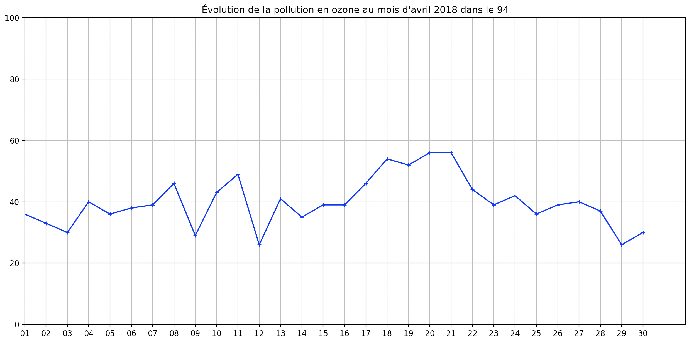

## Exercices Thème 4 : Les données structurées et leurs traitements

### Exercice 1 : écrire les bonnes fonctions pour répondre à une question précise

Code pour vérifier les docstrings :

```Python
if __name__ == '__main__':
    import doctest
    doctest.testmod(optionflags=doctest.NORMALIZE_WHITESPACE | doctest.ELLIPSIS, verbose=True)
```


On souhaite traiter la table ci-dessous appelée `fruits` à l'aide des fonctions suivantes : `fonction1`, `fonction2`, `fonction3` présentées ci-après :

```Python
fruits=[
        ['espece','couleur','substrat','contenu'],
        ['fraise','rouge','sol','sans'],
        ['abricot','orange','arbre','noyau'],
        ['peche','orange','arbre','noyau'],
        ['cerise','rouge','arbre','noyau'],
        ['melon','vert','sol','pepins'],
        ['avocat','vert','arbre','noyau']
        ]

del(fruits[0])#supprime la ligne des descripteurs

def fonction1(table):
    return len(table),len(table[0])

def fonction2(table,indice,valeur):
    compteur=0
    for ligne in table:
        if ligne[indice]==valeur:
            compteur+=1
    return compteur

def fonction3(table,nom):
    for ligne in table:
        if ligne[0]==nom:
            return True
    return False
```

Répondre d'abord "à la main" aux questions suivantes à la lecture du code puis vérifiez avec Thonny en utilisant la console puis réaliser les `docstrings` des fonctions (c'est à dire un résumé succinct de ce que fait la fonction, les paramètres et leur type, un test permettant de vérifier la fonction).

1. Quel est le rôle de `fonction1` et que renvoie `fonction1(fruits)` ? Faire la docstring de cette fonction avec le test `fonction1(fruits)`. Proposer un autre test.
2. Quel est le rôle de `fonction2` et que renvoie `fonction2(fruits,1,'rouge')` ? Faire la docstring de cette fonction avec le test `fonction2(fruits,1,'rouge')`. Proposer un autre test.
3. Quel est le rôle de `fonction3` et que renvoie `fonction3(fruits,'fraise')` ? Faire la docstring de cette fonction avec le test `fonction3(fruits,'fraise')`. Proposer un autre test.
4. Modifier `fonction3` pour créer `fonction4` ; celle-ci doit renvoyer la liste des valeurs que prennent tous les descripteurs associés à l'objet si `nom` a été trouvé dans la table, et un message (chaîne de caractère ou string) indiquant dans le cas contraire que `nom` n'a pas été trouvé <sup>*</sup>.      
La docstring de cette `fonction4` doit permettre de vérifier les deux tests suivants :

```Python
>>> fonction4(fruits,'fraise')
['fraise', 'rouge', 'sol', 'sans']
>>> fonction4(fruits,'pomme')
"L'objet pomme est absent de la table"
```

<sup>*</sup> Indication : on sera amené à utiliser la concaténation de chaînes de caractères, par exemple : 

```Python
>>> partie2="la suite"#partie2 est une variable égale à une chaîne de caractères ou string (str)
>>> "ceci est le début, " +partie2 +" et la fin de la phrase"
'ceci est le début, la suite et la fin de la phrase'
```


### Exercice 2 : parcourir des données, extraire une information précise après avoir trié

Aller sur le site www.data.gouv.fr et effectuer la recherche "indices qualité de l'air Île de France" ;  télécharger puis ouvrir le fichier `indices_QA_commune_IDF_04_2018.csv` (le fichier est également présent dans le dossier `Assets` du thème 4).   

Il s'agit d'un exemple de données ouvertes ou **open data** accessibles à tous. Les indices de qualité de l’air sont des outils de communication qui permettent de décrire périodiquement sous une forme simple (qualificatif, chiffre) l’état global de la qualité de l’air dans une aire géographique donnée.

En s'inspirant des exemples du cours réalisés sur le fichier `contacts.csv`, répondre aux questions suivantes avec Python.  
 
**Attention**, on observe que les séparateurs dans le fichier `csv` sont ici des virgules `,` et non des points-virgules `;`, il faut donc modifier en conséquence notre programme de lecture et de transformation de fichier `csv` en tableau.
Penser également à transformer les chaînes de caractères représentant une valeur entière en nombre entier, en utilisant `int` : 

```Python
>>> int("45")
45
```

1. Quels sont les descripteurs utilisés ? Affichez-les.
2. Question posée : quel jour a été le plus pollué en dioxyde d'azote en Île de France ?

**Trier** les données en fonction de l'indice de pollution au dioxyde d'azote NO<sub>2</sub> dans l'ordre décroissant, puis **filtrer** les données correspondant à l'Île de France (code Insee : 0) afin de déterminer la réponse à la question.

**Indications** : On sera donc amené à écrire deux fonctions : `tri_selon_NO2(element)` pour trier les données dans l'odre décroissant de  `no2` et `filtre_selon_ninsee(ninsee,tableau)` pour ne garder que ce qui se rapporte à `ninsee`. 

3. Déterminer les numéro d'insee des deux communes d'Île-de-France les plus polluées en particules fines (pm10) le 20/04/2018.    

**Indications** : On sera amené à écrire les fonctions : `tri_selon_pm10(element)`pour  trier les données dans l'ordre décroissant de `pm10` et `filtre_selon_date(date,tableau)` pour ne garder que ce qui se rapporte à `date`.

Résultat attendu : `Les insee des deux communes d'Île-de-France les plus polluées aux particules fines (pm10) le 20/04/2018 sont :  92026  ,  92035`

4. Pendant combien de jours l'indice de pollution à l'ozone O<sub>3</sub> a-t-il été supérieur à 45 dans le Val-de-Marne (code d'Insee : 94) au mois d'avril 2018 ?   

**Indications** : On sera amené à écrire une fonction : `filtre_selon_code_mois_seuil(code,tableau,mois,seuil)` 

Résultat attendu : `Le nombre de jour où l'indice de pollution à l'ozone a été supérieur à 45 dans le Val-de-Marne est :  7 `

5. Donner la représentation graphique de l'évolution de la pollution à l'ozone pendant le mois d'avril 2018 dans le Val-de-Marne. Utiliser ce graphe pour déterminer les dates correspondant à la question précédente.

On sera amené à ordonner les données selon la `date`, placée en abscisse sur le graphe, en réalisant la fonction `tri_selon_date(element)`.

Voici le code permettant une représentation graphique du niveau d'ozone dans le Val-de-Marne au mois d'avril 2018 au cours du temps  une fois le tri et le filtre effectués.

```Python
import matplotlib.pyplot as plt
x=[]
y=[]
for element in table:
    x.append(element[0].split("/")[0])#on ne garde que le numéro du jour
    y.append(int(element[3]))#transforme en valeur entière
plt.axis([ 1, 31, 0, 100 ])
plt.plot(x,y,'+',markersize=5,linestyle='solid',color='blue')
plt.xlabel("Date")
plt.ylabel("Taux d'ozone")
plt.title ("Évolution de la pollution en ozone au mois d'avril 2018 dans le 94")
plt.grid()
plt.show()
plt.close()
```




### Exercice 3 : extraire l'information exacte à partir d'un fichier volumineux de données

1. Dans un premier temps on extrait à l'aide du programme ci-dessous en Python les données d'un fichier `csv` appelé `les_salles_de_cinemas_en_ile-de-france.csv` .  Le fichier est présent dans le dossier `Assets` du thème 4 ; il faudra placer ce fichier dans le même dossier que votre programme python `exercice3.py`.

```Python
import csv
fichier=open("les_salles_de_cinemas_en_ile-de-france.csv","r")
table_des_donnees=[]
for ligne in fichier:
    table_des_donnees.append(ligne.rstrip().split(';'))
fichier.close
```

Lancer le programme, puis, dans la console, observer les résultats qui s'affichent suite à ces commandes :

a) len(table_des_donnees)

b) table_des_donnees[0]

c) len(table_des_donnees[0])

d) table_des_donnees[0].index('dep') # noter ce résultat

e) table_des_donnees[0].index('entrees_2020') # noter ce résultat

f) table_des_donnees[0].index('fauteuils') # noter ce résultat

g) table_des_donnees[0].index('ecrans') # noter ce résultat

h) table_des_donnees[0].index('geo') # noter ce résultat

Donnez la signification de ces 6 résultats.

Pour la suite, nous supprimerons la ligne des descripteurs en ajoutant :  
 `del table_des_donnees[0]` après `fichier.close`

2. On se demande combien il y a de cinémas dans le département 95.   

**Indication:** Filtrer les données selon le département : `filtrer_selon_code(departement,tableau)`. Utiliser `len` pour déterminer le nombre d'élément du résultat.

3. Quel est le nom du cinéma d'Île de France (tous départements confondus) qui a fait le plus d'entrée en 2020 ?

**Indication** : créer un tableau trié `table_trie_selon_entree` dans l'ordre décroissant (`reverse=True`) en utilisant `sorted` et une fonction `tri_selon_entree_2020` comme critère de tri, puis, pour obtenir la réponse à la question posée, afficher dans la console le premier élement de ce tableau trié : `table_trie_selon_entree[0]`. 

4. Quel est le nom du cinéma du département 95 qui a fait le plus d'entrée en 2020 ?

**Indication** : Filtrer les données précédentes selon le département.

5. Quel est le nom du plus petit cinéma du département 75, c.a.d celui qui a le moins de fauteuil ?

**Indication** : Trier, puis filtrer.

6. Quel est le cinéma avec le meilleur ratio entrées / nombre de fauteuils ?

7. Combien y-a-t-il de cinémas dans le département 95 possédant plus de 5 écrans, plus de 8 écrans ?

8. On se propose maintenant de répondre à la question suivante : combien y-a-t-il de cinéma à moins de 10 km de Paris ?    

Pour cela, on importe un programme appelé `calcul_distance_latitude_longitude.py` en ajoutant dans notre code 

```Python
import calcul_distance_latitude_longitude as distance
```
 après avoir placé ce programme que l'on trouvera dans le dossier Assets du thème 4 dans le même dossier que le programme actif. 
 
Ce programme possède une fonction `a_paris(geo)` qui renvoie la distance en **mètre** par rapport à Paris d'un point dont les coordonnées géographiques sont données sous forme de tuple (latitude,longitude) comme dans les données ; pour l'appeler et l'utiliser dans notre programme, il suffit d'écrire la fonction `distance.a_paris` comme le montre l'exemple ci-dessous:

```Python
>>> distance.a_paris('48.873073,2.298394')
4346.833687547045`
```

**Indication** : réaliser une fonction de filtrage `filtre_selon_distance_a_Paris(tableau,rayon_a_Paris)` pour retenir les éléments du tableau correspondant à notre requête. 
La réponse sera donnée dans la console en écrivant la commande : `len(filtre_selon_distance_a_Paris(table_des_donnees,10000))`.


### Exercice 4 : exploiter des données pour répondre à des questions précises

Vous disposez du fichier `donnees-hospitalieres-relatives-a-lepidemie-de-covid-19-en-france.csv` dans le dossier `Assets` du thème 4. 

Répondre aux questions suivantes en justifiant:

QUESTION 1 : Quels sont les noms des départements de Bretagne qui ont eu au moins 100 hospitalisations, tout sexe confondu, le 19 avril 2022 (2022-04-19)? 

#### Aide pour la première question :

```Python
#########################################LECTURE DU FICHIER CSV et formation du tableau des données############################
import csv
fichier=open("donnees-hospitalieres-relatives-a-lepidemie-de-covid-19-en-france.csv","r",encoding="utf-8-sig")
table_des_donnees=[]
for ligne in fichier:
    table_des_donnees.append(ligne.rstrip().split(';'))
fichier.close()
#########################################RECHERCHE DES POSITIONS DES DESCRIPTEURS UTILES#############
# 
# >>> table_des_donnees[0]
# ['Code du Département', 'Date', 'Nb actuellement hospitalisés', 'Nb actuellement en soins intensifs', 'Total retour à domicile', 'Total Décès', 'Code région', 'Code ISO 3166 de la zone', 'Nom région', 'Nom département', 'Sexe', 'geo_point_2d', 'HospConv', 'SSR_USLD', 'autres', 'Nb Quotidien Admis Hospitalisation', 'Nb Quotidien Admis Réanimation', 'Nb Quotidien Décès', 'Nb Quotidien Retour à Domicile']

# >>> table_des_donnees[0].index('Code du Département')
# 0

# >>> table_des_donnees[0].index('Date')
# 1

# >>> table_des_donnees[0].index('Nb actuellement hospitalisés')
# 2

# >>> table_des_donnees[0].index('Sexe')#######Les possibilités sont Homme, Femme, Tous
# 10

del table_des_donnees[0]#SUPPRESSION DE LA LIGNE DES DESCRIPTEURS

#########################################QUESTION 1################################

# Quels sont les noms des départements de Bretagne qui ont eu au moins 100 hospitalisations, tout sexe confondu, le 19 avril 2022 (2022-04-19)?

def filtrer_selon_conditions(tableau):
    solution=[]
    for ligne in tableau:
        if int(ligne[2])>=100 and ligne[10]=="Tous" and ligne[1]=="2022-04-19":
            solution.append(ligne)
    return solution


# >>> filtrer_selon_conditions(table_des_donnees)
# [['35', '2022-04-19', '496', '31', '7098', '1056', '53', 'FRA', 'Bretagne', 'Ille-et-Vilaine', 'Tous', '48.1584949366, -1.63554809717', '347.0', '112.0', '6.0', '14', '7', '2', '13'], ['22', '2022-04-19', '204', '6', '3103', '399', '53', 'FRA', 'Bretagne', "Côtes-d'Armor", 'Tous', '48.4390612443, -2.86206319142', '140.0', '46.0', '12.0', '54', '4', '1', '54'], ['29', '2022-04-19', '440', '25', '3469', '526', '53', 'FRA', 'Bretagne', 'Finistère', 'Tous', '48.2628706879, -4.05692098846', '235.0', '150.0', '30.0', '87', '10', '3', '24'], ['56', '2022-04-19', '231', '12', '4117', '649', '53', 'FRA', 'Bretagne', 'Morbihan', 'Tous', '47.8441455862, -2.8088066223', '168.0', '49.0', '2.0', '33', '1', '4', '21']]
# >>> len(filtrer_selon_conditions(table_des_donnees))
# 4

# Conclusion : Il y a 4 departements de Bretagne répondant à cette recherche : 35, 22, 29, 56
```
________

QUESTION 2 : Y a-t-il eu plus d’hospitalisations chez les hommes que chez les femmes en Ille-et-Vilaine (35) ce jour-là ?

#### indications : 

1) filtrer la ligne correspondant au 'Code du Département' : '35', à la 'Date' '2022-04-19' et au 'Sexe' : Homme.
2) Lire l'information 'Nb actuellement hospitalisés'.
3)Faire de même pour 'Sexe' : Femme, puis conclure.

_________

QUESTION 3 :  Combien de personnes (tout sexe confondu) étaient hospitalisées le 8 février 2023 (2023-02-08) en Bretagne (tout département confondu) ?

#### indications : 

1) filter les lignes correspondant à la 'Date' '2023-02-08' et 'Sexe' : Tous
2) Lire l'information 'Nb actuellement hospitalisés'.

_________
QUESTION 4 : Dans le Finistère (29), quel jour a connu le plus d’hospitalisations tout sexe confondu ?

#### indications :  

1) filter les lignes correspondant au 'Code du Département' : '29' et 'Sexe' : Tous
2) Trier dans l'ordre décroissant de 'Nb actuellement hospitalisés'
3) La première ligne donnera la date.


