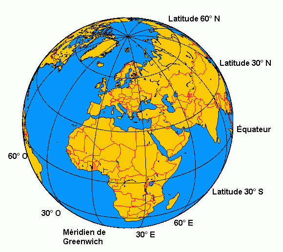
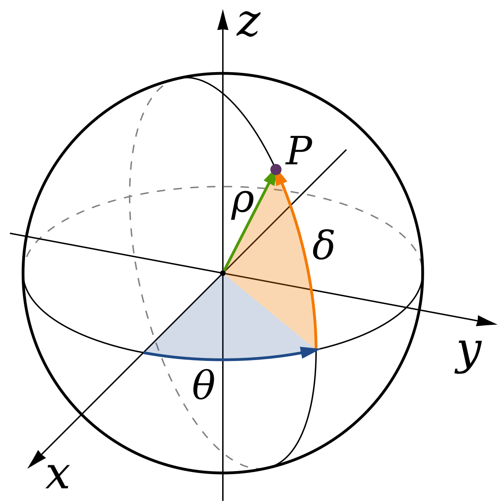
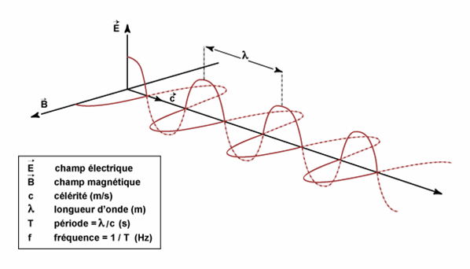
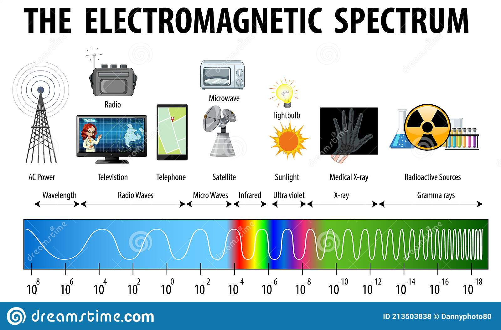
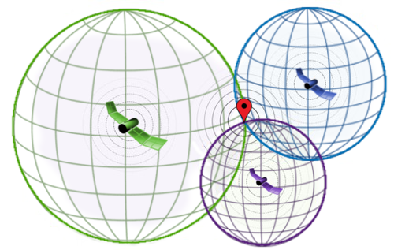
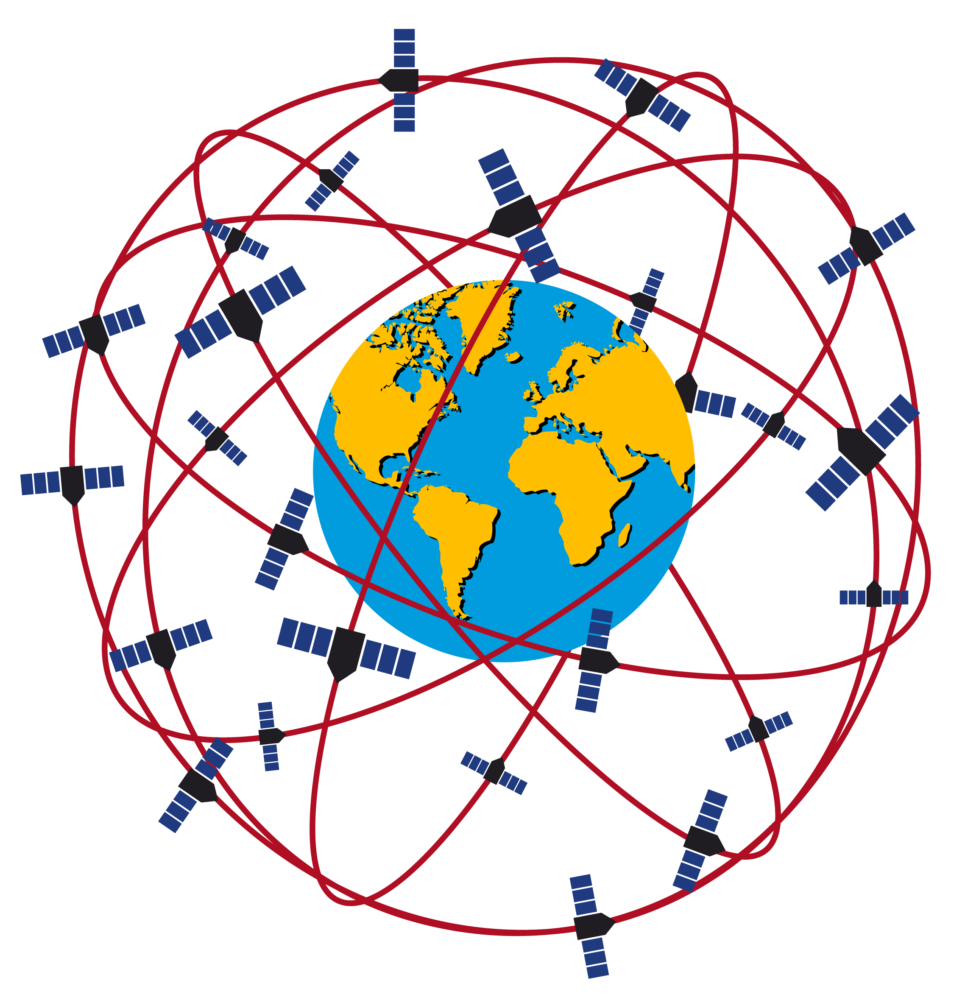
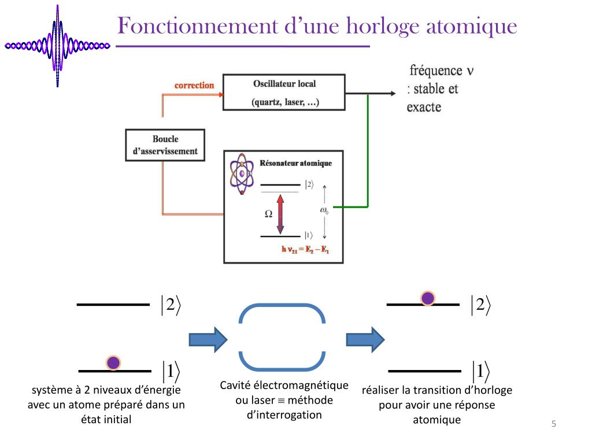
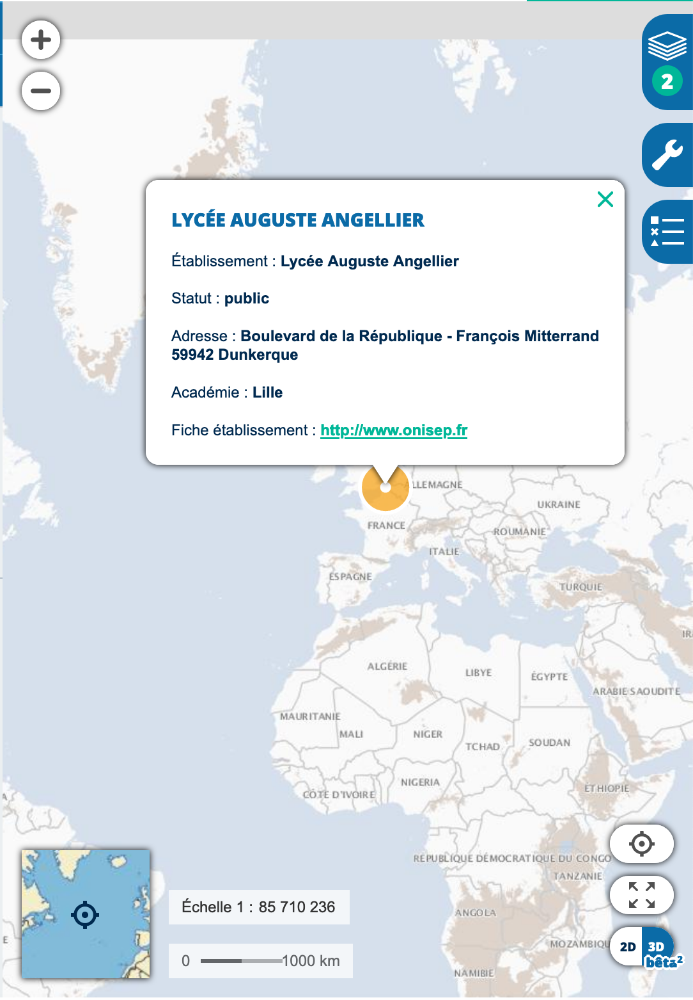
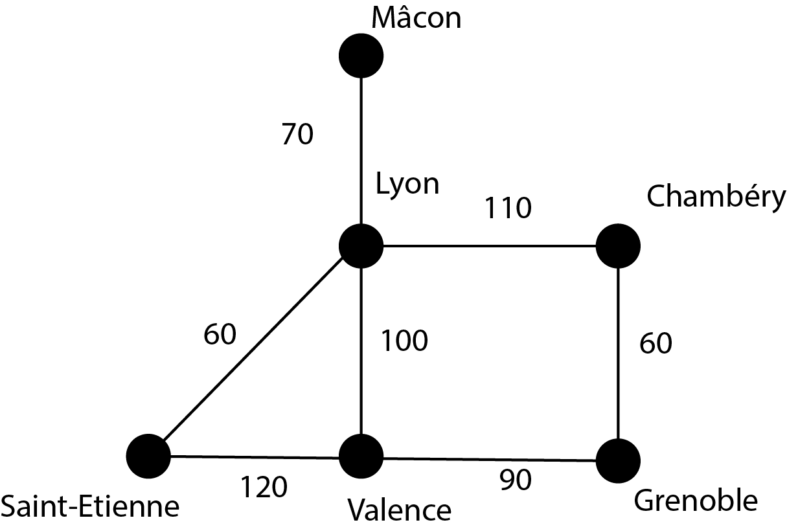

## Thème 5 : Localisation, cartographie et mobilité

### Introduction

Le repérage par satellites des différents points de la Terre a modifié considérablement nos déplacements. L'invention du GPS (Global Positioning System : système de positionnement utilisant des satellites) par les États-Unis d'abord à des fins militaires à partir de 1973 puis ouvert au civil en 2000 est désormais utile à chacun.

### Historique

- 1973 : Lancement du GPS par l'armée américaine
- 1978 : Mise en orbite du premier satellite GPS
- 2004 : Création de la plateforme OpenStreetMap (l'équivalent de Wikipédia pour les cartes)
- 2004 : Mise en ligne de Google Maps, d'abord pour les États-Unis puis pour le reste du monde.
- 2006 : Lancement de Géoportail : plateforme de diffusion de l'information géographique.
- 2016 : Mise en service de Galiléo, plus précis que le système américain GPS, d'une précision égale au mètre, garantissant une indépendance stratégique pour l'Europe.

### Les coordonnées géographiques

Pour situer un point sur la surface terrestre, on utilise des coordonnées géographiques appelées latitude et longitude qui sont des angles exprimés en degrés.

La **latitude** d'un point est l'angle δ (delta minuscule) sur le schéma ci-dessous qui varie de - 90° au pôle Sud à + 90° au pôle Nord et renseigne sur la position par rapport au plan de l'équateur de latitude 0°.   
La **longitude** d'un point est l'angle θ (thêta minuscule) sur le schéma ci-dessous qui varie de - 180° à + 180° et mesure l'angle par rapport au méridien de Greenwich. Le méridien de Greenwich fut adopté comme standard international en octobre 1884 à la conférence internationale du méridien de Washington. En contrepartie de l'adoption du méridien de Greenwich, les Britanniques se sont engagés à adopter le système métrique, adhérant à la Convention du Mètre la même année.

On peut aussi préciser l'**altitude** d'un lieu qui est mesurée par rapport au niveau de la mer.

Pour plus de précision, l'angle peut être donné en **minute d'arc** : 1°=60'.
Une minute d'arc peut elle-même être subdivisée en **seconde d'arc** : 1'=60''.

Exemple : les coordonnées de la Tour Eiffel sont : 48°51'31" N (latitude) et 2°17'39" E (longitude).

On trouvera [ici](Assets/measurements_from_the_sky.pdf) une activité permettant de déterminer la latitude d'un lieu en déterminant la position du Soleil ou de l'étoile Polaire dans le ciel.

### La localisation GPS : [vidéo](https://webtv.univ-lille.fr/video/5507/comment-fonctionne-un-gps)

Le système GPS utilise environ 30 satellites en orbite autour de la Terre. Chaque satellite émet des signaux ou **ondes électromagnétiques** contenant deux informations : 

- la position du satellite  
- l'heure d'émission du signal.  

Un récepteur GPS peut capter un tel signal (ou trame) et en déduire le temps que le signal a mis pour lui parvenir sachant que le signal est une onde électromagnétique qui se propage à la **vitesse de la lumière** c'est-à-dire à la célérité **c = 300 000 km/s = 3,00×108 m·s-1**.

On utilise pour cela la relation : **d=c·Δt** où Δt désigne la durée de transfert du signal, différence entre la date de réception et la date d'émission .

Cette information permet au calculateur intégré au GPS de calculer que l'utilisateur se trouve sur une sphère de rayon d centré sur la position actuelle du satellite.
Il faut donc à priori 3 satellites pour pouvoir localiser l'utilisateur à l'intersection de 3 sphères centrées sur ces 3 satellites.

La difficulté est cependant de synchroniser les horloges des satellites et celle du récepteur. Une erreur d'un millionième de seconde en effet provoque une erreur de 300 mètres sur la position. Le récepteur ne peut bien entendu pas bénéficier d'une horloge atomique comme les satellites ; il doit néanmoins disposer d'une horloge assez stable, mais dont l'heure n'est pas à priori synchronisée avec celle des satellites. Les signaux de quatre satellites au moins sont donc nécessaires pour déterminer ce décalage, puisqu'il faut résoudre un système d'au moins quatre équations mathématiques à quatre inconnues qui sont la position dans les trois dimensions (3 inconnues) plus le décalage de l'horloge du récepteur avec l'heure GPS (1 inconnue). 

Le GPS comprend au moins 24 satellites circulant à 20 200 km d'altitude. Ils se répartissent sur six orbites distinctes à raison de quatre satellites par orbite, et tournent à une vitesse de l'ordre de 14000 km/h.

Compléter la phrase : une erreur de 30 ns (nanoseconde) provoque une erreur de ... mètres sur la géolocalisation.

C'est la raison pour laquelle des horloges de grande précision sont embarquées à bord des satellites G.P.S ; ce sont des horloges dites **atomiques** (basées sur des transitions énergétiques électroniques au sein de l'atome de césium Cs : émission dont la fréquence est immuable (constante quelques soient les conditions extérieures) et qui sert de référence pour la mesure du temps). 

 

Des corrections doivent être apportées dans la mesure du temps pour tenir compte des effets de la relativité  [restreinte](https://www.youtube.com/watch?v=Ytk2z3NApYo) (le temps ne s'écoule pas au même rythme à bord du satellite animé d'une grande vitesse par rapport à la Terre que sur Terre) et la relativité générale (la gravité joue également un rôle sur l'écoulement du temps) ; ces deux théories ont été découvertes par Einstein en 1905.

On trouvera ici, si l'on est intéressé, la démonstration classique du phénomène de [dilatation des durées](Assets/demonstration.md).

❓Question : Quand j'utilise le GPS sur mon téléphone, pourquoi ai-je besoin qu'il y ait du réseau si je reçois les signaux de la part de satellites ?

En théorie, un GPS n’a pas besoin de réseau mobile ou Wi-Fi pour capter les signaux des satellites et déterminer ta position. Cependant, il y a plusieurs raisons pour lesquelles un accès au réseau est souvent nécessaire pour une expérience optimale :

    Téléchargement des cartes 📍
        Le GPS te donne des coordonnées (latitude, longitude, altitude), mais il ne contient pas forcément toutes les cartes en mémoire. Sans connexion Internet, ton application GPS ne peut pas télécharger ou mettre à jour les cartes en temps réel.

    Assistance GPS (A-GPS) 🚀
        Les smartphones utilisent souvent l’Assisted GPS (A-GPS) pour accélérer le temps de localisation. Plutôt que d’attendre que le téléphone capte seul les signaux satellites (ce qui peut prendre plusieurs minutes), le réseau mobile envoie des données d’aide pour une localisation plus rapide.

    Mise à jour du trafic et des itinéraires 🚦

    Google Maps, Waze et autres applications GPS ont besoin d’Internet pour afficher le trafic en direct, proposer des itinéraires alternatifs et signaler des incidents sur la route.

### Trame NMEA

Pour échanger des informations de localisation, il faut que les différents appareils puissent se comprendre. La norme NMEA 0183 est un protocole de communication mis au point par la National Electronics Association (NMEA) et notamment utilisé pour la navigation maritime.

Exemple : 

$GPGLL,2736.45,N,10321.12,W,134244,A

- Une trame commence toujours par $
- GP signifie que l'information provient d'un récepteur GPS
- Les trois caractères suivants correspondent au type de la trame et précise donc quelles sont les informations communiquées. Dans notre exemple, GLL signifie que la trame contient les coordonnées géographiques de latitude et de longitude
- 2736.45,N correspond à la latitude 27°36'45" Nord
- 10321.12,W correspond à la longitude 103°21'12'' West
- 134244 donne l'heure de calcul de la position : 13 h 42 min 44 s UTC
- A signifie que la trame est vide

### Les bases de données cartographiques

#### Géoportail

[Géoportail](https://www.geoportail.gouv.fr/) est une plateforme dédiée à la cartographie mise en service par l'État français. Il permet de visualiser l'état français à l'aide d'un fond (photographies aériennes, cartes géologiques...) auquel on peut superposer des couches (musées, réseau ferroviaire...).
On peut à l'aide des outils mesurer une distance, mesurer une surface, établir un profil altimétrique... 

L'**échelle d'une carte**, par exemple 1 : 121 981, est le rapport entre la distance mesurée sur la carte et la distance réelle. Ainsi 1 cm mesuré sur la carte, représente 121 981 cm soit 1219 m ou 1,219 km.

#### OpenStreetMap

[OpenStreetMap](http://www.openstreetmap.fr/) est un projet cartographique libre et collaboratif : tout le monde peut ajouter ou corriger des informations.

### Calcul d'itinéraire

Les cartes numériques et de géolocalisation ont grandement simplifié la recherche d'itinéraire. 

Pour ce faire, un algorithme, appelé **algorithme du plus court chemin**, est utilisé. Il existe de nombreuses façons de calculer un plus court chemin, plus ou moins efficaces suivant le type de carte.

L'**algorithme de Dijkstra**, inventé par Edsger Dijkstra en 1959, est l'un des plus connus. Cet algorithme utilise un graphe où chaque sommet représente une position (ville par exemple) et chaque arête représente une route possédant une longueur donnée.

Exemple : considérons un exemple simplifié de graphe :

Sur ce graphe, on voit que la distance Lyon - Saint-Étienne est de 60 km.
Quel est le plus court chemin pour aller de Grenoble à Mâcon ?

En énumérant tous les chemins possibles, on voit que le chemin Grenoble - Chambéry - Lyon - Mâcon, de longueur 60+110+70=240 km est le plus court.

Cependant, énumérer toutes les possibilités pour une carte réelle prendrait trop de temps.

L'**algorithme de Dijkstra** est un moyen efficace de trouver le plus court chemin dans un graphe (c'est-à-dire un réseau de villes reliées par des routes, par exemple). Il est souvent utilisé en informatique et en mathématiques.

🌍 Idée principale

L’algorithme de Dijkstra permet de trouver le chemin le plus court entre un point de départ et les autres points d’un réseau. Il fonctionne en explorant progressivement les chemins les plus courts possibles.
🚗 Exemple : Un réseau de villes

Imaginons que nous avons cinq villes : A, B, C, D et E, reliées par des routes avec les distances suivantes :

        (10)
     A ------ B
      \       |
    (5)\  (2) | (2)
        C ---- D
         \   / (3)
        (8) E

Les chiffres entre parenthèses représentent la distance entre les villes.

Objectif : Trouver le plus court chemin de A à D.

🔢 Étapes de l'algorithme

    On note la distance de A à lui-même comme 0 et les autres distances comme "∞" (infini, car on ne les connaît pas encore) :

A = 0, B = ∞, C = ∞, D = ∞, E = ∞

On commence par A (c'est notre point de départ).

    A → B : Distance 10
    A → C : Distance 5

A = 0, B = 10, C = 5, D = ∞, E = ∞

On prend la ville avec la plus petite distance connue (ici C avec 5).

    C → D : 5 + 2 = 7 (c'est mieux que ∞, on met à jour D)
    C → E : 5 + 8 = 13 (mieux que ∞, donc on met à jour E)

A = 0, B = 10, C = 5, D = 7, E = 13

On continue avec D (qui a maintenant la plus petite distance, 7).

    D → B : 7 + 2 = 9 (mieux que 10, donc on met B à jour)

    A = 0, B = 9, C = 5, D = 7, E = 10

    On choisit B (9, la plus petite distance restante).
        Pas d’amélioration pour les autres villes.

    On termine avec E (10).
        Pas d’amélioration.

🎯 Résultat final

Le plus court chemin de A à D est A → C → D avec une distance totale de 7.

📌 Résumé :

    On part de la ville de départ (A) avec une distance de 0.
    On explore les villes voisines et on met à jour les distances si on trouve un chemin plus court.
    On choisit toujours la ville avec la plus petite distance connue et on continue.
    On répète jusqu'à avoir trouvé tous les plus courts chemins.

🏆 Pourquoi c’est utile ?

L’algorithme de Dijkstra est utilisé dans les GPS, les jeux vidéo pour les déplacements de personnages et même pour gérer des réseaux informatiques ! 🚀

🚀 Conclusion

L’idée derrière Dijkstra est de choisir toujours la meilleure option immédiate (principe glouton) et de garantir que chaque distance trouvée est la plus courte possible. C’est ce qui permet d’assurer que l’algorithme trouve la solution optimale efficacement.

⛏️ À vous de jouer pour trouver le plus court chemin de A à E en utilisant l'algorithme de Dijkstra.

