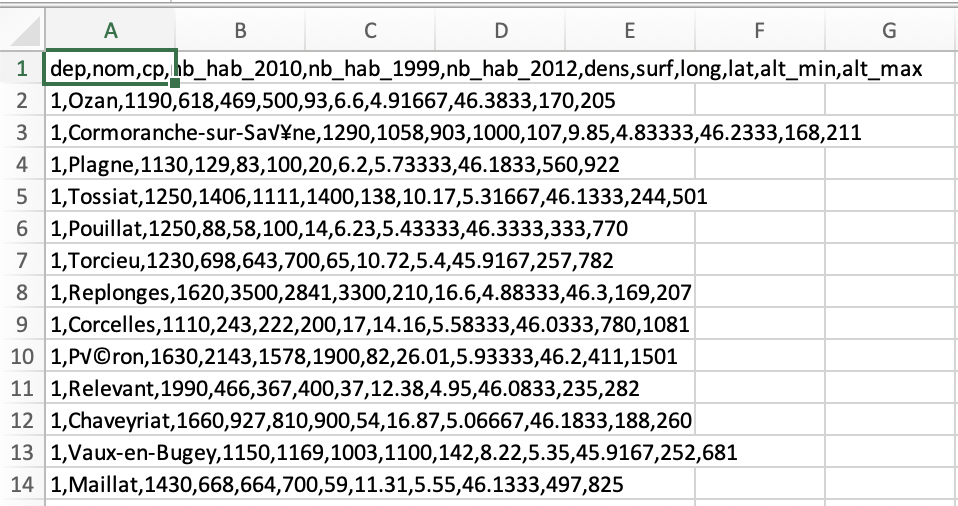

On utilise le [fichier csv](assets/villes_virgule.csv) dont on donne ici les premières lignes lues avec un éditeur de texte :

```csv
dep,nom,cp,nb_hab_2010,nb_hab_1999,nb_hab_2012,dens,surf,long,lat,alt_min,alt_max
1,Ozan,1190,618,469,500,93,6.6,4.91667,46.3833,170,205
1,Cormoranche-sur-Saône,1290,1058,903,1000,107,9.85,4.83333,46.2333,168,211
1,Plagne,1130,129,83,100,20,6.2,5.73333,46.1833,560,922
1,Tossiat,1250,1406,1111,1400,138,10.17,5.31667,46.1333,244,501
1,Pouillat,1250,88,58,100,14,6.23,5.43333,46.3333,333,770
1,Torcieu,1230,698,643,700,65,10.72,5.4,45.9167,257,782
1,Replonges,1620,3500,2841,3300,210,16.6,4.88333,46.3,169,207
1,Corcelles,1110,243,222,200,17,14.16,5.58333,46.0333,780,1081
```

Voici l'image lorsque le fichier est ouvert par un tableur comme Excel :



Dans Thonny, écrire le code suivant :

```python
import pandas
info_villes=pandas.read_csv("villes_virgule.csv")
print(info_villes)

>>> %Run exploitation_fichier_csv_villes.py
       dep                       nom     cp  ...       lat  alt_min  alt_max
0        1                      Ozan   1190  ...  46.38330    170.0    205.0
1        1     Cormoranche-sur-Saône   1290  ...  46.23330    168.0    211.0
2        1                    Plagne   1130  ...  46.18330    560.0    922.0
3        1                   Tossiat   1250  ...  46.13330    244.0    501.0
4        1                  Pouillat   1250  ...  46.33330    333.0    77

```

À la première ligne, on importe la bibliothèque `pandas` qui va nous permettre de lire le fichier csv.

La variable `info_villes` apparaît comme une liste indicée. Pour récupérer l'information concernant un champ donné d'une ligne donnée, on utilise la méthode `loc`.

```python
import pandas
info_villes=pandas.read_csv("villes_virgule.csv")
print(info_villes.loc[2,'nom'])
>>> %Run exploitation_fichier_csv_villes.py
Plagne
```
Le code suivant nous permet de faire une recherche avec critère portant sur la valeur d'un descripteur ; ici on recherche les villes dont l'altitude minimale est de 1500.

```python
import pandas
info_villes=pandas.read_csv("villes_virgule.csv")
nom_alt=info_villes.loc[info_villes["alt_min"]>1500,["nom","alt_min"]]
print(nom_alt)
>>> %Run exploitation_fichier_csv_villes.py
                       nom  alt_min
1618                Larche   1606.0
1790              Ristolas   1571.0
1798           Saint-Véran   1756.0
1847    Molines-en-Queyras   1625.0
1904                Abriès   1513.0
1923        Villar-d'Arêne   1519.0
26927          La Llagonne   1546.0
26943  Caudiès-de-Conflent   1616.0
27039      Porté-Puymorens   1557.0
27125           Mont-Louis   1516.0
27134               Angles   1531.0
29970              Bessans   1673.0
30114          Val-d'Isère   1785.0
30127     Bonneval-sur-Arc   1759.0
```

Il est également possible de faire un calcul de moyenne. L'utilisation des ":" signifie que l'on considère toutes les lignes du tableau.

```python
import pandas
info_villes=pandas.read_csv("villes_virgule.csv")
moyenne_alt_min=info_villes.loc[:,"alt_min"].mean()
print(moyenne_alt_min)
>>> %Run exploitation_fichier_csv_villes.py
193.15756945963685
```

On peut aussi trier un tableau dans l'ordre croissant de la valeur d'un descripteur :

```python
import pandas
info_villes=pandas.read_csv("villes_virgule.csv")

tri_alt_min=info_villes.sort_values(by=["lat"])
print(tri_alt_min)
>>> %Run exploitation_fichier_csv_villes.py
       dep                   nom     cp  ...      lat  alt_min  alt_max
36698  971          Saint-Martin  97150  ... -63.0829      NaN      NaN
36578  971              Deshaies  97126  ... -61.7922      NaN      NaN
36588  971          Pointe-Noire  97116  ... -61.7893      NaN      NaN
36599  971       Vieux-Habitants  97119  ... -61.7636      NaN      NaN
36571  971               Baillif  97123  ... -61.7287      NaN      NaN
...    ...                   ...    ...  ...      ...      ...      ...
36660  974            Petite-Île  97429  ...  55.5651      NaN      NaN
36661  974  Plaine-des-Palmistes  97431  ...  55.6296      NaN      NaN
36664  974           Saint-André  97440  ...  55.6539      NaN      NaN
36657  974            Bras-Panon  97412  ...  55.6849      NaN      NaN
36665  974          Saint-Benoît  97470  ...  55.6972      NaN      NaN

[36700 rows x 12 columns]
```
Pour trier dans l'ordre décroissant, il faudrait écrire : 
tri_alt_min=info_villes.sort_values(by=["lat"],ascending=False)

**À faire vous-même 1**

Recherchez la ville qui en France a une densité de population supérieure à 50 et une altitude minimum supérieure à 1500 m ; il est possible de combiner plusieurs facteurs de sélection en utilisant un 'et' (&) ou un 'ou' (|). On prendra soin de placer des parenthèses correctement pour éviter les ambiguités.

**À faire vous-même 2**

Déterminer le nombre moyen d'habitants en 2012.


**À faire vous-même 3**

Quelle est la ville de France ayant la densité de population la plus forte ?

