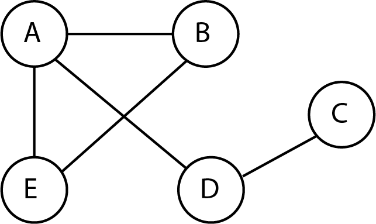

## Les réseaux sociaux

### Introduction

Plus de la moitié des Français sont actifs sur les réseaux sociaux. Ceux-ci ont modifié notre rapport aux autres mais aussi à l'information. Ils ont permis des retrouvailles, de garder le lien avec des personnes sinon oubliées. Certains cependant en deviennent totalement dépendants et se complaisent dans des relations virtuelles aux dépens de vrais rapports humains. L'anthropologue Robin Dunbar (l'anthropologie est la science qui étudie l'être humain et les groupes humains sous tous leurs aspects, à la fois physiques et culturels) a estimé qu'un individu ne pouvait avoir plus de 150 relations humaines stables, au-dessus de ce nombre la confiance mutuelle d'un groupe est compromise, ainsi ceux qui s'extasient d'avoir plus de mille amis sur Facebook n'entretiennent certainement pas de liens avec la grande majorité d'entre eux.
Passionné d'informatique dès son adolescence, Marc Zuckerberg, né en 1984, lance en 2004, avec quelques amis, sa première version de Facebook, il n'a pas 20 ans !
D'abord destiné aux étudiants de Harvard (université privée américaine située à Cambridge, ville de l'agglomération de Boston dans le Massachussets au nord-est des États-Unis), le site est ouvert à tous en septembre 2006. Le succès est immédiat et se poursuit grâce à la création de nouvelles fonctionnalités. Son immense diffusion le place face à des responsabilités éthiques que sont la confidentialité, la mise en ligne de propos racistes et haineux, et la diffusion de **fake news** (en français infox : néologisme qui veut dire fausse information).

### Définition

Les réseaux sociaux sont des applications basées sur les technologies du Web qui offrent un service de mise en relation d'internautes pour ainsi développer des communautés d'intérêts. La publicité constitue le revenu principal de beaucoup de réseaux sociaux.

Exemples:
- Facebook : créé en 2004, il devient accessible en 2006 ; un utilisateur de Facebook peut partager des messages, photos et vidéos avec une liste d'amis. Il est aussi possible de rejoindre des groupes d'intérêts communs autour d'un sujet précis. Facebook revendique plus de 2 milliards d'utilisateurs actifs chaque mois.
- Twitter : fondé en 2006 par Jack Dorsey, Noah Glass, Biz Stone et Evan Williams. Un utilisateur peut envoyer de courts messages appelés tweets à ses followers. Le nombre d'utilisateurs actifs de Twitter dépasse 300 millions.
- Linkedln : réseau social à but professionnel : les utilisateurs peuvent y poster leur CV et consulter des offres d'emploi. Fondé en 2002, il comptabilise plus de 600 millions de membres.

### Fake news

Elles sont très fréquentes sur les réseaux sociaux du fait de la rapidité du partage d'informations, la plupart du temps sans vérification. Bien qu'il s'agisse de fausses informations, les fake news peuvent avoir des impacts bien réels (choix politique, diffamation d'une personne..). Il est donc important d'analyser une information avec un esprit critique et de vérifier si la source est digne de confiance.

### Harcèlement numérique

Le harcèlement numérique existe aussi sur les réseaux sociaux et là aussi des lois existent pour protéger les victimes. Ainsi l'article 222-33-2-2 du code pénal prévoit des peines pour le harcèlement (numérique ou non) qui vont jusqu'à 3 ans d'emprisonnement et 45000€ d'amende. Le site https://www.nonauharcelement.education.gouv.fr/ a été mis en place pour aider les victimes et témoins de harcèlement.

### Vie privée

Les réseaux sociaux sont souvent critiqués par leur manque de respect de la vie privée de ses utilisateurs. Beaucoup de réseaux sociaux collectent des informations sur leurs utilisateurs pour ensuite les revendre ou les utiliser à des fins commerciales ou politiques. Le [scandale Facebook-Cambridge Analytica](Assets/How_to_turn_Facebook.pdf)  est une illustration : la société Cambridge Analytica a collecté les informations personnelles de millions d'utilisateurs Facebook dans le but d'influencer des intentions de vote, notamment lors des élections présidentielles américaines.
Il est souvent possible de paramétrer certains aspects relatifs à la vie privée : par exemple, sur Facebook, on peut spécifier dans Paramètres qui peut voir ou publier dans le journal personnel. 
Le [réglement général sur la protection des données (RGPD)](https://www.cnil.fr/fr/reglement-europeen-protection-donnees) est un ensemble de lois européennes garantissant certains droits relatifs aux données personnelles. Ainsi, dans le cadre du droit à la portabilité des données, vous pouvez demander à récupérer les informations collectées par n'importe quel réseau social. Le "droit à l'oubli" (Article 17 du RGPD) vous permet de supprimer des données vous concernant sur un réseau social ou un moteur de recherche.

### Modélisation des réseaux sociaux

On peut modéliser les relations qu'il existe entre les utilisateurs d'un réseau social à l'aide d'un **graphe**, c'est-à-dire d'un ensemble de points représentant les utilisateurs et de traits représentant les relations d'amitié entre eux. Les points sont ainsi appelés sommets et les traits arêtes.

Considérons un exemple simpliste de réseau social comportant 5 utilisateurs : Alice, Benjamin, Chloé, Dylan et Emma (auxquels on fera référence par les initiales A, B, C, D et E.
- A est ami avec B, D et E
- B est ami avec A et E
- C est ami avec D
- D est ami avec A et C
- E est ami avec A et B

D'où le graphe représentant les relations entre A, B, C, D et E.

 
 
 Un graphe, qui est une représentation très commune et très utile en informatique, peut être caractérisé de la manière suivante :

1. Le **degré** d'un sommet est le nombre d'arêtes dont il est l'extrémité ; ici, cela correspond aux nombres d'utilisateurs ; par exemple le degré de A est 3, le degré de C est 1.
2. La **distance** entre deux sommets est le nombre minimum d'arêtes qu'il faut parcourir pour aller de l'un à l'autre. Par exemple, la distance de D à E est 2 (en allant de D à A puis de A à E). La distance de B à C est 3 avec le chemin B-A-D-C.
3. L'**excentricité** d'un sommet est la distance maximum de ce sommet aux autres sommets. A est à distance 2 de C et A est à distance 1 de B, D et E ; donc l'excentricité de B est égale à 3.
4. Le **diamètre** est la distance maximum entre deux sommets quelconques. Le diamètre du graphe proposé est 3 car la distance de B à C est 3 et la distance entre deux sommets quelconques est au plus 3.
5. Le **rayon** d'un graphe est la valeur minimale de l'excentricité des sommets de ce graphe. Comme les excentricité de A, B, C, D et E sont 2, 3, 3, 2, 3 respectivement, on en déduit que le rayon du graphe est 2.
6. Un sommet dont l'excentricité est minimum est **centre** du graphe ; le graphe considéré possèdent deux centres : A et D.

### Implémenter le traitement d'un graphe dans Python

Il existe plusieurs façons de stocker un graphe dans Python. Nous allons utiliser ici ce que l'on appelle la représentation par **liste d'adjacence** d'un graphe.
On suppose dans toute la suite que les n sommets d'un graphe sont numérotés de 0 à n-1. On utilise alors une liste G de taille n telle que, pour tout entier i de 0 à n-1, G[i] est la liste des sommets qui sont reliés au sommet i. Par exemple le graphe précédent peut être stocké de la façon suivante, en associant les points A, B, C, D, E aux valeurs 0, 1, 2, 3, 4 : 
```Python
>>> G=[[1,3,4],[0,4],[3],[0,2],[0,1]]
>>> G[0]
[1, 3, 4]
>>> G[1]
[0, 4]
>>> G[2]
[3]
>>> G[3]
[0, 2]
>>> G[4]
[0, 1]
```
Pour accéder à la valeur 2 dans cette liste de liste, on écrit : 

```Python
>>> G=[[1,3,4],[0,4],[3],[0,2],[0,1]]
>>> G[3][1]
2
```

Nous pouvons alors écrire des algorithmes en Python sur des graphes.
Par exemple, on peut définir une fonction `lien` qui détermine si deux sommets i et j sont reliés ; elle admet comme paramètre un graphe et deux sommets i et j.
L'algorithme consiste à regarder si l'élément j se trouve dans la liste d'adjacence de i ; pour cela on parcourt cette liste et on regarde si on y trouve l'élément j. 

Rappels et indications :

- Pour parcourir les éléments d'une liste les uns après les autres :

```Python
>>> liste=[4,8,9,2]
>>> for element in liste:
    	print(element)   
4
8
9
2
```
- Une autre méthode (peu appropriée ici) serait de parcourir les indices des éléments de la liste depuis l'indice 0 à l'indice égal à len(liste)-1 :

```Python
>>> liste=[4,8,9,2]
>>> for i in range(len(liste)):
    	print(liste[i])  
4
8
9
2
```

On rappelle le code pour faire les doctests.

```Python
if __name__ == '__main__':
  import doctest
  doctest.testmod(verbose=True)
```

1. Compléter la fonction `lien`.

```Python
	def lien(i,j,Graphe):
    """
    Renvoie True si i et j sont liés
    >>> lien(0,3,G)
    True
    """
```

2. Compléter la fonction `degre(Graphe,i)`.

```Python
	def degre(Graphe,i):
    """
    Renvoie le degré du sommet i dans le graphe, c'est-à-dire le nombre
    d'arêtes dont il est l'extrémité
    >>> degre(G,1)
    2
    """
```

3. Compléter la fonction `nb_aretes` renvoyant le nombre total d'arêtes dans un graphe représenté par une liste d'adjacence.

```Python
def nb_aretes(Graphe):
    """
    Renvoie le nombre d'arêtes du graphe
    >>> nb_aretes(G)
    5
    """
```

### Petits mondes

On peut se demander quelle est la distance moyenne qui sépare deux utilisateurs d'un réseau social. En 1967, [Stanley Milgram](Assets/Email_to_test_New_Scientist.pdf), un psychologue social américain, a préparé environ 300 lettres ayant chacune un destinateur cible. Il a envoyé ensuite chaque lettre à une personne au hasard, qui devait soit la renvoyer directement à la personne cible (s'il la connaissait) soit à une connaissance qui pouvait potentiellement la connaître. Ce processus était répété jusqu'à ce que le distinataire cible reçoive la lettre. Milgram a alors constaté que les lettres qui sont arrivées à destination sont passées par 6 personnes, d'où la célèbre théorie des **six degrés de séparation** : deux personnes sont reliées par une chaîne de 6 relations en moyenne. Cependant, cette expérience a été critiquée du fait que beaucoup de lettres ne soient pas arrivées à destination.
En 2016, des chercheurs ont estimé à 4.57 la distance moyenne entre deux utilisateurs du [graphe d'amitié de Facebook][https://research.fb.com/blog/2016/02/three-and-a-half-degrees-of-separation]. Ce nombre peut apparaître étonnamment faible : les réseaux sociaux permettent de rapprocher des utilisateurs géographiquement très éloignés. On parle ainsi de **petits mondes**.

### Communauté

Au sein d'un réseau social, on constate souvent la création de communautés, regroupant des personnes ayant des opinions politiques similaires, des centres d'intérêts commun, etc... Par exemple, les "hashtags" permettent aux utilisateurs de Twitter de communiquer avec d'autres utilisateurs autour d'un sujet précis. Ce phénomène de communauté comporte des avantages mais il peut aussi nuire à l'esprit critique de ses membres.
Un utilisateur d'un réseau social reçoit, par des systèmes de recommandation, des publicités et des suggestions d'ajout de contact qui dépendent entre autres de sa liste d'amis. On peut modéliser une communauté par une **clique** dans un graphe, c'est-à-dire un ensemble de sommets qui sont tous reliés mutuellement entre eux.

Exemple : Pour notre situation précédente, A, B, E forment une clique tandis que A, B, D ne forment pas de clique car B n'est pas relié à D.

 
 
Écrire la fonction `est_clique` telle que si G est un graphe représenté par une liste d'adjacence et S une liste de sommets, `est_clique(G,S)` renvoie `True` si S forme une clique, `False` sinon.

```Python
def est_clique(Graphe,liste):
    """
    Renvoie True si la liste est une clique où tous les sommets sont reliés mutuellement entre eux
    >>> est_clique(G,[0,1,4])
    True
    >>> est_clique(G,[0,1,3])
    False
    """
```

Le principe de l'algorithme à écrire est le suivant : on parcourt tous les éléments de la liste ; pour chacun d'entre eux on regarde s'il est relié aux autres éléments de la liste hormis lui-même ; dès que le test est négatif, cela signifie que ce n'est pas une clique ; si tous les tests sont positifs, cela signifie que c'est une clique.

