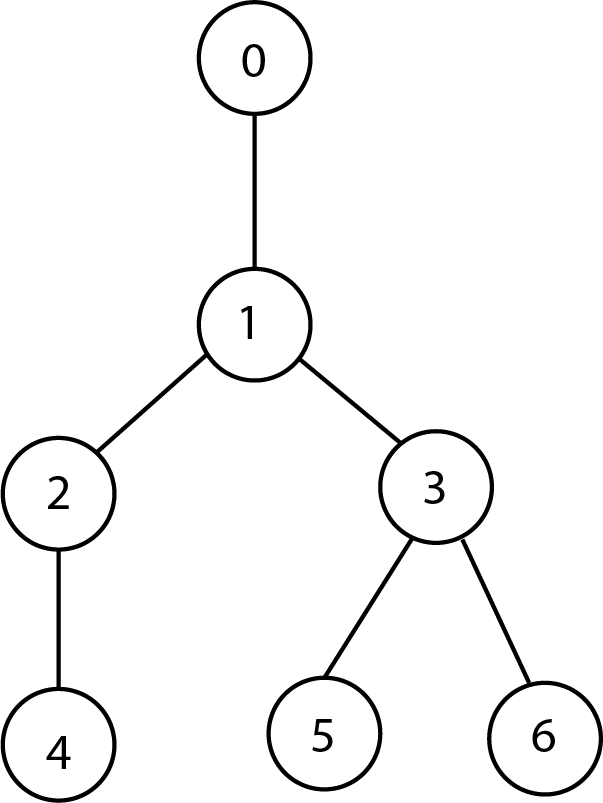
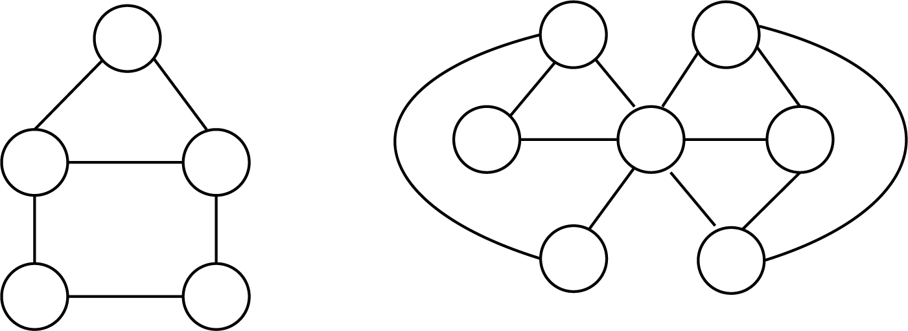

## Exercices Thème 3 : Réseaux sociaux

On rappelle le code pour faire les doctests.

```Python
if __name__ == '__main__':
  import doctest
  doctest.testmod(verbose=True)
```

### Exercice 1

Une personne malveillante décide d'envoyer une fausse nouvelle à 3 personnes. Le jour suivant, chacune de ces 3 personnes envoie à nouveau à 3 nouvelles personnes cette nouvelle, et ainsi de suite. Combien faudra-t-il de jours avant que le monde entier l'ait reçu ?
Population mondiale : 7,8 milliards.

Indications :

1. Donner, en fonction de n, une expression du nombre de nouvelles personnes touchées par la fake news le nième jour.
2. Écrire un programme en Python permettant de répondre à la question.

### Exercice 2

Consulter le [kit complet de sensibilisation aux risques numériques](Assets/kit_complet_de_sensibilisation.pdf) réalisé par cybermalveillance.gouv.fr puis effectué le test de connaissances.

### Exercice 3

Soit le graphe ci-dessous :



1. Donner une représentation par liste d'adjacence de ce graphe.
2. En utilisant les définitions du cours, déterminer son diamètre et son rayon.
3. Indiquer le ou les centres de ce graphe.

### Exercice 4

Il peut être intéressant de trouver la plus grande communauté dans un réseau social. On a vu qu'une communauté peut être vue comme une clique (sommets tous reliés entre eux) dans un graphe. Dans les graphes suivants, quel est le nombre maximum de sommets d'une clique ?


