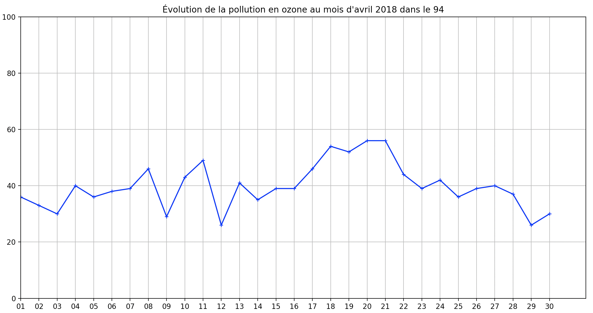

## Exercices Thème 4 : Les données structurées et leurs traitements

### Exercice 1

Aller sur le site www.data.gouv.fr et effectuer la recherche "indices qualité de l'air Île de France" ;  télécharger puis ouvrir le fichier `indices_QA_commune_IDF_04_2018.csv` (le fichier est également présent dans le dossier `Assets` du thème 4).   

Il s'agit d'un exemple de données ouvertes ou **open data** accessibles à tous. Les indices de qualité de l’air sont des outils de communication qui permettent de décrire périodiquement sous une forme simple (qualificatif, chiffre) l’état global de la qualité de l’air dans une aire géographique donnée.

En s'inspirant des exemples du cours réalisés sur le fichier `contacts.csv`, répondre aux questions suivantes avec Python.  
 
**Attention**, on observe que les séparateurs dans le fichier `csv` sont ici des virgules `,` et non des points-virgules `;`, il faut donc modifier en conséquence notre programme de lecture et de transformation de fichier `csv` en tableau.
Penser également à transformer les chaînes de caractères représentant une valeur entière en nombre entier, en utilisant `int` : 

```Python
>>> int("45")
45
```

1. Quels sont les descripteurs utilisés ? Affichez-les.
2. Question posée : quel jour a été le plus pollué en dioxyde d'azote en Île de France ?

**Trier** les données en fonction de l'indice de pollution au dioxyde d'azote NO<sub>2</sub> dans l'ordre décroissant, puis **filtrer** les données correspondant à l'Île de France (code Insee : 0) afin de déterminer la réponse à la question.

**Indications** : On sera donc amené à écrire deux fonctions : `tri_selon_NO2(element)` pour trier les données dans l'odre décroissant de  `no2` et `filtre_selon_ninsee(ninsee,tableau)` pour ne garder que ce qui se rapporte à `ninsee`. 

3. Déterminer les numéro d'insee des deux communes d'Île-de-France les plus polluées en particules fines (pm10) le 20/04/2018.    

**Indications** : On sera amené à écrire les fonctions : `tri_selon_pm10(element)`pour  trier les données dans l'ordre décroissant de `pm10` et `filtre_selon_date(date,tableau)` pour ne garder que ce qui se rapporte à `date`.

Résultat attendu : `Les insee des deux communes d'Île-de-France les plus polluées aux particules fines (pm10) le 20/04/2018 sont :  92026  ,  92035`

4. Pendant combien de jours l'indice de pollution à l'ozone O<sub>3</sub> a-t-il été supérieur à 45 dans le Val-de-Marne (code d'Insee : 94) au mois d'avril 2018 ?   

**Indications** : On sera amené à écrire une fonction : `filtre_selon_code_mois_seuil(code,tableau,mois,seuil)` 

Résultat attendu : `Le nombre de jour où l'indice de pollution à l'ozone a été supérieur à 45 dans le Val-de-Marne est :  7 `

5. Donner la représentation graphique de l'évolution de la pollution à l'ozone pendant le mois d'avril 2018 dans le Val-de-Marne. Utiliser ce graphe pour déterminer les dates correspondant à la question précédente.

On sera amené à ordonner les données selon la `date`, placée en abscisse sur le graphe, en réalisant la fonction `tri_selon_date(element)`.

Voici le code permettant une représentation graphique du niveau d'ozone dans le Val-de-Marne au mois d'avril 2018 au cours du temps  une fois le tri et le filtre effectués.

```Python
import matplotlib.pyplot as plt
x=[]
y=[]
for element in table:
    x.append(element[0].split("/")[0])#on ne garde que le numéro du jour
    y.append(int(element[3]))#transforme en valeur entière
plt.axis([ 1, 31, 0, 100 ])
plt.plot(x,y,'+',markersize=5,linestyle='solid',color='blue')
plt.xlabel("Date")
plt.ylabel("Taux d'ozone")
plt.title ("Évolution de la pollution en ozone au mois d'avril 2018 dans le 94")
plt.grid()
plt.show()
plt.close()
```



### Exercice 2

Code pour vérifier les docstrings :

```Python
if __name__ == '__main__':
    import doctest
    doctest.testmod(optionflags=doctest.NORMALIZE_WHITESPACE | doctest.ELLIPSIS, verbose=True)
```


On souhaite traiter la table ci-dessous appelée `fruits` à l'aide des fonctions suivantes : `fonction1`, `fonction2`, `fonction3` présentées ci-après :

```Python
fruits=[
        ['espece','couleur','substrat','contenu'],
        ['fraise','rouge','sol','sans'],
        ['abricot','orange','arbre','noyau'],
        ['peche','orange','arbre','noyau'],
        ['cerise','rouge','arbre','noyau'],
        ['melon','vert','sol','pepins'],
        ['avocat','vert','arbre','noyau']
        ]

del(fruits[0])#supprime la ligne des descripteurs

def fonction1(table):
    return len(table),len(table[0])

def fonction2(table,indice,valeur):
    compteur=0
    for ligne in table:
        if ligne[indice]==valeur:
            compteur+=1
    return compteur

def fonction3(table,nom):
    for ligne in table:
        if ligne[0]==nom:
            return True
    return False
```

Répondre d'abord "à la main" aux questions suivantes à la lecture du code puis vérifiez avec Thonny en utilisant la console puis réaliser les `docstrings` des fonctions (c'est à dire un résumé succinct de ce que fait la fonction, les paramètres et leur type, un test permettant de vérifier la fonction).

1. Quel est le rôle de `fonction1` et que renvoie `fonction1(fruits)` ? Faire la docstring de cette fonction avec le test `fonction1(fruits)`. Proposer un autre test.
2. Quel est le rôle de `fonction2` et que renvoie `fonction2(fruits,1,'rouge')` ? Faire la docstring de cette fonction avec le test `fonction2(fruits,1,'rouge')`. Proposer un autre test.
3. Quel est le rôle de `fonction3` et que renvoie `fonction3(fruits,'fraise')` ? Faire la docstring de cette fonction avec le test `fonction3(fruits,'fraise')`. Proposer un autre test.
4. Modifier `fonction3` pour créer `fonction4` ; celle-ci doit renvoyer la liste des valeurs que prennent tous les descripteurs associés à l'objet si `nom` a été trouvé dans la table, et un message (chaîne de caractère ou string) indiquant dans le cas contraire que `nom` n'a pas été trouvé <sup>*</sup>.      
La docstring de cette `fonction4` doit permettre de vérifier les deux tests suivants :

```Python
>>> fonction4(fruits,'fraise')
['fraise', 'rouge', 'sol', 'sans']
>>> fonction4(fruits,'pomme')
"L'objet pomme est absent de la table"
```

<sup>*</sup> Indication : on sera amené à utiliser la concaténation de chaînes de caractères, par exemple : 

```Python
>>> partie2="la suite"#partie2 est une variable égale à une chaîne de caractères ou string (str)
>>> "ceci est le début, " +partie2 +" et la fin de la phrase"
'ceci est le début, la suite et la fin de la phrase'
```

Exemple : réponses à la question 1

```Python
def fonction1(table):
    """
    Renvoie un tuple donnant le nombre d'éléments du tableau et le nombre de données dans son premier élément
    param: table : list
    return : tuple
    >>> fonction1(fruits)
    (6, 4)
    """
    return len(table),len(table[0])
```

### Exercice 3

1. Dans un premier temps on extrait à l'aide du programme ci-dessous en Python les données d'un fichier csv appelé `les_salles_de_cinemas_en_ile-de-france.csv` .  On trouvera également ce fichier sur le site de données ouvertes du gouvernement à cette [adresse](https://www.data.gouv.fr/fr/datasets/les-salles-de-cinema-en-ile-de-france-idf/).
Vous trouverez ce fichier `csv` (comma-separated values) dans le dossier `Assets` du thème4 ; il faudra placer ce fichier dans le même dossier que votre programme python `exercice3.py`.

```Python
import csv
fichier=open("les_salles_de_cinemas_en_ile-de-france.csv","r")
table_des_donnees=[]
for ligne in fichier:
    table_des_donnees.append(ligne.rstrip().split(';'))
fichier.close
```

Dans la console, noter les résultats affichés :

a) print(len(table_des_donnees)) 

b) print(table_des_donnees[0]) 

c) print(len(table_des_donnees[0])) 

d) print(table_des_donnees[0].index('dep')) 

e) print(table_des_donnees[0].index('entrees_2020'))  

f) print(table_des_donnees[0].index('geo')) 

Donnez la signification de ces résultats.   
Pour la suite, supprimer la ligne des descripteurs en ajoutant :  
 `del table_des_donnees[0]` après `fichier.close`

2. On se demande combien il y a de cinémas dans le département 95.   

Pour cela, compléter les lignes de code de la fonction `denombre` donnée ci-dessous pour que sa docstring soit vérifiée. On dénombre en effet 30 salles de cinéma dans le département 93. Puis dans la console appliquer cette fonction au département 95.

**Indication:** s'inspirer de la question 2 de l'exercice 2.

```Python

def denombre(departement,tableau):
    """
    Renvoie le nombre de salles de cinéma dans departement après le parcours de tableau 
    param : departement : str
    param : tableau : list
    return : int
    >>> denombre("93",table_des_donnees)
    30
    """
    ................................
    ................................
    ................................
    ................................
    ................................

        
if __name__ == '__main__':
    import doctest
    doctest.testmod(optionflags=doctest.NORMALIZE_WHITESPACE | doctest.ELLIPSIS, verbose=True)
```


3. Quel est le nom du cinéma d'Île de France (tous départements confondus) qui a fait le plus d'entrée en 2020 ?

**Indication** : créer une liste triée en utilisant `sorted` et une fonction `tri_selon_entree_2020` comme critère de tri.

4. Quel est le nom du cinéma du département 95 qui a fait le plus d'entrée en 2020 ?

**Indication** : réaliser une fonction de filtrage `filtre_selon_code(code,tableau)` pour retenir les éléments du tableau de la question précédente correspondant au code mis en paramètre.

5. On se propose maintenant de répondre à la question suivante : combien y-a-t-il de cinéma à moins de 10 km de Paris ?    

Pour cela, on importe un programme appelé `calcul_distance_latitude_longitude.py` en ajoutant dans notre code 

```Python
import calcul_distance_latitude_longitude as distance
```
 après avoir placé ce programme que l'on trouvera dans le dossier Assets dans le même dossier que le programme actif. 
 
Ce programme possède une fonction `a_paris(geo)` qui renvoie la distance en <u>mètre</u> par rapport à Paris d'un point dont les coordonnées géographiques sont données sous forme de tuple (latitude,longitude) ; pour l'appeler et l'utiliser dans notre programme, il suffit d'écrire la fonction `distance.a_paris` comme le montre l'exemple ci-dessous:

```Python
>>> distance.a_paris('48.873073,2.298394')
4346.833687547045`
```

**Indication** : réaliser une fonction de filtrage `filtre_selon_distance_a_Paris(tableau,rayon_a_Paris)` pour retenir les éléments du tableau correspondant à notre requête.