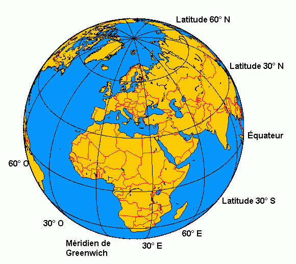
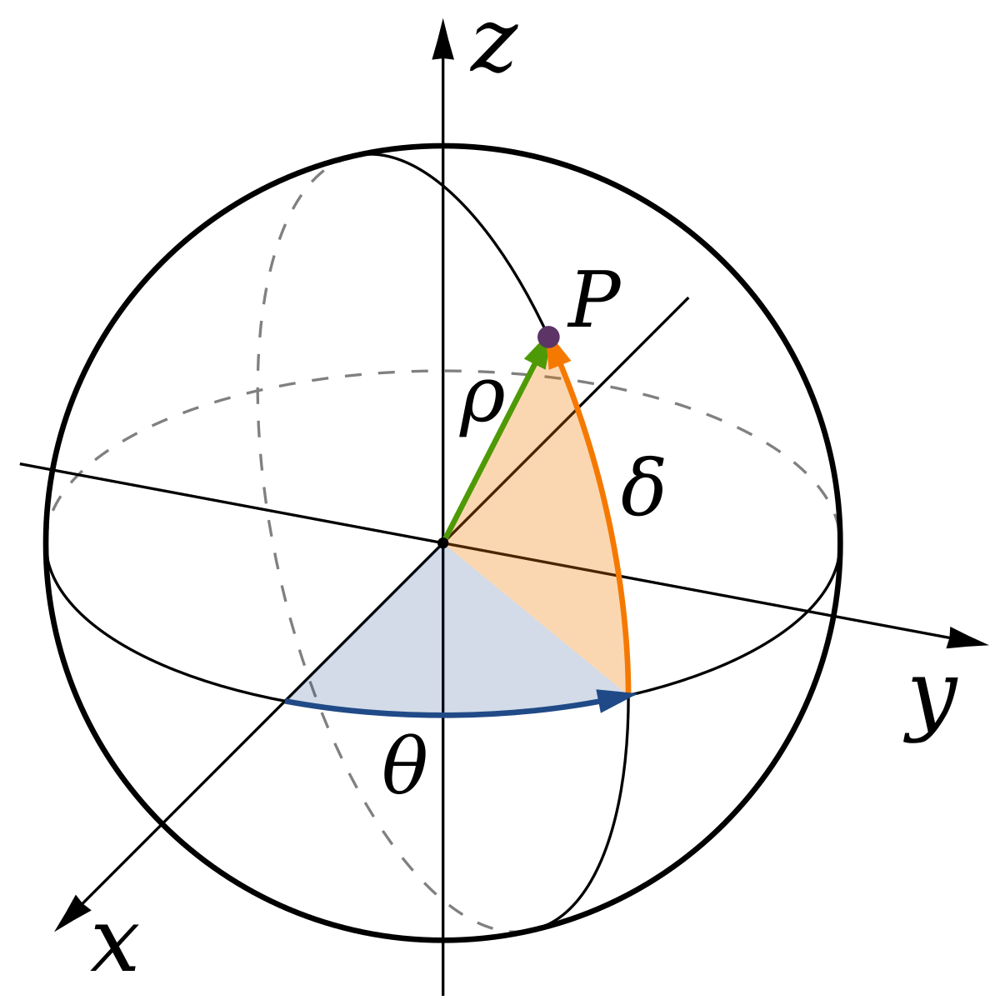
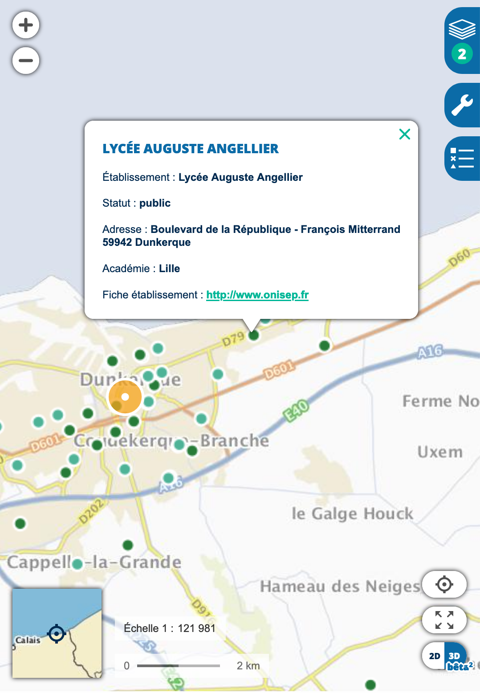
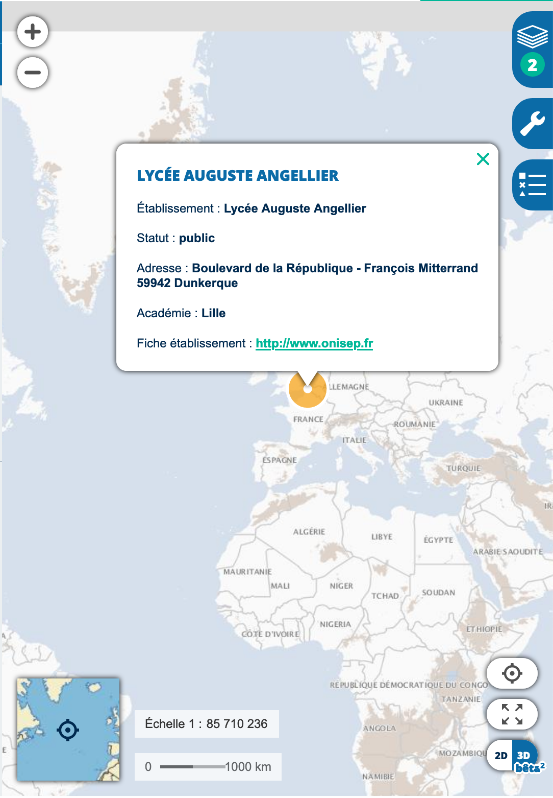
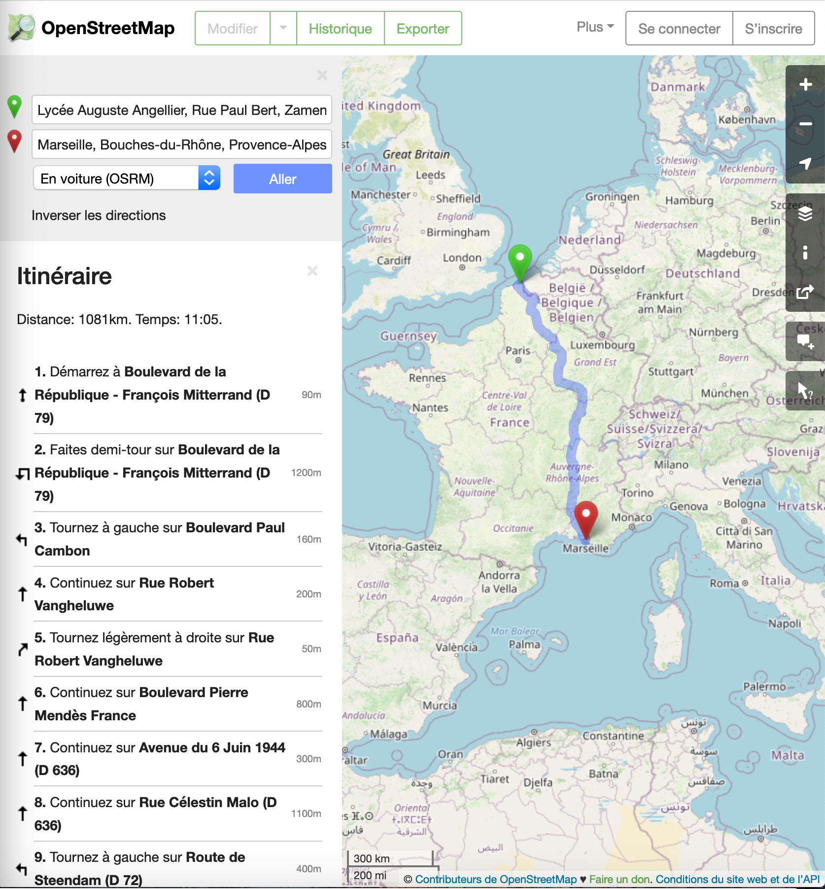
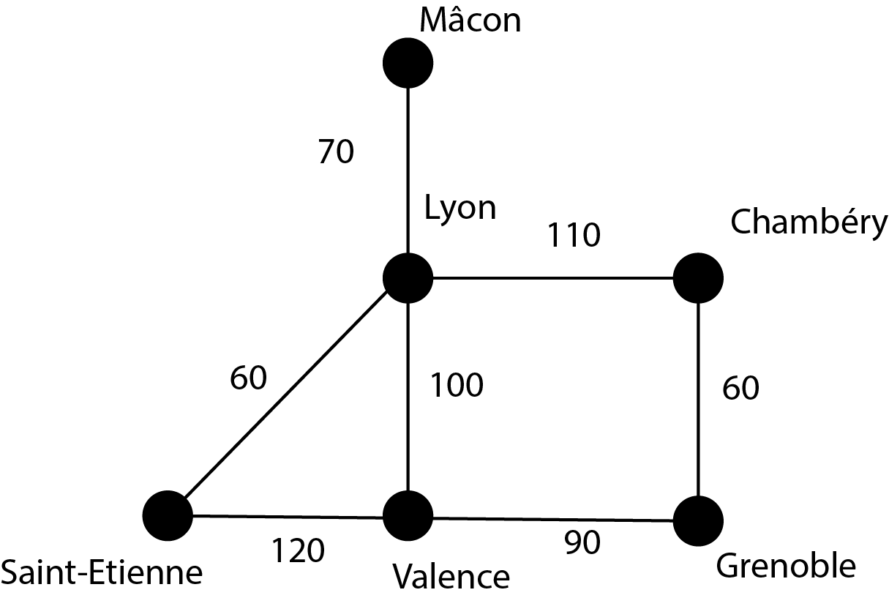

## Thème 5 : Localisation, cartographie et mobilité

### Introduction

Le repérage par satellites des différents points de la Terre a modifié considérablement nos déplacements. L'invention du GPS (Global Positioning System : système de positionnement utilisant des satellites) par les États-Unis d'abord à des fins militaires à partir de 1973 puis ouvert au civil en 2000 est désormais utile à chacun. La mise en place prochaine du système européen Galileo devrait encore améliorer la précision de la localisation.

### Historique

- 1973 : Lancement du GPS par l'armée américaine
- 1978 : Mise en orbite du premier satellite GPS
- 2004 : Création de la plateforme OpenStreetMap (l'équivalent de Wikipédia pour les cartes)
- 2004 : Mise en ligne de Google Maps, d'abord pour les États-Unis puis pour le reste du monde.
- 2006 : Lancement de Géoportail : plateforme de diffusion de l'information géographique.
- 2020 : Mise en service prévue de Galiléo, censé être plus précis que le système GPS.

### Coordonnées

Pour situer un point sur la surface terrestre, on utilise des coordonnées géographiques appelées latitude et longitude qui sont des angles exprimés en degrés.

La **latitude** d'un point est l'angle δ sur le schéma ci-dessous qui varie de - 90° au pôle Sud à + 90° au pôle Nord et renseigne sur la position par rapport à l'équateur de latitude 0°.
La **longitude** d'un point est l'angle θ sur le schéma ci-dessous qui varie de - 180° à + 180° et mesure l'angle par rapport au méridien de Greenwich (Le méridien de Greenwich fut adopté comme standard international en octobre 1884 à la conférence internationale du méridien de Washington. En contrepartie de l'adoption du méridien de Greenwich, les Britanniques se sont engagés à adopter le système métrique, adhérant à la Convention du Mètre la même année) .

On peut aussi préciser l'**altitude** d'un lieu qui est mesurée par rapport au niveau de la mer.

Pour plus de précision, l'angle peut être donné en **minute d'arc** : 1°=60'.
Une minute d'arc peut elle-même être subdivisé en **seconde d'arc** : 1'=60''.

Exemple : les coordonnées de la Tour Eiffel sont : 48°51'31" N (latitude) et 2°17'39" E (longitude).

### Localisation GPS

Le système GPS utilise environ 30 satellites en orbite autour de la Terre. Chaque satellite émet des signaux contenant la position du satellite et l'heure d'émission du signal.

Un récepteur GPS peut capter un tel signal et en déduire le temps que le signal a mis pour lui parvenir sachant que le signal est une onde électromagnétique qui se propage à la **vitesse de la lumière** c'est-à-dire à la célérité **c = 300 000 km/s = 3,00×108 m·s-1**.

On utilise pour cela la relation : d=c·Δt où Δt désigne la durée de transfert du signal soit Δt=date de réception-date d'émission.

Cette information permet au calculateur du récepteur de savoir que l'utilisateur se trouve sur une sphère de rayon d centré sur la position actuelle de ce satellite.
Il faut à priori 3 satellites pour pouvoir localiser l'utilisateur à l'intersection de 3 sphères centrées sur ces 3 satellites.

La difficulté est de synchroniser les horloges des satellites et celle du récepteur. Une erreur d'un millionième de seconde provoque une erreur de 300 mètres sur la position (cf. exercice 2). Le récepteur ne peut bien entendu pas bénéficier d'une horloge atomique comme les satellites ; il doit néanmoins disposer d'une horloge assez stable, mais dont l'heure n'est a priori pas synchronisée avec celle des satellites. Les signaux de quatre satellites au moins sont nécessaires pour déterminer ce décalage, puisqu'il faut résoudre un système d'au moins quatre équations mathématiques à quatre inconnues qui sont la position dans les trois dimensions plus le décalage de l'horloge du récepteur avec l'heure GPS. 

### Bases de données cartographiques

#### Géoportail

Géoportail (https://www.geoportail.gouv.fr/) est une plateforme dédiée à la cartographie mise en service par l'État français. Il permet de visualiser l'état français à l'aide d'un fond (photographies aériennes, cartes géologiques...) auquel on peut superposer des couches (musées, réseau ferroviaire...).
On peut à l'aide des outils mesurer une distance, mesurer une surface, établir un profil altimétrique... 

L'**échelle d'une carte**, par exemple 1 : 121 981, est le rapport entre la distance mesurée sur la carte et la distance réelle. Ainsi 1 cm mesuré sur la carte, représente 121 981 cm soit 1219 m ou 1,219 km.

#### OpenStreetMap

OpenStreetMap (http://www.openstreetmap.fr/) est un projet cartographique libre et collaboratif : tout le monde peut ajouter ou corriger des informations.

### Calcul d'itinéraire

Les cartes numériques et de géolocalisation ont grandement simplifié la recherche d'itinéraire. 

Pour ce faire, un algorithme, appelé **algorithme du plus court chemin**, est utilisé. Il existe de nombreuses façons de calculer un plus court chemin, plus ou moins efficaces suivant le type de carte.

L'algorithme de Dijkstra, inventé par Edsger Dijkstra en 1959, est l'un des plus connus. Cet algorithme utilise un graphe où chaque sommet représente une position (ville par exemple) et chaque arête représente une route possédant une longueur donnée.

Exemple : considérons un exemple simplifié de graphe :

Sur ce graphe, on voit que la distance Lyon - Saint-Étienne est de 60 km.
Quel est le plus court chemin pour aller de Grenoble à Mâcon ?

En énumérant tous les chemins possibles, on voit que le chemin Grenoble - Chambéry - Lyon - Mâcon, de longueur 60+110+70=240 km est le plus court.

Cependant, énumérer toutes les possibilités pour une carte réelle prendrait trop de temps ; l'algorithme de Dijkstra procède de façon plus intelligente, en calculant la distance de la ville de départ à toutes les autres villes de proche en proche. (cf. exercice 7)

### Trame NMEA

Pour échanger des informations de localisation, il faut que les différents appareils puissent se comprendre. La norme NMEA 0183 est un protocole de communication mis au point par la National Electronics Association (NMEA) et notamment utilisé pour la navigation maritime.

Exemple : 

$GPGLL,2736.45,N,10321.12,W,134244,A

- Une trame commence toujours par $
- GP signifie que l'information provient d'un récepteur GPS
- Les trois caractères suivants correspondent au type de la trame et précise donc quelles sont les informations communiquées. Dans notre exemple, GLL signifie que la trame contient les coordonnées géographiques de latitude et de longitude
- 2736.45,N correspond à la latitude 27°36'45" Nord
- 10321.12,W correspond à la longitude 103°21'12'' West
- 134244 donne l'heure de calcul de la position : 13 h 42 min 44 s UTC
- A signifie que la trame est vide

