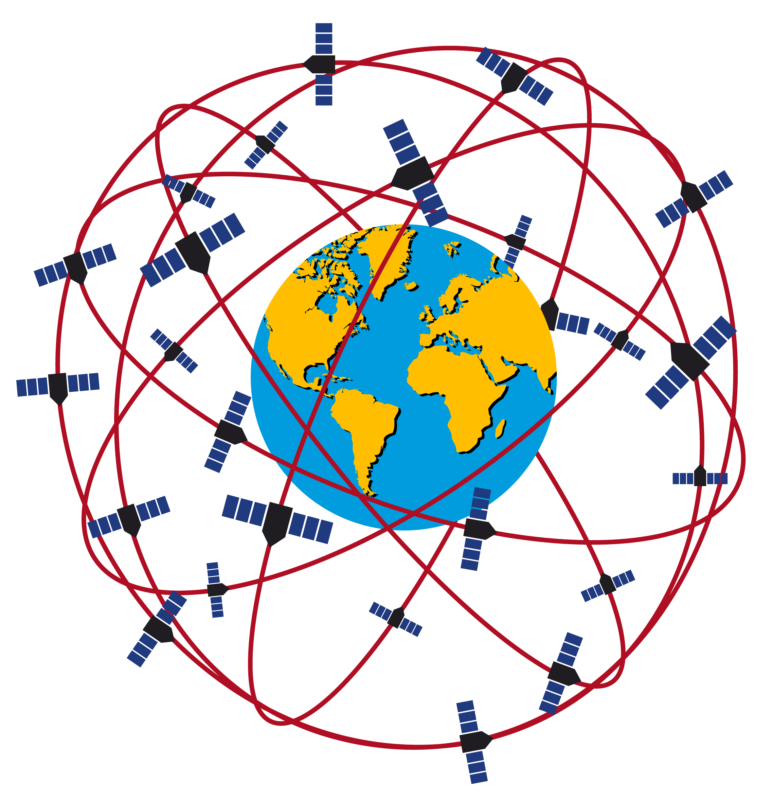
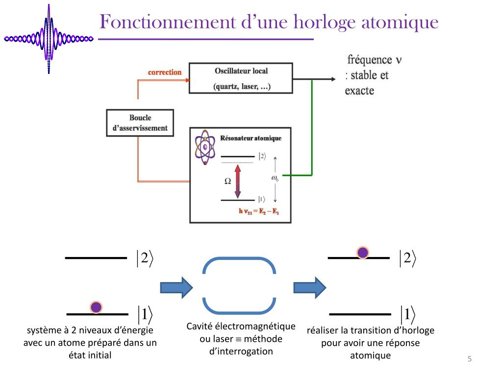
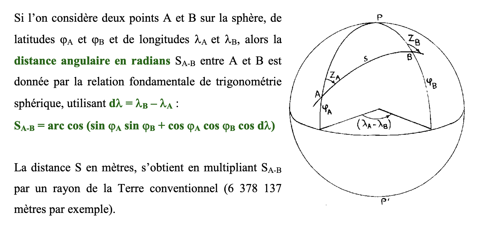
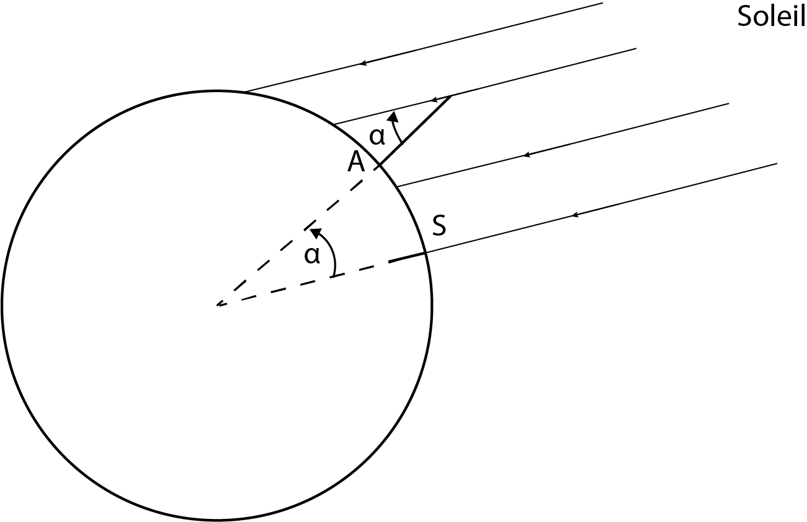
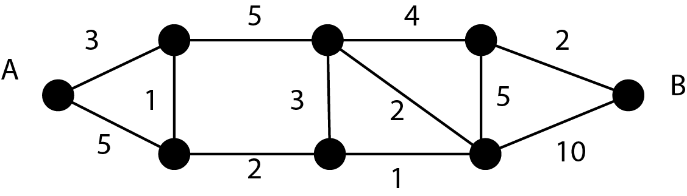

## Exercices Thème 5 : Localisation, cartographie et mobilité

### Exercice 1

En utilisant [Géoportail](https://www.geoportail.gouv.fr/), trouver les coordonnées géographiques (latitude et longitude) du château de Chambord.

En utilisant openStreetMap, dire ce que l'on peut trouver aux coordonnées (latitude : 45.83267°, longitude : 6.86517°). Il suffit de changer les coordonnées dans l'[adresse](https://www.openstreetmap.org/#map=14/45.8359/6.8677) du site.

### Exercice 2

On rappelle le code pour faire les doctests.

```Python
if __name__ == '__main__':
  import doctest
  doctest.testmod(verbose=True)
```

En Python, écrire une fonction `distance` telle que si un satellite a envoyé à l'instant t1 un signal, qui ensuite a été reçu à l'instant t2 par un récepteur, `distance(t1,t2)` renvoie la distance entre le satellite et le récepteur exprimée en km.
Les dates t1 et t2 sont données en heure UTC.     
exemple : 064036.261116 signifie que la trame a été envoyée à 06 h 40 min 36.261116 s.      

On donne la valeur exacte de la célérité de la lumière : c=299.792,458 km/s.

Expliquer pourquoi elle est donnée en physique avec 3 chiffres significatifs sous la forme : c=3.00×10<sup>8</sup> m.s<sup>-1</sup>.

```Python
def distance(t1,t2):
    """
    Renvoie la distance calculée à partir de la date d'émission t1 du signal émis par le satellite et la date t2 de réception du calculateur du G.P.S
    param : t1 : float
    param : t2 : float
    return : float
    >>> distance(064036.261116,064036.3284959)
    20199.98584068947
    """
```

Le GPS comprend au moins 24 satellites circulant à 20 200 km d'altitude. Ils se répartissent sur six orbites distinctes à raison de quatre satellites par orbite, et tournent à une vitesse de l'ordre de 14000 km/h.



Compléter la phrase : une erreur de 30 ns (nanoseconde) provoque une erreur de ... mètres sur la géolocalisation.

C'est la raison pour laquelle des horloges de grande précision sont embarquées à bord des satellites G.P.S ; ce sont des horloges dites **atomiques** (basées sur des transitions énergétiques électroniques au sein de l'atome de césium Cs). 

 

Des corrections doivent être apportées dans la mesure du temps pour tenir compte des effets de la relativité  [restreinte](https://www.youtube.com/watch?v=Ytk2z3NApYo) (le temps ne s'écoule pas au même rythme à bord du satellite animé d'une grande vitesse par rapport à la Terre que sur Terre) et la relativité générale (la gravité joue également un rôle sur l'écoulement du temps) ; ces deux théories ont été découvertes par Einstein en 1905.

On trouvera ici la démonstration classique du phénomène de [dilatation des durées](Assets/demonstration.md).


### Exercice 3

En utilisant [Géoportail](https://www.geoportail.gouv.fr/) et l'outil "mesurer une distance", trouver la distance à vol d'oiseau de la Tour Eiffel à l'Arc de Triomphe.

Latitude de Eiffel Tower	48.858370.  
Longitude de Eiffel Tower	2.294481. 

Latitude de arc de triomphe	48.873792.   
Longitude de arc de triomphe	2.295028. 



La démonstration du calcul de la distance à vol d'oiseau à partir des latitudes et longitudes se fait en exprimant le [produit scalaire](Assets/produit_scalaire.md) de deux manières différentes. Vérifier sa compréhension sur un [exemple](Assets/exemple.md) simple.

Voir la [démonstration](Assets/demonstration_distance.md).

Le programme ci-dessous a pour but de déterminer la distance à vol d'oiseau entre deux positions en utilisant la méthode explicitée précédemment ; compléter les lignes manquantes.

```Python
import math

PI=math.pi

R=6378137

def conversion_degre_radian(angle):
    """
    Convertit un angle exprimé en degré en radian
    >>> conversion_degre_radian(180)
    3.141592653589793
    """
    return ...................

def calcul_distance_a_vol_d_oiseau(A,B):
    """
    Calcule la distance en m entre deux points A et B à partir de leurs coordonnées géographiques
    param : A : tuple : doublet (latitude, longitude)
    param : B : tuple : doublet (latitude, longitude)
    return : float
    >>> calcul_distance_a_vol_d_oiseau((48.858370,2.294481),(48.873792,2.295028))
    1717.236416494379
    """
    dλ=conversion_degre_radian(B[1])-conversion_degre_radian(A[1])
    S=math.acos(math.sin(conversion_degre_radian(A[0]))*math.sin(conversion_degre_radian(B[0]))+math.cos(conversion_degre_radian(A[0]))*math.cos(conversion_degre_radian(B[0]))*math.cos(dλ))
    d=..............
    return d

if __name__ == '__main__':
    import doctest
    doctest.testmod(optionflags=doctest.NORMALIZE_WHITESPACE | doctest.ELLIPSIS, verbose=True)

```

En déduire la distance à vol d'oiseau entre ces deux villes : Lille : (50.636565,3.063528) - Dunkerque : (51.034771,2.377253)

Retrouver le résultat à cette [adresse](https://www.coordonnees-gps.fr/distance).


### Exercice 4

Donner l'heure et les coordonnées d'acquisition de la trame NMEA 0183 suivante :
'$GPGLL,4835.07,N,235.47,E,203712,A'

Écrire la fonction `exploitation_trame` définie ci-dessous : 

```Python

def exploitation_trame(trame):
    """
    Renvoie la position géographique de façon textuelle à partir de la trame
    param : trame : string
    return : string
    >>> exploitation_trame("$GPGLL,4916.45,N,12311.12,W,225444,A")
    'position géographique : latitude : 49 deg. 16.45 min. N ; longitude : 123 deg. 11.12 min. W ; acquisition : 22:54:44 UTC'    
    """
    pass
    
if __name__ == '__main__':
  import doctest
  doctest.testmod(verbose=True)
  
```

Indications :

- Pour transformer une chaîne de caractères en liste en utilisant un séparateur, afin d'en prélever ensuite un élement

```Python
>>> "poisson,chien,chat".split(",")
['poisson', 'chien', 'chat']
>>> "poisson,chien,chat".split(",")[1]
'chien'
```

- Pour extraire une partie d'une chaîne de caractères à l'aide d'un `slicing`

```Python
>>> "poisson"[3:5]
'ss'
>>> "poisson"[3:]
'sson'
>>> "poisson"[:3]
'poi'
>>> "poisson"[-3:]
'son'
>>> "poisson"[:-3]
'pois'
```

- Pour accoler ou concaténer plusieurs morceaux de texte, utiliser l'opérateur + :

```Python
>>> "requin"+"-"+"marteau"
'requin-marteau'
```
### Exercice 5

Il y a plus de 2000 ans, le scientifique grec Ératosthène invente la discipline de la géographie dont le terme est encore utilisé aujourd'hui ; il a même réussi à estimer la circonférence de la Terre.

Pour cela il a constaté qu'à midi à Syène (aujourd’hui Assouan en Égypte) les rayons du Soleil sont à la verticale (un puits creusé en donne une preuve expérimentale car il est éclairé tout entier). Le même jour à la même heure, à Alexandrie, ville située quasiment sur le même méridien (à 3° de longitude près), les rayons lumineux forment un angle α de 7,2° avec un bâton planté verticalement.
De plus il sait que les caravanes de chameaux partant de Syène mettent 50 jours pour arriver à Alexandrie en parcourant 100 stades par jour (un stade équivaut à 160m).  




1. En utilisant l'égalité des angles alternes et internes, donner l'expression de la circonférence P de la Terre en fonction de l'angle α et de la longueur s de l'arc qui joint A à S. On rappelle que la longueur s d'un arc de cercle de rayon R sous-tendu par un angle α est donnée par la relation : s=R·α à condition d'exprimer α en radian. On rappelle que π=180° ; on retrouve ainsi l'expression bien connue du périmètre d'un cercle : p=2π·R.
2. Donner la valeur de la circonférence de la Terre calculée par Ératosthène. 
3. Estimer l'erreur relative commise, exprimée en pourcentage, en utilisant la valeur connue du rayon moyen de la Terre : 6 371 km. Le pourcentage d'erreur relative entre une valeur expérimentale e<sub>exp</sub> et une valeur théorique e<sub>théo</sub> est donné par : 100×|e<sub>exp</sub>-e<sub>théo</sub>|/e<sub>théo</sub>.


### Exercice 6

1) Déterminer "au jugé" le plus court chemin de A à B dans le graphe suivant et donner sa longueur (chaque arête possède une longueur exprimée par exemple en km).



2) En utilisant l'algorithme de Dijkstra explicité dans ce [document](Assets/Dijkstra.pdf), retrouver "à la main" le plus court chemin de A à B.
Compléter le fichier [Tableau.odt](Assets/Tableau.odt).    

On peut résumer ainsi la construction du tableau : pour passer d'une ligne à l'autre, on détermine le sommet à marquer en retenant le sommet pour lequel on a la plus petite distance, puis pour chacune des colonnes des sommets non marqués, on écrit la distance (si elle existe, sinon False) entre le sommet marqué et le sommet non marqué si, après addition de la retenue, celle-ci est strictement inférieure à la valeur inscrite dans la ligne précédente ; on précise également la provenance correspondant au sommet marqué.
Pour obtenir le résultat final, on part du sommet d'arrivée et on remonte en passant par les provenances.

3) L'implémentation en Python de cet algorithme est donnée ci-dessous : on retrouvera la construction du tableau dans `ajout_ligne(T,S_marques,Graphe)` puis `calcule_tableau(Graphe, depart)`.
Ajouter deux fonctions à ce programme : `distance_deux_points(graphe,i,j)` et `distance_totale(graphe,liste)` pour que le programme retourne également la longueur du chemin le plus court. Retrouvez ainsi vos résultats précédents.

```Python
#  Implémentation  de  l’algorithme  de  Dijkstra

#  Graphe 1 est le graphe correspondant à l'exemple du document pdf ; il faudra donc l'adapter à notre exemple

Graphe1 = [
          [0,2,5,False,3,False,False],
          [2,0,2,1,False,False,8],
          [5,2,0,1,4,2,False],
          [False,1,1,0,False,False,5],
          [3,False,4,False,0,False,False],
          [False,False,2,False,False,0,1],
          [False,8,False,5,False,1,False]
          ]

def SommetSuivant(T, S_marques) :
    """
    En  considérant  un  tableau  et  un  ensemble  de  sommets  marqués, détermine  le  prochain  sommet  marqué.
    param : T : list
    param : S_marques : list
    return : int
    >>> T=[[False, [2, 0], [5, 0], False, [3, 0], False, False],[False, False, [4, 1], [3, 1], [3, 0], False, [10, 1]]]
    >>> S_marques=[0,1]
    >>> SommetSuivant(T, S_marques)
    3
    """
    L = T[-1]
    n = len(L)
#  minimum  des  longueurs,  initialisation
    minimum = False
    for i in range(n) :
        if not(i in S_marques) :
#  si  le  sommet  d’indice  i  n’est  pas  marqué
            if L[i]:
                if not(minimum) or L[i][0] < minimum :
#  on  trouve  un  nouveau  minimum
#  ou  si  le  minimum  n’est  pas  défini
                    minimum = L[i][0]
                    marque = i
    return(marque)

def ajout_ligne(T,S_marques,Graphe) :
    """
    Ajoute  une  ligne  supplémentaire  au  tableau
    param : T : list
    param : S_marques : list
    param : Graphe : list
    return : list, list    
    """
    L = T[-1]
    n = len(L)
#  La  prochaine  ligne  est  une  copie  de  la  précédente, #  dont  on  va  modifier  quelques  valeurs.
    Lnew = L.copy()
#  sommet  dont  on  va  étudier  les  voisins
    S = S_marques[-1]
#  la  longueur  du  (plus  court)  chemin  associé
    retenue = L[S][0]
    for j in range(n) :
        if j not in S_marques:
            poids = Graphe[S][j]
            if poids :
#  si  l’arète  (S,j)  est  présente
                if not(L[j]) :  #  L[j]  =  False
                    Lnew[j] = [ retenue + poids, S ]
                else :
                    if retenue + poids < L[j][0]:
                        Lnew[j] = [ retenue + poids, S ]
    T.append(Lnew)
#  Calcul  du  prochain  sommet  marqué
    S_marques.append(SommetSuivant(T, S_marques))
    return T, S_marques

def calcule_tableau(Graphe, depart) :
    """
    Calcule  le  tableau  de  l’algorithme  de  Dijkstra
    param : Graphe : list
    param : depart : int
    return : list
    """
    n = len(Graphe)
#  Initialisation  de  la  première  ligne  du  tableau
#  Avec  ces  valeurs,  le  premier  appel  à  ajout_ligne
#  fera  le  vrai  travail  d’initialisation
    T=[[False] *n]
    T[0][depart] = [depart, 0]
#  liste  de  sommets  marques
    S_marques = [ depart ]
    while len(S_marques) < n :
        T, S_marques = ajout_ligne(T, S_marques, Graphe)
    return T

def plus_court_chemin(Graphe, depart, arrivee) :
    """
    Détermine  le  plus  court  chemin  entre  depart  et  arrivee  dans le  Graphe
    param : Graphe : list
    param : depart : int
    param : arrivee : int
    return : list
    >>> plus_court_chemin(Graphe1,0,6)
    [0, 1, 2, 5, 6]
    """
    n = len(Graphe)
#  calcul  du  tableau  de  Dijkstra
    T = calcule_tableau (Graphe,depart)
#  liste  qui  contiendra  le  chemin  le  plus  court,  on  place  l’arrivée
    C = [ arrivee ]
    while C[-1] != depart :
        C.append( T[-1][C[-1]][1] )
#  Renverse  C,  pour  qu’elle  soit  plus  lisible
    C.reverse()
    return C

def distance_deux_points(Graphe,i,j):
    """
    Renvoie la distance entre deux sommets i et j
    param : Graphe : list
    param : i : int
    param : j : int
    return : int
    >>> distance_deux_points(Graphe1,0,2)
    5
    """
    pass

def distance_totale(graphe,i,j):
    """
    Renvoie la distance correspondant au chemin le plus court du sommet i au sommet j
    param : graphe : list
    param : i : int
    param : j : int
    return : list
    >>> distance_totale(Graphe1,0,6)
    7
    """
    pass
    

if __name__ == '__main__':
  import doctest
  doctest.testmod(verbose=True)    
 
```


