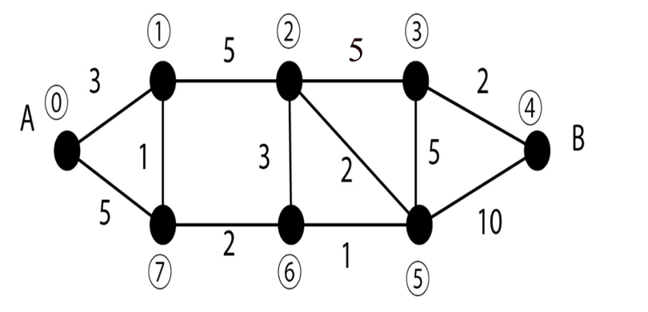

## Exercices Thème 5 : Localisation, cartographie et mobilité

### Exercice 1

En utilisant Géoportail, trouver les coordonnées géographiques (latitude et longitude) du château de Chambord.
En utilisant openStreetMap, dire ce que l'on peut trouver aux coordonnées (latitude : 45.83267°, longitude : 6.86517°).

### Exercice 2

En Python, écrire une fonction `distance` telle que si un satellite a envoyé à l'instant t1 un signal, qui ensuite a été reçu à l'instant t2 par un récepteur, `distance(t1,t2)` renvoie la distance entre le satellite et le récepteur exprimée en km.
Les dates t1 et t2 sont données en heure UTC 
exemple : 064036.261116   : Trame envoyée à 06 h 40 min 36.261116 s
Valeur exacte de la célérité de la lumière : c=299.792,458 km/s

```Python
>>> print(distance(064036.261116,064036.328451))
20200.499999918975
```

Le GPS comprend au moins 24 satellites circulant à 20 200 km d'altitude. Ils se répartissent sur six orbites distinctes à raison de quatre satellites par orbite.


Compléter la phrase au vue de l'exemple ci-dessous : une erreur d'un millionième de seconde provoque une erreur de ... mètres sur la position.

```Python
>>> print(distance(064036.261116,064036.328451))
20200.499999918975
>>> print(distance(064036.261116,064036.328452))
20200.800000020536
```

### Exercice 3

En utilisant Géoportail et l'outil "mesurer une distance", trouver la distance à vol d'oiseau de la Tour Eiffel à l'Arc de Triomphe.


### Exercice 4

En utilisant Géoportail et l'outil "calculer un itinéraire", trouver le temps de trajet en voiture pour aller de Dunkerque à Marseille.

### Exercice 5

Donner l'heure et les coordonnées d'acquisition de la trame NMEA 0183 suivante :
$GPGLL,4835.07,N,235.47,E,203712,A

### Exercice 6

Il y a plus de 2000 ans, le scientifique grec Ératosthène invente la discipline de la géographie dont le terme est encore utilisé aujourd'hui ; il a même réussi à estimer la circonférence de la Terre.

Pour cela il a constaté qu'à midi à Syène (aujourd’hui Assouan en Égypte) les rayons du Soleil sont à la verticale (un puits creusé en donne une preuve expérimentale car il est éclairé tout entier). Le même jour à la même heure, à Alexandrie, ville située quasiment sur le même méridien (à 3° de longitude près), les rayons lumineux forment un angle α de 7,2° avec un bâton planté verticalement.
De plus il sait que les caravanes de chameaux partant de Syène mettent 50 jours pour arriver à Alexandrie en parcourant 100 stades par jour (un stade équivaut à 160m).  


1. En utilisant l'égalité des angles alternes et internes, estimer la circonférence de la Terre en fonction de l'angle α et de la longueur de l'arc qui joint A à S. On rappelle que la longueur s d'un arc de cercle de rayon R sous-tendu par un angle α est donnée par la relation : s=R·α à condition d'exprimer α en radian. On retrouve ainsi l'expression bien connue du périmètre d'un cercle : p=2π·R avec π=180°.
2. Donner la valeur de la circonférence de la Terre calculée par Ératosthène. 
3. Estimer l'erreur relative commise en utilisant la valeur connue du rayon moyen de la Terre : 6 371 km.


### Exercice 7

Trouver le plus court chemin de A à B dans le graphe suivant et donner sa longueur (chaque arête possède une longueur exprimée en km).


