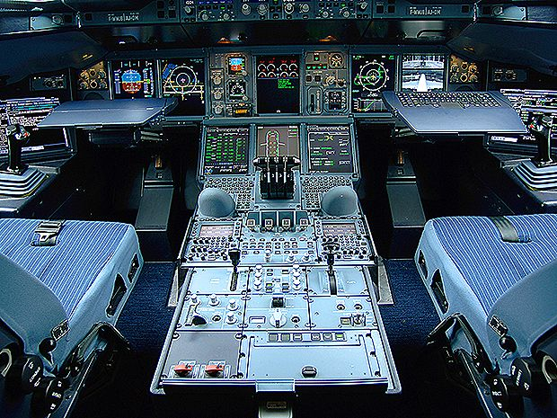

## Thème 6 : Informatique embarquée et objets connectés

### Introduction

Les premiers systèmes embarqués ont permis la réussite voici 50 ans de la mission Apollo 11 qui fit débarquer deux hommes sur la Lune. De nos jours, nous possédons tous des objets connectés dont la puissance leur est de très loin supérieure. Leur conception s'est faite avec la miniaturisation des processeurs, en particulier des transistors qui en sont un élément essentiel. Leur fonctionnement nécessite la mise au point de nombreux algorithmes.

### Historique

- 1948 : Invention du transistor, composant essentiel des processeurs.
- 1967 : Première utilisation d'un système embarqué pour la mission lunaire Apollo.
- 1971 : Intel crée le premier processeur.
- 1984 : L'Airbus A320 est le premier avion équipé de commandes électriques informatisées.
- 1999 : Introduction de la notion d'"Internet des objets" (Internet of Things) qui désigne l'ensemble des objets connectés, c'est-à-dire les systèmes embarqués connectés entre eux par Internet.

### Systèmes embarqués

Un **système embarqué** est un système électronique et informatique autonome. Il sert souvent à effectuer une tâche particulière au sein d'un mécanisme plus large. Ainsi un ordinateur n'est généralement pas considéré comme un système embarqué (il est trop général).

Voici quelques exemples de systèmes embarqués :
- Dans une voiture : la radio, la climatisation, le GPS, etc.
- Dans un four à micro-ondes : le minuteur, la lumière, etc.
- Dans un smartphone : l'appareil photo, l'alarme, le système de verrouillage, etc.

Un système embarqué comporte souvent : 
- un **microcontrôleur** composé notamment d'unités mémoires et d'un **microprocesseur** capable d'exécuter des instructions
- des **capteurs** pour obtenir des informations du monde réel (température, luminosité, etc.).
- des **actionneurs** pour agir sur le monde réel (afficher un résultat, faire tourner un moteur, etc.).

### Interface homme-machine (IHM)

Souvent l'utilisateur peut interagir avec un système embarqué à l'aide d'une **interface homme-machine** :

- un **dispositif d'entrée** (clavier, souris, bouton, reconnaissance vocale, etc.) de l'IHM permet à l'utilisateur de donner des informations ou des commandes au système embarqué.
- un **dispositif de sortie** (écran, LED, son, etc.) de l'IHM permet à l'utilisateur d'obtenir des informations du système embarqué

Un exemple d'interface homme-machine : le cockpit de l'A380 

L'informatique n'étant plus réservée aux informaticiens, il a fallu concevoir des interfaces homme-machine intuitives et pratiques à utiliser. L'**ergonomie** est un domaine de recherche multi-disciplinaire visant à étudier et améliorer les relations entre l'être humain et les systèmes.
Voici quelques exemples d'innovations en matière d'interface homme-machine :

- **Sketchpad** (1963) est le premier programme informatique à disposer d'une interface graphique complète. Il est également un précurseur de la conception assistée par un ordinateur à l'aide d'un crayon optique, l'utilisateur peut dessiner un objet pour ensuite le produire industriellement.
- La **souris** (computer mouse) est inventé en 1968 par Douglas Engelbart.
- En 1984, le **Macintosh** devient le premier grand succès commercial intégrant une souris et une interface graphique
- 2012 : l'Oculus Rift fait connaître la **réalité virtuelle** au grand publique. Ce casque de réalité virtuelle simule un environnement en interaction avec l'utilisateur.

 ### Conception d'une application web : interaction avec le clavier de l'ordinateur
 
 Sans aller jusqu'au bout ce qui n'est pas notre sujet, on pourra suivre [ici](http://isnangellier.alwaysdata.net/php/Projet_Gobble.html) la mise au point d'une application web utilisant HTML 5 où l'utilisateur déplace avec les flèches du clavier une boule verte pour manger des boules rouges sans entrer en collision avec les boules bleues ; les niveaux se complexifient avec un nombre de plus en plus élevé de boules bleues. 
 On pourra également voir [ici](http://isnangellier.alwaysdata.net/php/Projet_carte.html) la mise au point d'une autre application web où il s'agit, en temps limité, de cliquer correctement sur une mappemonde pour localiser le maximum de pays demandés.
 
 ### Sécurité et objets connectés
 
 Les objets connectés sont désormais omniprésents dans notre vie quotidienne : enceintes connectés, caméras de surveillance, imprimantes, etc.. Malheureusement c'est un immense territoire de jeu pour les cybercriminels : les objets connectés sont accessibles par Internet (parfois sans que leurs propriétaires ne le sachent) et les mots de passe par défaut ne sont pas toujours modifiés.
 
 En 2016, le botnet Mirai a utilisé des objets connectés mal sécurisés pour mener des attaques DDoS (Distributed Denial of Service) sur de nombreux sites web, ce qui a notamment rendu inaccessibles Twitter, Ebay et Netflix pendant de nombreuses heures. Ce type d'attaque consiste à envoyer énormément de requêtes à partir d'objets connectés souvent infectés vers un site web. Ce dernier devient alors incapable de réponde à toutes les requêtes y compris celles qui sont légitimes. Mirai se connectait automatiquement aux objets connectés en essayant des mots de passe comme admin, 1234, password, etc. Il est ainsi fortement conseillé de modifier le mot de passe par défaut de tout objet connecté et d'en choisir un suffisamment compliqué.
 