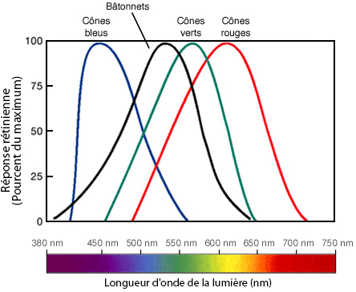
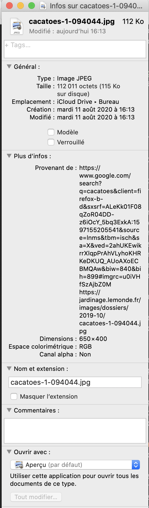
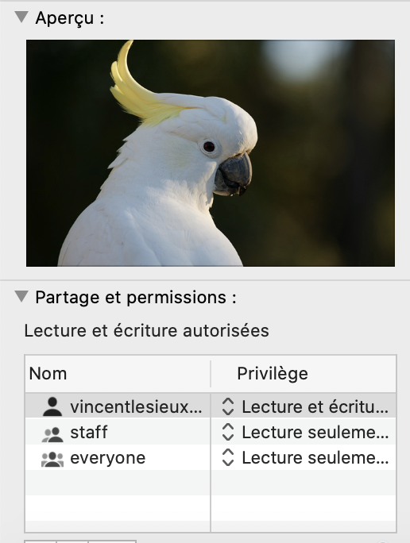

## Thème 7 : La photographie numérique

On trouvera [ici](http://vfsilesieux.free.fr/Photography.pdf) un document complet et illustré portant sur le sujet de la photographie provenant de la revue scientifique New Scientist.
(En pratique, on pourra ouvrir sur l'écran deux fenêtres avec un [dictionnaire en ligne](https://www.macmillandictionary.com/) et y faire un copier-coller pour rechercher les mots inconnus).

### Introduction

L'apparition de la photographie numérique a bouleversé notre rapport à l'image et à ses utilisations. L'imagerie astronomique, pour sa part, a gagné en précision grâce aux capteurs photographiques.

### Historique

- 1826 : Première photographie argentique de Nicéphore Niépce
- 1900 : Début de la photographie en couleur. Généralisation du format 24×36 et de la visée reflex après la seconde guerre mondiale.
- 1969 : Premiers capteurs CCD (Charge Coupled Device)
- 1975 : Premiers appareils numériques
- 2007 : Arrivée du smartphone

### Capture et numérisation de l'image

La capture de l'image par un appareil photographique numérique est similaire à celle par l'œil humain : l'objectif avec ses lentilles joue un rôle analogue au cristallin de l'œil et permet de projeter l'image sur la rétine qui joue un rôle analogue au capteur CCD. Le diaphragme, tout comme l'iris de l'œil, permet de réguler la quantité de lumière qui entre par l'objectif.
La mise au point de l'appareil photographique diffère néanmoins de l'accommodation de l'œil ; dans le premier cas la lentille ou les lentilles se déplacent, dans le second les muscles ciliaires appuient sur le critallin en modifiant sa vergence ; plus celui-ci est bombé, plus le cristallin est convergent, plus sa vergence (qui est l'inverse de sa distance focale f'=OF' où F' désigne le foyer image où converge un faisceau incident de lumière parallèle).

La rétine est constitué de cellules photosensibles : les cônes (bleus, rouges, verts), qui permettent d'analyser les différentes couleurs de l'image en vision diurne (elles sont sensibles à des domaines spécifiques du spectre visible) et les bâtonnets pour la vision nocturne.

De même le capteur d'un appareil numérique est constitué de **photosites** : il s'agit de cellules mesurant l'intensité lumineuse. Chacune de ces cellules est munie d'un filtre coloré (rouge, vert, bleu) ne laissant passer que les rayons de la couleur en question et d'une microlentille convergente permettant de concentrer les rayons au centre du photosite. Les photosites sont disposés comme sur la figure ci-dessous : deux sites "vert" pour un site "rouge" et un site "bleu". La **définition** du capteur correspond au nombre de ses photosites.

Une fois l'image capturée, les informations reçues par chaque photosite permettent d'obtenir un premier fichier au format RAW, c'est-à-dire un fichier brut de données non interprétées.
Les données subissent ensuite plusieurs traitements, notamment le **dématriçage**, afin d'obtenir une image numérique (format JPEG ou TIFF) constituée de petits carrés de couleur : les pixels.

La **définition d'une image** est le nombre de pixels constituant l'image. Par exemple, une image contenant 2592 pixels en largeur et 1936 pixels en hauteur (2592×1936) a une définition de 5 018 112 pixels, soit environ 5 Mpx (mégapixels).
Remarque : il n'y a pas nécessairement le même nombre de pixels sur l'image que de photosites sur le capteur. Cela dépend des algorithmes utilisés lors du dématriçage. La définition du capteur peut donc être différente de la définition de l'image.

La **résolution d'une image** quant à elle correspond au nombre de pixels par unité de longueur. Elle est généralement exprimée en ppp (pixel par pouce) ou ppi (pixel per inch) ou dpi (dot per inch) pour les imprimantes. Plus la résolution est importante, plus l'image sera de bonne qualité lors d'un zoom. On obtient une très bonne qualité d'impression avec une résolution de 300 ppi par exemple ; tandis que les écrans d'ordinateur ont désormais généralement une résolution entre 85 et 150 ppi. Cependant certains smartphones ont désormais des écrans avec une très bonne résolution avec par exemple 326 ppi.

Voir [exercice](Assets/Exercice_physique.pdf)

### Le codage RVB des couleurs

Une image peut être considérée comme un tableau de pixels. La couleur de chaque pixel peut être codée sur 3 octets selon les trois composantes : rouge, vert et bleu.
On parle de **codage RVB ou RGB** pour Red-Green-Blue. Il s'agit pour chacune des trois composantes d'indiquer l'intensité lumineuse de la couleur par un nombre compris entre 0 et 255. En effet, chaque couleur est codée sur 1 octet formé de 8 bits ce qui offre 28=256 possibilités de niveau de couleur pour le rouge, autant pour le vert et le bleu soit une totalité de 28×28×28=224=16 777 216 couleurs. 
Ainsi le rouge est codé par (255,0,0) ; le vert par (0,255,0) ; le bleu par (0,0,255).
L'égalité des trois niveaux correspond à des niveaux de gris, il y en a donc 256.

On trouvera [ici](http://isnangellier.alwaysdata.net/php/colours.html) le codage des couleurs.

Remarque :  le codage RVB des couleurs n'est pas le seul codage possible. Lorsqu'on code une page web par exemple, dans la feuille de style CSS on peut aussi préciser la couleur en utilisant le codage hexadécimal de cette couleur. On trouvera [ici](http://vfsilesieux.free.fr/exemple_page_web/page_web.html) une page html dont on pourra regarder le code source qui démontre que trois types codages des couleurs dans le CSS sont possibles pour un résultat analogue, par exemple : green, rgb(0,128,0) ou #008000. 

### Métadonnées

Un fichier RAW, JPEG ou TIFF ne contient pas uniquement des données permettant l'affichage de l'image, il contient également des données sur la date et l'heure de la prise de vue, l'appareil utilisé, éventuellement le lieu etc. Toutes ces données sont appelées des **métadonnées** et sont stockées au format EXIF (Exchangeable Image File Format). On peut accéder à ces données, en effectuant un clic-droit sur le fichier, et en regardant dans les **propriétés de l'image**.

### Algorithmes de traitement de l'image

Entre le moment où l'on presse le bouton de l'appareil numérique pour déclencher une prise de vue et la publication de l'image sur un réseau social, de nombreux algorithmes ont été réalisés.

- Avant même le déclenchement de la prise de vue : 

	. Stabilisation de l'image afin de compenser le mouvement du photographe.  
	. Mise au point.  
	. Correction du flou.  

- Capture de l'image : obtention du fichier RAW
- Après la capture de l'image :

	. Dématriçage.  
	. Balance des blancs. 
	. Contraste.    
	. Saturation.  

- Compression de l'image : obtention du fichier JPEG
- Amélioration de l'image
	
	Une fois l'image enregistrée on peut encore utiliser différents algorithmes grâce à des logiciels de retouche afin de corriger des imperfections, améliorer le rendu des couleurs ou passer en noir et blanc, découper des zones de l'image (détection des contours) etc.
	

Avec Python, on peut récupérer les données portant sur les pixels d'une image en utilisant `image.getpixel((x,y))` : cf. ex 5.  

Avec JavaScript on peut récupérer les données concernant les pixels d'une image en écrivant `ctx.getImageData(0,0,500,500)` pour une image de taille 500*500 : cf. ex 6.
	
### Droit à l'image - droit d'auteur

À l'heure des réseaux sociaux, il est important de rester vigilant et de connaître ses droits afin de maîtriser la diffusion de ses données personnelles.

L'article 226-1 du code pénal indique : 

   « - Est puni d'un an d'emprisonnement et de 45000 euros d'amende le fait, au moyen d'un procédé quelconque, volontairement de porter atteinte à l'intimité de la vie privée d'autrui :
   « 1° En captant, enregistrant ou transmettant, sans le consentement de leur auteur, des paroles prononcées à titre privé ou confidentiel ;
   « 2° En fixant, enregistrant ou transmettant, sans le consentement de celle-ci, l'image d'une personne se trouvant dans un lieu privé.
   « Lorsque les actes mentionnés au présent article ont été accomplis au vu et au su des intéressés sans qu'ils s'y soient opposés, alors qu'ils étaient en mesure de le faire, le consentement de ceux-ci est présumé ».

Chaque personne dispose d'un droit exclusif sur son image et l'utilisation qui en est faite. Ainsi, lorsqu'une image a été prise dans un lieu privé, sa publication nécessite le consentement écrit des personnes identifiables. Toutefois, sous reserve de ne pas porter atteinte à la dignité des personnes, certaines images ne sont pas soumises à cette règle, comme par exemple :

- les images illustrant des événements d'actualité (droit à l'information)
- les images de personnalités publiques dans l'exercice de leurs fonctions
- les images illustrant un sujet historique

Dans le cas où le droit n'est pas respecté, il convient alors de demander le retrait de l'image, puis, si cela n'aboutit pas, une plainte peut être déposée auprès du CNIL (Commission Nationale de l'Informatique et des Libertés) : https://www.cnil.fr/fr/plaintes

Par ailleurs, il existe un **droit à l'oubli**. Ainsi on peut demander le retrait de certaines données dès lors qu'on estime qu'elles nous portent préjudice.

Enfin, rappelons que les images numériques sont également soumises au **droit d'auteur**. Avant de publier une image il faut donc s'assurer que cela est possible, par exemple parce qu'il s'agit d'une image diffusée sous la licence Creative Commons. Notons qu'en cas de litige, les métadonnées EXIF peuvent fournir des informations essentielles.
