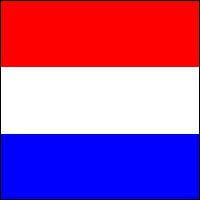
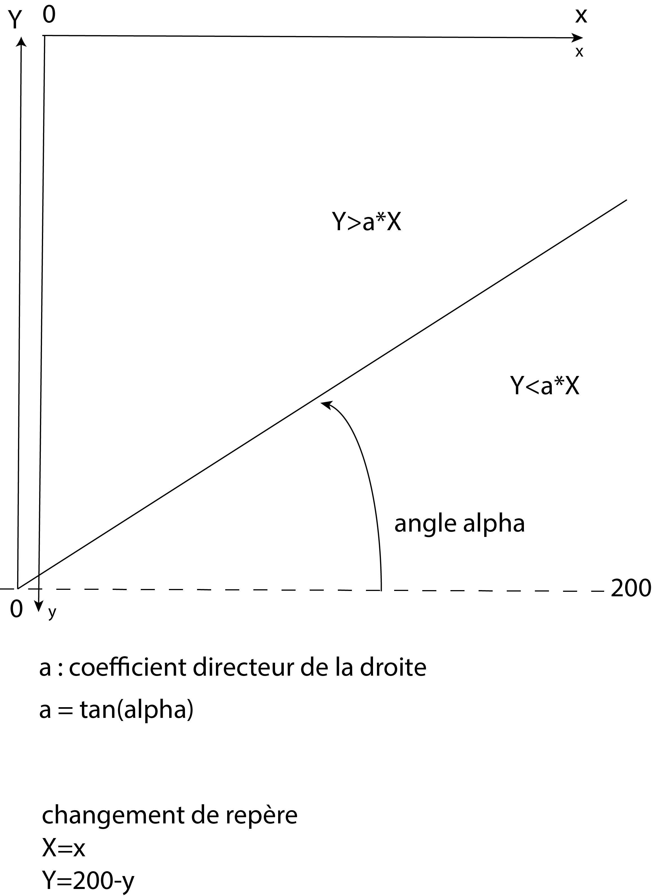

## Exercices Thème 7 : La photographie numérique

### Exercice 1

On dispose d'une image carrée dont la définition est de 4 Mpx. 
On rappelle que la **définition** d'une image est le produit du nombre de pixels sur la hauteur par le nombre de pixels sur la largeur de l'image.
Déterminer les dimensions en cm de cette image :
- si elle est affichée sur un écran de résolution 144 ppi (pixels per inch)
- si elle est imprimée par une imprimante de résolution 300 dpi (dots per inch).

1 inch = 1 pouce = 2.54 cm

### Exercice 2

Un magasin propose deux ordinateurs à des prix intéressants.
Le premier possède un écran de définition 1233 × 925 px et de dimensions 345,44 × 259,08 mm (écran 17").
Le second a un écran de définition 1219 × 914 px et de dimensions 304,80 × 228,60 mm (écran 15").
Lequel a la meilleure résolution ?
On rappelle que la **résolution** d'un écran est la densité de pixels affichés sur chaque pouce de l'écran, elle s'exprime en ppi (pixels per inch).

### Exercice 3

La **luminance** relative est une grandeur correspondant à la sensation visuelle de luminosité ; elle varie entre 0 pour le noir et 1 pour le blanc pris comme référence, la pondération est basée sur la sensibilité de l'oeil humain  ; le vert contribue le plus à l'intensité perçue par l'œil humain et le bleu le moins.
Lorsque l'on dispose du code RVB d'une couleur, que l'on note (R,V,B), le calcul de la luminance se calcule à l'aide de la formule L = (0,2126 × R + 0,7152 × V + 0,0722 × B)/255.

Écrire une fonction en Python telle que `lum(couleur)` qui renvoie la valeur de la luminance, lorsque la couleur est donnée sous forme d'un triplet (r,v,b).
Donner sa valeur dans le cas du blanc (255,255,255), du rose clair (255,192,203) et du bordeaux (165,42,42).

### Exercice 4

Dans cet exercice nous allons utiliser le module Image de la librairie **PIL** ou **pillow** de Python (à télécharger dans le menu outils du logiciel Thonny).

On suivra [ici](http://vfsilesieux.free.fr/traitements_d_une_me%CC%82me_image.pdf) différents traitements possibles d'une image.

Application : réaliser les programmes permettant d'obtenir les drapeaux suivants (200×200) portant chacun un fin liseré noir :

- France : 
- Belgique : 
- Hollande : 
- Suisse : 
- Japon : 

Code pour la réalisation du drapeau français ; l'image se formera dans le dossier où a été enregistré le programme dont le code est le suivant :

```python

from PIL import Image

def drapeau_france():
    (colonne,ligne)=(200,200)
    imagearrivee=Image.new('RGB',(colonne,ligne))
    
    # le parcours de toutes les lignes y et colonnes x de l'image pour implanter en (x,y) les pixels de notre choix
    
    for x in range(colonne):
        for y in range(ligne):
            if x<200/3:
                imagearrivee.putpixel((x,y),(0,0,255))
            elif x>200/3 and x<400/3:
                imagearrivee.putpixel((x,y),(255,255,255))
            else:
                imagearrivee.putpixel((x,y),(255,0,0))
                
    # le liseré noir
    for x in range(colonne):
        imagearrivee.putpixel((x,0),(0,0,0))
        imagearrivee.putpixel((x,199),(0,0,0))
    for y in range(ligne):
        imagearrivee.putpixel((0,y),(0,0,0))
        imagearrivee.putpixel((199,y),(0,0,0)) 
        
    imagearrivee.save("Drapeau_france.jpg")

drapeau_france()
```

Autre application : le drapeau des Seychelles (situé dans l'ouest de l'océan Indien et rattaché au continent africain) peut être réalisé approximativement ainsi 

On peut proposer le programme suivant à compléter.
En travaillant avec des listes `couleurs` et `valeurs`, on fait l'économie d'écrire toutes les conditions et on synthètise en une seule ligne l'ensemble des conditions.

```python

from PIL import Image

import math # on importe le module math pour utiliser math.pi et la fonction math.tan

couleurs=[(0,255,0),.......### à compléter (1) ##########................]

alpha=####### à compléter (2) (l'angle exprimé en radian en fonction de math.pi qui représente 180°) ##########################

Valeurs=[0,........ ########### à compléter (3) ###########################

def drapeau_seychelles():
    (colonne,ligne)=(200,200)
    imagearrivee=Image.new('RGB',(colonne,ligne))
    for x in range(colonne):
        for y in range(ligne):
            X,Y=x,200-y #changement de repère pour avoir l'origine en bas à gauche
            for i in range(5):
                if Y>math.tan(alpha*Valeurs[i])*X and ############# à compléter (4) ##########:
                    imagearrivee.putpixel((x,y),######## à compléter (5) ############)
    
    #le liseré noir
    for x in range(colonne):
        imagearrivee.putpixel((x,0),(0,0,0))
        imagearrivee.putpixel((x,199),(0,0,0))
    for y in range(ligne):
        imagearrivee.putpixel((0,y),(0,0,0))
        imagearrivee.putpixel((199,y),(0,0,0)) 
    imagearrivee.save("drapeau_seychelles.jpg")
    
drapeau_seychelles()

```

Explications : une droite passant par l'origine d'équation y=a×x partage l'espace en deux demi-plans ; les points du demi-plan inférieur vérifient y<a×x tandis que les points du demi-plan supérieur vérifient y>a×x.





### Exercice 5

Dans cet exercice nous allons utiliser la possibilité de modifier les données portant sur les pixels d'une image avec JavaScript.  
  
1. On trouvera [ici](http://isnangellier.alwaysdata.net/php/Transformations_image.html) différentes transformations à réaliser en modifiant les pixels d'une image.

`imageData = ctx1.getImageData(0,0,500,500);`    

`imageData` représente la collection des informations pour chacun des pixels du contexte ctx1 de l'image.

`imageData.data[i]` représente le niveau de rouge du pixel i ;

`imageData.data[i+1]` représente le niveau de vert du pixel i ;

`imageData.data[i+2]` représente le niveau de bleu du pixel i ;

`imageData.data[i+2]` représente le niveau de transparence du pixel i ;


`for (i=0;i<imageData.data.length;i+=4) {` permet de parcourir les données de 4 en 4, puisque chaque pixel porte quatre informations.

`for (n=1;n<=500;n++) {`  

`for (p=1;p<=500;p++) {` permet de balayer les n lignes et les p colonnes de l'image de taille 500*500

`imageData.data[((n-1)*500+p-1)*4]` permet d'atteindre le niveau de rouge du pixel situé à l'intersection de la ligne n et de la colonne p

`imageData.data[((n-1)*500+p-1)*4+1]` permet d'atteindre le niveau de vert du pixel situé à l'intersection de la ligne n et de la colonne p

`imageData.data[(n-1)*500+p-1)*4+2]` permet d'atteindre le niveau de bleu du pixel situé à l'intersection de la ligne n et de la colonne p

`imageData.data[((n-1)*500+p-1)*4+3]` permet d'atteindre le niveau de transparence du pixel situé à l'intersection de la ligne n et de la colonne p

2. Réaliser le traitement permettant d'obtenir le résultat suivant :


3. Comprendre l'algorithme permettant de repérer le [positionnement d'un point à l'intérieur d'un contour polygonal quelconque](http://isnangellier.alwaysdata.net/php/Algorithme_localisation_quelconque.html).
4. Analyser le code source de la [page html](http://isnangellier.alwaysdata.net/php/melange.html) suivante et procéder à une réalisation similaire. 