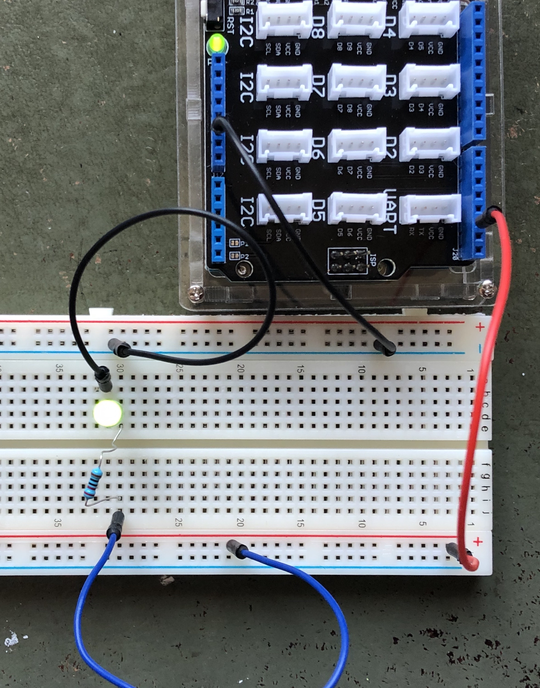

**Montage n°1 : allumage d'une diode**

Attention, la diode est un composant polarisé.



```c
void setup() {
  // put your setup code here, to run once:
  pinMode(2,OUTPUT);
}

void loop() {
  // put your main code here, to run repeatedly:
  digitalWrite(2,HIGH);
  delay(1000);
  digitalWrite(2,LOW);
  delay(1000);

}    
```

Le pin 2 est déclaré comme pin de sortie (output).
Tantôt il est mis au niveau haut, tantôt il est mis au niveau bas, à intervalle régulier d'une seconde ou 1000 ms, de sorte que la diode clignote.

